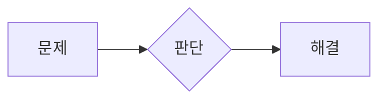

# yollo4179.github.io

GitHub Pages와 Jekyll로 배포하는 Markdown 기반 포트폴리오입니다.

## 프로젝트 글 작성

`_projects/`에 Markdown 파일을 추가하면 `/projects/`의 팀 프로젝트 목록과 태그 필터에 자동으로 반영됩니다.

```yaml
---
title: 프로젝트 제목
order: 2
team_project: true
category: SSAFY
project_type: 특화 프로젝트
summary: 프로젝트를 설명하는 한두 문장
status: 기록 정리 중
period: 입력 예정
role: 입력 예정
team: 입력 예정
stack: 입력 예정
tags:
  - SSAFY
  - 팀 프로젝트
nav_context: SSAFY / SPECIAL PROJECT
---

## 프로젝트 개요

Markdown으로 본문을 작성합니다.
```

공통 문구와 메뉴는 `_data/site.yml`, 공통 화면은 `_includes/`와 `_layouts/`에서 관리합니다. 프로젝트 이미지는 `assets/images/projects/{slug}/`에 둡니다.

## 길봄 상세 기록 구조

길봄은 프로젝트 공통 내용과 상세 기록을 다음 세 카테고리로 나눕니다.

```text
/projects/gilbom/                              공통 프로젝트 개요
├─ /projects/gilbom/details/                   전체 상세 기록
├─ /projects/gilbom/troubleshooting/           트러블슈팅
│  ├─ 01-mqtt-latency-replay/                  MQTT 지연·중복·Replay
│  ├─ 02-command-roundtrip/                    Command 정상·비정상 왕복
│  ├─ 10-patrol-area-coordinate-overlay/       순찰 구역 좌표·Overlay
│  └─ 11-mission-lifecycle-consistency/        Mission 상태 정합성
├─ /projects/gilbom/performance/               성능 향상
│  ├─ 03-mission-map-flicker/                  Mission 지도 플리커링
│  └─ 08-telemetry-statistics-refresh/         Telemetry 통계 갱신
└─ /projects/gilbom/maintainability/           유지보수,확장성
   ├─ 04-mqtt-tls-mtls-strategy/               TLS·mTLS 전략 분리
   ├─ 05-mqtt-v2-contract-gate/                MQTT v2 계약 Gate
   ├─ 06-image-session-isolation/               이미지 요청·관리자 Session 분리
   ├─ 09-robot-credential-lifecycle/           Robot Credential 수명주기
   └─ 12-flyway-ci-contract-recovery/          Flyway·CI 계약 복구
```

개별 글은 `_details/`에서 관리하고 `_layouts/detail.html`을 공유합니다. 카테고리
표시와 링크는 `_data/detail_categories.yml`에서 관리합니다. 새 상세 글을 추가할 때는
`detail_category`, `category_slug`, `category_url`, `permalink`, `order`, `number`,
`domain`, `summary`, `verified_at`, `validation_scope`, `result_label`, `tags`를 front
matter에 기록합니다.
검증 결과는 실행 시점과 환경을 함께 적고, 과거 결과를 현재 HEAD 통과 결과로
표현하지 않습니다.

## 역할 B 원본 반영 기준

`I15D101T/TROUBLESHOOTING` 9개와 `I15D101T/CHANGLOGS` 78개를 역할 B 범위로
대조합니다. 같은 종단 흐름의 연속 변경 로그는 하나의 디테일에 통합하고, 각 공개
디테일의 `근거 문서` 절에 사용한 원본을 기록합니다.

| 디테일 | 역할 B 원본 범위 |
| --- | --- |
| 01 | MQTT TTL·Replay·Broker 통합 검증 |
| 02 | Command UI·정상·비정상·재연결·보안 왕복 |
| 03 | Mission Map·SVG·Drag·Zoom·실시간 재투영 |
| 04 | MQTT TLS·mTLS 전략·Mosquitto Topic ACL |
| 05 | MQTT v2 계약·Schema·Fixture·Jetson 통합 가이드 |
| 06 | 이미지 인증 체인·관리자 Session 격리·Nginx Cookie 경계 |
| 08 | Telemetry 기간 통계·SSE 갱신·Recharts |
| 09 | Robot 등록·Credential·Registry·통합 Provisioning |
| 10 | Patrol Area 등록·Polygon·CSP·좌표·Marker |
| 11 | Mission 삭제·완료·취소·긴급정지·재배정 |
| 12 | Package·Flyway·Compose·CI·Release 계약 충돌 |

다음 원본은 공개 기술 디테일로 만들지 않습니다.

- `00_RoleB_QuantitativeEvidence.md`는 별도 사례가 아니라 여러 디테일의 수치 색인이므로 대응 글에 분산합니다.
- 문서 체계화, 문서 상태 동기화, 작업내용 갱신, Codex 빌드 산출물 Ignore, Windows `Zone.Identifier`, 팀 인수인계, Smart Commit 패키징, 증거 폴더 골격과 오래된 Backlog 제거는 공개 구현 설명에서 제외합니다.
- 이미지 저장·Incident 판정은 팀원 C 범위입니다. 역할 B 글에서는 Robot Credential이 이미지 업로드 접속값을 전달하는 Provisioning 경계까지만 설명합니다.

## 증빙 이미지 교체

`_projects/ssafy-common.md`는 실제 정보가 들어오기 전까지 `published: false`로
공개 빌드에서 제외한 작성 템플릿입니다. 다음 더미 이미지는 템플릿에서만
사용합니다.

| 파일 | 실제로 보여줄 자료 |
| --- | --- |
| `overview-placeholder.svg` | 서비스명과 핵심 기능이 함께 보이는 대표 화면 |
| `problem-placeholder.svg` | 인터뷰·설문 요약, 기존 사용자 여정과 불편 지점 |
| `contribution-placeholder.svg` | 담당 기능, 이슈·PR·설계 문서 등 개인 기여 근거 |
| `solution-placeholder.svg` | 시스템 구성도, 기술 선택 비교, 구현 전후 화면 |
| `result-placeholder.svg` | 테스트 결과, 성능 비교, 사용자 피드백과 개선 내용 |

실제 자료는 `assets/images/projects/ssafy-common/`에 저장하고 `_projects/ssafy-common.md`의 `image` 경로를 변경합니다. 동일한 파일명으로 교체하면 Markdown을 수정하지 않아도 됩니다. 권장 비율은 16:9이며 개인정보와 비밀 키는 반드시 가립니다.

## 배포

GitHub 저장소의 **Settings → Pages**에서 배포 소스를 **Deploy from a branch**, 브랜치를 `main`, 폴더를 `/(root)`로 설정합니다. 이후 커밋을 푸시하면 GitHub Pages가 Jekyll 사이트를 빌드합니다.

로컬 Jekyll 설치는 배포에 필수가 아닙니다. 로컬 미리보기가 필요한 경우에만 Ruby와 Jekyll 환경을 별도로 준비합니다.

## Mermaid 다이어그램

Markdown 파일에서 다음처럼 소문자 `mermaid` 언어 식별자를 사용합니다. 같은 fenced
code block을 GitHub는 직접 다이어그램으로 렌더링하고, Jekyll 사이트는
`assets/js/mermaid-loader.js`가 변환합니다.

````markdown

````

브라우저 런타임은 `assets/vendor/mermaid/mermaid.min.js`에 고정한 Mermaid
11.16.1을 사용합니다. 라이선스는 같은 디렉터리의 `LICENSE`에 보존합니다.

## 편집 메모와 권고사항

이 문서는 `_config.yml`에서 공개 빌드 대상에서 제외됩니다. 블로그 정리 과정에서 생긴 권고와 운영 메모는 공개 글에 섞지 않고 여기에 남깁니다.

### 길봄 메인 소개 자료

- 사용자 확인 신원·역할: 조민호, 웹 A·B·C 중 B 담당. TLS 설정·CA 인증서 처리, 패킷 정의, SSE 이벤트 핸들러, Robot·Telemetry DB와 Trajectory 조회 구현을 담당했다. 안건석은 로봇과 임베디드 측 MQTT 담당이다. 사용자와 안건석을 동일 인물로 연결하지 않는다.
- 역할 근거: `C:\ssafy\I15D101T\web\docs\팀원B\README.md`, `작업내용\README.md`, `팀원B-remaining-7days.md`의 책임 경계, `V2\나의 팀원 B의 스키마.md`. B 범위는 로봇 등록·Credential, MQTT 계약·보안·수신, Robot Current·History, Telemetry 통계·시계열, SSE, Command·Patrol·Mission API와 관제 화면이다. 결함 업무 처리·이미지 저장·보고서 생성·AWS 배포·공통 로그인과 세션을 B의 개인 기여로 확장하지 않는다. 기존 마이페이지 프로필·비밀번호 변경 연동과 공통 인증 구현은 구분한다.
- Trajectory는 저장된 GPS Telemetry를 조회하는 기능으로 설명한다. 별도 `mission_trajectory` 테이블을 구현한 것처럼 쓰지 않는다. SSE는 DB 커밋 후 변경을 알리고 React가 REST 정본을 재조회하는 구조다.
- 원본: `C:\ssafy\I15D101T\docs\15기_공통PJT_발표자료_D101.pptx` (D101 최종 발표 자료).
- 서비스 소개는 점자블록 결함 모니터링, 로봇·순찰구역 관리, LLM 보고서 작성으로 구성했다. 개인 기여는 기존 담당 범위에 한정한다.
- 배경색 `#F6F6FE`, 남색 `#2E3D86`, 경계색 `#B6BDDF`, 노란 강조색 `#FEEFC5`는 PPT의 실제 색상 값이다. PPT 표지의 로고와 네트워크 이미지를 사용한다. 유료 발표용 글꼴은 복제하지 않고 기존 사이트 글꼴을 사용한다.
- `assets/images/projects/gilbom/presentation-*.png`는 PPT 내장 이미지다. 로고·네트워크는 1번 슬라이드, 결함 모니터링은 25번, 순찰구역은 29번, 보고서는 32번 슬라이드에서 가져왔다.
- 기존 메인의 편집 과정 로컬 테스트 안내는 공개 소개에서 제외했다. 로컬 TLS Mosquitto·Mock Robot·Fake Naver SDK·Chromium 테스트와 HEAD 단위 테스트는 실제 Jetson·EC2 배포 근거로 사용하지 않는다.

- 에이전트의 작업 완료 요약, 수정 파일 목록, 명령·로그와 임시 메모는 블로그 본문에 작성하지 않고 채팅에서만 보고합니다.
- 제목, 부제, 요약, 푸터 카피와 슬로건은 확인된 프로젝트 자료를 사용하며, 근거가 없는 선택 문구는 임의로 만들지 않고 생략합니다.
- 공개 글에는 프로젝트 독자가 이해해야 할 개발 과정과 검증 근거만 남깁니다. 로컬 Mock과 실제 환경, 과거 결과와 현재 HEAD의 차이는 과장 방지를 위한 근거이므로 생략하지 않습니다.
- 상세 글은 트러블슈팅, 성능 향상, 유지보수,확장성의 세 카테고리로 관리합니다. 이전 03·04 트러블슈팅 주소는 새 카테고리 주소로 이동시킵니다.
- 새 이미지가 필요한 위치는 `.detail-image-placeholder` 빈 박스로 두고, 박스 안에는 `필요한 화면: …` 한 줄만 작성합니다. 실제 이미지·더미 이미지·별도 캡션은 넣지 않습니다.

### SSketch 원본 자료와 8편 구성

2026-09-27 다운로드 폴더의 Notion 내보내기 Markdown 9개를 원본 자료로 사용한다. 기존 6편 본문은 보존하고 Room과 이벤트 전달을 독립 글로 구성한다.

| 원본 | 연결할 글 |
| --- | --- |
| doc1 · 호스트 권한 서버의 구조 | 01 · Host Authority |
| doc8 · IOCP 통신 서버 구조 | 02 · IOCP TCP·UDP, 작업 큐 설명은 03 |
| doc4 · Room구조 전반부 | 03 · Room 책임 분리와 JobQueue |
| doc4 · Room구조 후반부 | 04 · 이벤트 수신 어댑터와 클라이언트 발행·구독 |
| doc6 · 플레이어 동기화와 호스트틱 예약하기 | 05 · HostTick / InputTick |
| doc7 · 로컬 플레이어와 상대방의 애니메이션 처리 | 06 · Prediction / Reconciliation / Interpolation |
| doc2 · 문제 재정의와 개선방향, doc3 · INPUT_PACKET_CONSUMPTION_FALLBACK, doc9 · 호스트-서버 인풋 소비 요약 | 07 · 입력 deadline, Pre-Tick Pump, Diagnostics 비용 분석 |
| doc5 · 점프 fallback과 호스트의 입력 거절, doc3·doc9 점프 계측 | 08 · Jump Edge Event |

- 시리즈 분류는 Architecture, Refactoring, Synchronization, Troubleshooting이며 각각 2편이다.
- 서버 어댑터는 이벤트 수신 인터페이스 구현체다. `std::visit`의 타입별 분기와 클라이언트 메시지 버스의 구독 목록 호출을 구분한다.
- 클라이언트 방 서비스는 퇴장 시 방 상태를 비운다. 구독 일괄 해제는 서비스 정리 시 수행한다.
- 새 공개 원고에는 `아직 검증되지 않았다`와 같은 미검증 문구를 넣지 않는다.

### 2026-09-28 게임 포트폴리오 자료

- 다운로드 폴더의 Notion ZIP 네 개(크레이지 아케이드 채팅 서버, UnityChan RPG, 젤다의 전설, 건파이어 리본)를 원본으로 사용했다. 각 ZIP의 Markdown으로 구현 범위를 확인하고 코드 이미지, GIF, MP4를 프로젝트 페이지에 연결했다.
- `download.jpg` 세 장과 `unitychan_BG.png`는 원작·외부 표지 이미지로 보인다. 사용자 요청에 따라 네 게임 페이지의 참고 표지로 포함했다. 실제 구현 화면과 구분해 표시한다.
- 젤다와 건파이어 리본 Markdown에 기재된 YouTube 주소는 링크로 옮겼지만 외부 페이지의 공개 상태와 재생 내용은 확인하지 못했다. 게시 전에 실제 영상과 접근 상태를 확인한다.
- 네 ZIP에는 별도 검증 글과 게임 빌드·전체 소스가 없었다. 공개 프로젝트 글에는 원본에 기록된 구현 방식과 첨부 미디어만 정리했다.


### 가논·라이넬 원고와 영상 운영 메모

- 사용자 제공 패턴 대본과 다운로드의 Clip_2·Clip_3 영상 26개를 근거로 별도 상세 글을 작성했다. 구현 동작 영상 17개와 사용자 요청에 따른 등장 컷신 2개를 포함해 공개 영상은 19개다. 컷신은 각 보스 상세 글의 도입부에 배치했다. 원본은 Downloads에 보존한다.
- 가논 단순 근접·횡베기·종베기·레이저 장면 4개, 라이넬 백스텝·퇴각·페이즈 시작 연출 3개는 배포 자산에서 제외했다. 해당 기능 설명은 본문에 유지한다.
- 웹용 영상은 H.264/AAC, 최대 1280×720, faststart로 변환했다. 자동재생과 일괄 미리 다운로드를 사용하지 않는다. 배속·정지·자르기 대본 지시는 원본 재생에는 적용하지 않았다.
- 라이넬 불기둥은 대본의 전체 월드 행렬 전달 표현을 코드의 InitialPos·크기 descriptor 전달로 구체화했다.
- GitHub Pages는 Git LFS를 지원하지 않으므로 게시 영상은 일반 정적 자산으로 관리한다. https://docs.github.com/en/repositories/working-with-files/managing-large-files/about-git-large-file-storage


### 건파이어 영상 확인 — D:/동영상

- MP4 22개의 구간별 프레임을 확인했다. 내비메시 편집·저장, 슬라이딩, 애니메이션, 파티클, 카툰 외곽선, UI, 디스토션, 비동기 로딩 영상 8개를 건파이어 원고에 연결했다. 원본은 D:/동영상에 보존한다.
- HDR, SSAO, ToneMapping, Water 영상과 Clipchamp (4)는 젤다 화면이다. Orbital Bullet BillBoard는 다른 게임 화면이다. 건파이어 글에는 넣지 않는다.
- Clipchamp (5)/(6)은 같은 트레일 장면, (7)은 기존 디졸브 GIF와 겹치는 장면, (9)는 Anim Interpolation, (10)은 Particle Instancing과 겹친다. (8)은 짧은 원거리 공격 장면으로 추가 구현 설명이 없어 이번 선별에서 제외했다.
- 몬스터 배치 과정 영상은 없으며 사용자가 해당 영상 없이 진행하도록 지정했다. 배치 글의 빈 이미지 자리와 추가 촬영 요청을 제거한다. 모델 바이너리 변환은 코드에서 수행하므로 별도 도구 화면이나 영상이 필요하지 않다.
- 트레일 공유 버그 당시 영상은 사용자가 촬영하지 않았다. 추가 영상 요청 대상에서 제외한다. 사용자가 기억하는 현상은 트레일이 원점 (0, 0, 0)으로 튀거나 다른 객체 쪽으로 계속 이동하는 것이며, 공개 글은 이 경험과 객체별 버퍼·원소 분리 구현을 설명한다. 기존 정상 동작 영상은 당시 버그의 촬영 자료로 표현하지 않는다.
- 비동기 로딩 영상의 실행 창별 설정과 동일 조건 여부를 입증할 기록은 확인하지 않아 성능 배수나 시간 단축 수치를 쓰지 않는다. 소스의 완료 플래그를 성공 보장으로 표현하지 않는다.
- 원고 편집 중 코드에서 발견한 동기화·수명 관리 검토 사항은 공개 성과에 포함하지 않는다: 완료 플래그의 동기화, busy polling, CAsyncLoader::Loading의 return 뒤 LeaveCriticalSection, 스레드 핸들 해제 API. 게임 소스는 수정하지 않았다.

- 모델 바이너리 글은 CModel의 변환 함수와 AI_Info의 읽기 함수, 뼈 계층 재귀 기록과 키 값·시간 저장을 코드로 설명한다. 별도 변환 UI가 있다는 표현을 사용하지 않는다.

### 2026-10-05 지원 전 최소 수정 및 보류

- 사용자 요청으로 직군별 핵심 PDF 신설, Android/Travel-Mate 추가, UnityChan 확장과 게임 원본 수정은 오늘 범위에서 보류했다.
- SSketch 기간은 사용자 확인에 따라 공통 프로젝트 이후 6주(기획 3주·구현 3주)로 표시했다. 팀 인원·공개 연락처·Android 공개 링크는 미확인이다.
- SSketch의 95%+는 동일 PC Host 1개·Guest 3개 수동 비교의 입력 소비율 95.43~96.91%다. 실제 배포의 보편적 성능 보장으로 확대하지 않는다.
- 길봄의 기존 8 PASS / 1 ERROR는 2026-08-15 편집 중 재실행의 comms import 오류 기록이었다. 공개 원고에서는 제외하고 2026-07-30 TROUBLESHOOTING/9_MqttV2ContractFreeze.md의 Ran 8 tests / OK와 배포 검증 제외 범위를 표시했다.
- 코드 대조: 건파이어 Framework/Engine/Bin/ShaderFiles/Shader_Deferred.hlsl:320,521은 깊이 0.8·노멀 0.2를 사용한다. 이미지의 0.05와 불일치 정리는 보류했다.
- 코드 대조: 젤다 Client/Bin/ShaderFiles/CShader_Deffered_SSAO.hlsl의 CS_SSAO에도 offset = mul(vPosition, gProjection)이 남아 있다. 올바른 이미지로 교체해 수정된 소스처럼 소개하지 않는다. 건파이어 Engine/Private/Navigation.cpp:35의 0 == hFile도 원본에 남아 있다. 두 게임 코드와 관련 문서의 수정은 보류했다.
- UnityChan PDF의 10MB 포털용 용량 절감과 직군별 10~15쪽 핵심본은 보류했다.
- 편집 검증: Jekyll 빌드, 홈·SSketch·길봄 목록 내부 링크, 360px/1440px 가로 넘침·JavaScript 오류, 메뉴 열기/Escape 닫기 통과. SSketch PDF 73쪽·링크 51개 및 텍스트 검색 확인. 이 검증은 블로그 편집 확인이며 프로젝트 실행 성과가 아니다.

### 2026-10-05 젤다 SSAO 최종 소스 확정

- 사용자가 `D:/왕국의 눈물final2-Comp`를 최종본으로 지정했다. 젤다 SSAO 원고와 PDF의 기준은 이 폴더의 `Client/Bin/ShaderFiles/CShader_Deffered_SSAO.hlsl`이다.
- 위 보류 메모의 SSAO 오류는 `C:/ssafy/147_Team_HDR_Compaarision` 버전에 해당한다. 최종본은 샘플 위치를 `mul(offset, gProjection)`으로 투영하며 `sample.z - gBias - 0.2f`를 깊이 비교 기준으로 사용한다. 게임 원본 코드는 변경하지 않았다.
- 깊이·노멀 복원과 커널 발췌를 최종 소스로 교체했다. 기존 구현 이미지 01~04도 최종 코드와 대조했다. PDF는 35쪽을 유지하며 검색 가능한 코드와 링크 74개, SSAO 절의 페이지 잘림을 확인했다. 게임 실행 검증은 수행하지 않았다.

### 2026-10-05 추가 리뷰 반영

- 배포 URL을 직접 요청해 홈 소개·GitHub 링크 존재와 길봄 목록의 `/ 59`, `8 PASS / 1 ERROR` 제거를 확인했다. 해당 지적은 수정 전 버전과 구분한다. SSketch 개요 기간은 6주로 이미 반영돼 있으며 팀 인원과 공개 연락처는 미확인이다.
- 최종 젤다 발췌는 앞선 턴에서 D:/왕국의 눈물final2-Comp 원본과 대조해 보존했다. 이번 환경에는 D: 드라이브가 없어 재열람하지 못했다. 보존 발췌의 TBN 행 기저 구성과 mul(TBN, kernel)은 접선 공간 → 뷰 공간 방향이 맞지 않는다. HLSL mul 및 행렬 생성자 규약에 따라 수정 방향을 블로그·PDF에 명시했다. 게임 원본 수정과 실행 검증은 수행하지 않았다.
- 길봄 RobotEventIngestionService.ingest는 기존 event_id를 먼저 조회하지만 미수신 이벤트에는 MqttReplayProtectionService.claim의 non_increasing_sequence 검사가 적용된다. Telemetry도 같은 claim을 사용한다. 로봇 client.py는 재접속 시 Outbox를 먼저 발행하는 보완이 있으므로 항상 유실된다고 단정하지 않는다. 더 큰 seq가 먼저 처리된 조건에서 처음 도착한 낮은 seq 이벤트가 거부되는 한계를 원고에 명시했다. 새 로컬 실행 결과를 배포 성과로 넣지 않았다.
- 건파이어 합성 코드의 노멀 임계값은 0.2이며 >= 비교다. 웹/PDF의 오래된 0.05 코드 이미지 참조를 실제 소스 발췌로 대체했다. 원본 이미지는 보존했다. Navigation.cpp의 CreateFile 실패 검사와 크아 LoadObject 실패 처리는 원본을 유지하고 문서에서 한계·수정 방향을 구분했다. ofstream::failbit/badbit는 ios_base 공통 플래그이므로 기능 오류로 단정하지 않는다.
- 젤다 개요·PDF 담당 범위를 상세 글이 뒷받침하는 항목으로 좁혔다. 하위 게임 목록의 meta description은 해당 페이지 본문에서 파생한다.
- PDF 4종의 페이지 수(젤다 35, 건파이어 44, 크아 16, SSketch 73)를 유지하며 검색 가능한 수정 문구와 링크를 확인했다. 편집된 페이지의 하단 넘침을 검사했다. SSketch PDF에도 기획 3주·구현 3주를 반영했다.

### 2026-10-05 사용자 TBN 원본 수정 반영

- D:/왕국의 눈물final2-Comp가 다시 접근 가능한 상태에서 CS_SSAO 90행의 `mul(gSampleKernel[i].xyz, TBN)` 수정 사실을 확인했다. 앞선 TBN 미수정 메모는 이 확인으로 대체한다.
- 블로그와 PDF 발췌·설명을 수정된 소스에 맞췄다. 이전 곱셈을 보여 주는 ssao-implementation-04.png는 공개 원고와 PDF에서 제외하고 원본 파일은 보존했다. TBN을 미수정 과제로 설명하던 문구를 구현 설명으로 바꿨다.
- HLSL 발췌 4개가 원본과 일치함을 확인했다(주석·공백 제외). PDF는 35쪽, 링크 72개이며 SSAO 페이지 넘침과 수정 코드 검색을 확인했다. range check는 원본 차폐 루프에 추가되지 않았으며, 풀 외곽 음영 개선을 실행 성과로 쓰지 않았다.

### 2026-10-05 게임 분류와 연락처

- 홈은 게임 개발·전체 프로젝트 두 진입 링크로 정리하고 이메일 qkd123tkd@gmail.com 및 GitHub https://github.com/yollo4179를 사용자 제공 정보로 표시했다.
- 게임 목록의 game_tracks로 클라이언트 4개(SSketch·UnityChan·젤다·건파이어), 서버 2개(SSketch·크아)를 분류한다. SSketch는 같은 정본 URL을 양쪽에서 연결한다. 전체 프로젝트에는 공개 개인·팀 프로젝트 6개를 포함한다.
- 건파이어 기준 소스는 사용자가 지정한 D:/건파이어_리본_Final -비동기_멀쓰2/Framework다. Shader_Deferred.hlsl 320·521행의 깊이 0.8/노멀 0.2 조건을 확인했으며, 공개 블로그·PDF 발췌와 일치한다. Navigation.cpp 35행의 0 == hFile은 이 기준 소스에도 남아 있다.
- 홈·게임 진입·게임 목록·전체 목록을 360px/1440px에서 확인했다. 분류별 개수, 개인 프로젝트 포함, 연락처, 가로 넘침과 JavaScript 오류를 점검했다.
