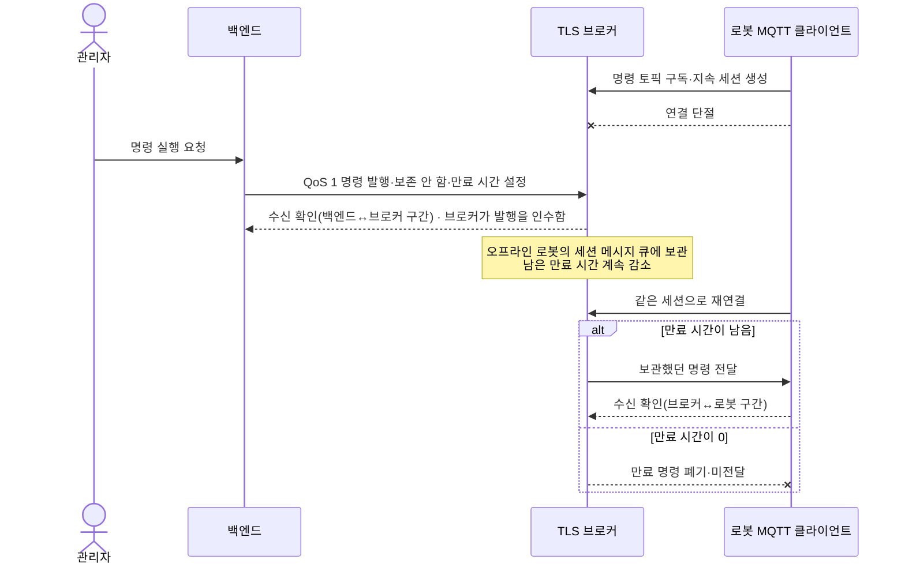
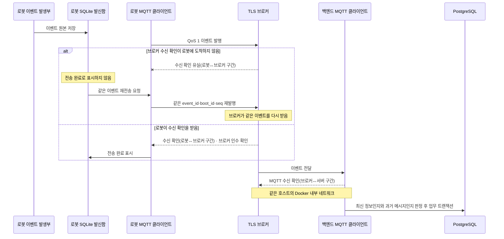
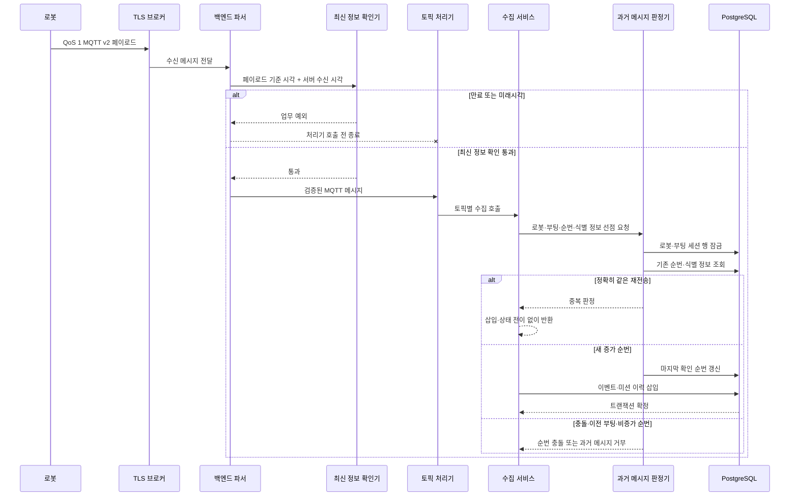

<nav class="project-toc" aria-label="MQTT 트러블슈팅 목차">
  <p>이 글에서 다루는 내용</p>
  <ol>
    <li><a href="#problem">문제 상황</a></li>
    <li><a href="#cause">원인</a></li>
    <li><a href="#solution">해결 과정</a></li>
    <li><a href="#verification">검증 결과</a></li>
    <li><a href="#limits">회고와 확장 과제</a></li>
  </ol>
</nav>

<h2 id="problem">문제 상황</h2>

1. **오프라인 로봇에 늦은 명령이 전달되는 문제**

   로봇이 명령 토픽을 구독한 지속 세션을 남긴 채 오프라인이 되면, TLS 브로커는
   오프라인인 로봇에게 명령을 전달할 수 없으므로 그 로봇으로부터 PUBACK을
   전달받지 못합니다. 따라서 TLS 브로커는 백엔드가 발행한 QoS 1 명령을 해당 로봇의
   지속 세션 메시지 큐에 보관합니다.
   브로커는 명령 JSON의 `expires_at`을 해석하지 않으므로, 별도 만료 속성이 없으면
   로봇 재연결 뒤 업무적으로 의미가 없어진 명령도 전달합니다. 이를 **백엔드
   발행기가 MQTT 5 메시지 만료 시간을 설정하고, TLS 브로커가 메시지 큐에서 남은 만료 시간을
   차감해 만료 명령을 폐기하는 방식**으로 해결했습니다.

2. **동일 이벤트가 Spring 수신부에 두 번 도착하는 문제**

   미션 시작 요청의 최초 주체는 관리자입니다. 백엔드는 관리자 요청을 받아
   `START_MISSION` 명령을 브로커로 발행하고, 로봇은 이 명령을 받아 실제 순찰 상태로
   전환합니다. 전환에 성공한 로봇이 “미션을 시작했다”는 실행 사실을 알리기 위해
   `MISSION_STARTED` 이벤트를 만들어 브로커를 통해 백엔드로 보냅니다.

   ```text
   관리자 → 백엔드: 미션 시작 요청
   백엔드 → 브로커 → 로봇: START_MISSION 명령
   로봇: 순찰 상태 전환 성공
   로봇 → 브로커 → 백엔드: MISSION_STARTED 이벤트
   ```

   MQTT 수신 확인은 종단 간 확인이 아니라 로봇↔브로커, 브로커↔서버 구간에서 각각
   처리됩니다. 같은 이벤트가 다시 전달되는 과정을 이해하려면 두 구간을 나누어 봐야
   합니다.

   1. **로봇–브로커 간 통신**

      로봇이 이벤트를 브로커에 발행했고 브로커가 받았지만, 브로커가 보낸 수신
      확인(PUBACK, 로봇↔브로커 구간)이 로봇에 도착하지 않을 수 있습니다. 이때
      로봇은 PUBACK을 받지 못하므로 브로커가 이벤트를 받았다는 사실을 알 수
      없습니다. 따라서 로봇은 SQLite 발신함의 이벤트를 전송 완료로 표시하지 않고
      다시 발행합니다. 이 경우에는 로봇이 같은 이벤트를 2회 발행하고, 브로커도 같은
      이벤트를 2회 받습니다.

      ```text
      로봇 → 브로커: 이벤트 첫 번째 발행
      브로커 → 로봇: 수신 확인 유실(로봇↔브로커 구간)
      로봇 발신함: 전송 완료로 표시하지 못함
      로봇 → 브로커: 같은 이벤트 두 번째 발행

      결과: 로봇 발행 2회 · 브로커 수신 2회 · 백엔드 전달 2회 가능
      ```

   2. **브로커–서버 간 통신**

      Spring 서버와 Mosquitto 브로커는 같은 호스트의 Docker 내부 네트워크에서
      통신합니다. 인터넷 구간을 지나지는 않지만 서로 다른 컨테이너와 프로세스로
      실행되기 때문에 브로커 컨테이너 재시작, 서버 재배포, Docker 네트워크 재생성
      때 MQTT 연결이 끊길 수 있습니다.

      ```text
      브로커 → Spring 서버: 이벤트 전달
      Spring 서버 → 브로커: MQTT 수신 확인(브로커↔서버 구간)
      ```

      PUBACK은 Spring MQTT 클라이언트의 이벤트 수신을 뜻하며, DB 트랜잭션 완료까지
      보장하지는 않습니다. 다만 같은 이벤트가 반복되거나 동시에 도착할 때 발생하는
      중복 삽입과 상태 전이는 한 번만 반영되도록 방어했습니다.

   | 통신 구간 | 이벤트 전달 | 수신 확인 | 연결 특성 |
   | --- | --- | --- | --- |
   | 로봇–브로커 간 통신 | 로봇 → 브로커 | 브로커 → 로봇 | 로봇의 SQLite 발신함에서 같은 이벤트를 다시 발행할 수 있음 |
   | 브로커–서버 간 통신 | 브로커 → Spring 서버 | Spring 서버 → 브로커 | 같은 Docker 내부 네트워크의 서로 다른 컨테이너가 통신함 |

   이 구조에서 같은 이벤트가 Spring 수신부에 두 번 들어오는 주된 흐름은 첫 번째
   구간에서 로봇이 SQLite 발신함에 남은 이벤트(PUBACK 미수신 등으로 전송 완료되지
   않은 이벤트)를 다시 발행하는 경우입니다. 같은 이벤트가 들어올 때마다 Spring MQTT
   수신 어댑터와 `MqttSubscriber`,
   `MqttInboundMessageDispatcher`는 실행됩니다. 따라서 목표를 “Spring에 한 번만
   도착하게 만들기”가 아니라 **여러 번 도착해도 데이터베이스에는 한 번만
   반영하기**로 정했습니다.

   ```text
   TLS 브로커 → Spring MQTT 수신부: 동일 이벤트 첫 번째 도착
   TLS 브로커 → Spring MQTT 수신부: 동일 이벤트 두 번째 도착
   Spring 처리기 실행: 2회 가능
   데이터베이스 이벤트·미션 이력 반영: 각각 1회만 허용
   ```

   Backend는 동일 이벤트를 도착할 때마다 새 행으로 저장하지 않습니다. 이벤트를
   받으면 데이터베이스에 쓰기 전에 다음 값을 확인합니다.

   - `event_id`: 어떤 사건인지 구분하는 이벤트 고유 번호
   - `boot_id`: 어느 로봇 통신 프로세스에서 만든 메시지인지 구분하는 부팅 세션 번호
   - `seq`: 해당 부팅 세션에서 몇 번째로 만든 메시지인지 나타내는 순번

   먼저 같은 `event_id`로 저장된 이벤트가 있으면 **이미 처리한 이벤트의 재전송**으로
   판정하고 `inserted=false`를 반환합니다. `MissionEventIngestionService`는 이 값을
   확인하고 즉시 종료하기 때문에 미션 상태를 다시 변경하거나 이력을 추가하지
   않습니다. 같은 `boot_id·seq`인데 `event_id`가 다르면 정상 재전송이 아니라 순번
   충돌로 거부합니다.

   애플리케이션 검사를 동시에 통과하는 경쟁 상황에도 대비했습니다.
   `robot_event.event_id`는 기본 키이고, `mission_status_history.source_event_id`에는
   고유 인덱스가 있습니다. 동일 이벤트가 두 번 수신돼도 `robot_event`와
   `mission_status_history`에는 각각 한 건만 반영됩니다.

3. **이전 부팅 세션 메시지가 현재 로봇 상태를 덮는 문제**

   이전 로봇 프로세스 A가 이벤트를 SQLite 발신함에 저장했지만, 브로커의 수신
   확인(로봇↔브로커 구간)을 받기 전에 통신이 끊기거나 프로세스가 종료될 수
   있습니다. SQLite 발신함은 메모리가 아니라 디스크 파일이기 때문에 프로세스 A가
   종료돼도 해당 구간의 수신 확인을 받지 못한 이벤트가 사라지지 않습니다.

   이후 새 프로세스 B가 시작되면 새 `boot_id`를 만들고 `seq=1`부터 현재 메시지를
   발행합니다. 로봇 MQTT 클라이언트는 브로커에 재연결한 뒤 SQLite 발신함에서
   프로세스 A의 미전송 이벤트도 다시 읽어 발행합니다. 이 때문에 백엔드가 프로세스
   B의 접속 메시지를 먼저 처리한 뒤, 프로세스 A가 만든 과거 이벤트를 나중에 받을 수
   있습니다.

   도착 순서나 숫자 `seq`만으로 현재 상태를 갱신하면, `seq=1`부터 다시 시작한 새
   프로세스와 이전 프로세스를 구분할 수 없습니다. 이를 **로봇 프로세스가 시작할 때
   UUIDv4 `boot_id`를 생성하고, 백엔드가 `boot_id·seq`를 함께 판정해 이미 교체된
   부팅 세션의 메시지를 과거 메시지 재처리로 거부하는 방식**으로 해결했습니다.

과거 메시지가 남는 이유는 **수신 측이 오프라인이어서 메시지를 받지 못했기
때문**이거나, **메시지는 전달됐지만 수신 확인이 유실되어 발신 측이 완료를 확인하지
못했기 때문**입니다. MQTT 구성 요소는 수신 완료가 확인되지 않은 메시지를 각자의
메시지 큐나 발신함에 보관합니다.

| 남는 상황 | 메시지를 보관하는 주체 | 다시 전달하는 주체 |
| --- | --- | --- |
| 오프라인 로봇이 명령을 아직 한 번도 받지 못함 | TLS 브로커의 지속 세션 메시지 큐 | TLS 브로커가 로봇 재연결 뒤 전달 |
| 로봇 이벤트를 브로커가 인수했지만 로봇이 수신 확인(로봇↔브로커 구간)을 받지 못함 | 로봇 SQLite 발신함 | 로봇 MQTT 클라이언트가 같은 이벤트 재발행 |

첫 번째는 아직 전달하지 못한 메시지이고, 두 번째는 브로커가 받았지만 로봇이 성공
확인을 받지 못해 다시 보내는 메시지입니다. 따라서 “미수신”뿐 아니라 “로봇–브로커
간 수신 확인 유실”도 과거 메시지가 남는 원인입니다.

<h2 id="cause">원인</h2>

MQTT QoS 1은 메시지가 **적어도 한 번 전송되는 At least once 규칙**을 따릅니다.
발신 측이 수신 확인(PUBACK)을 받지 못하면 같은 메시지를 재전송할 수 있으므로,
수신 측에는 중복 메시지가 도착할 수 있습니다. 이 규칙은 메시지가 최신인지, 동일
페이로드가 한 번만 처리됐는지, 같은 순번의 다른 페이로드가 충돌인지까지 판정하지
않습니다. 전달 품질과 업무 정합성을 같은 보장으로 보고 있던 것이 원인이었습니다.

| 필요한 성질 | QoS 1 제공 여부 | 별도 방어 |
| --- | --- | --- |
| 적어도 한 번 전송(At least once) | 제공 | QoS 1 |
| 만료 메시지 미전달 | 제공하지 않음 | MQTT 5 메시지 만료 시간 |
| 오래된 입력 거부 | 제공하지 않음 | 서버에서 최신 정보인지 확인 |
| 동일 페이로드 멱등 처리 | 제공하지 않음 | 식별 정보·처리 선점 |
| 데이터베이스 상태 전이 1회 보장 | 제공하지 않음 | 행 잠금·트랜잭션 |

### 메시지 방향과 처리 주체

MQTT에서 구독 클라이언트에게 `PUBLISH` 패킷을 직접 보내는 주체는 브로커입니다.
그러나 명령의 원 발행자는 백엔드이고, 상태·원격 측정값·이벤트의 원 발행자는 로봇
프로세스입니다. 브로커는 두 방향의 메시지를 중계하며, 필요한 경우 세션 메시지 큐와
QoS 1 전송 확인 대기 상태를 보관합니다.

| 메시지 | 원본을 만드는 주체 | 브로커에 발행하는 주체 | 최종 소비 주체 | 지연·재전송과 관련된 저장 위치 |
| --- | --- | --- | --- | --- |
| 명령 요청 | 관리자 요청을 처리한 백엔드 | 백엔드 `MqttV2Publisher` | 로봇 MQTT 클라이언트·명령 처리기 | TLS 브로커의 지속 세션 메시지 큐·QoS 1 전송 확인 대기 영역 |
| 상태 | 로봇 프로세스의 `MessageFactory` | 로봇 MQTT 클라이언트 | 백엔드 상태 처리기 | 브로커의 QoS 1 전송 확인 대기 영역·보존 상태값 |
| 원격 측정값 | 로봇 프로세스의 `MessageFactory` | 로봇 MQTT 클라이언트 | 백엔드 원격 측정값 처리기 | QoS 0·보존 안 함이므로 로봇 발신함 대상이 아님 |
| 이벤트 | 로봇 프로세스의 `MessageFactory` | 로봇 MQTT 클라이언트 | 백엔드 이벤트 처리기 | 로봇 SQLite 발신함·브로커의 QoS 1 전송 확인 대기 영역 |
| 명령 결과 | 명령을 실행한 로봇 프로세스 | 로봇 MQTT 클라이언트 | 백엔드 명령 결과 처리기 | 브로커의 QoS 1 전송 확인 대기 영역 |

`boot_id`도 브로커나 백엔드가 발급하지 않습니다. 임베디드의 `MessageFactory`가
**로봇 통신 프로세스 시작 시 UUIDv4를 한 번 생성**하고, 같은 프로세스 안에서 만든
상태·원격 측정값·이벤트에 넣습니다. MQTT 연결만 끊겼다가 자동 재연결되면 같은
`MessageFactory`와 `boot_id`를 유지하고, 로봇 통신 프로세스가 재시작되면 새
`boot_id`와 `seq=1`로 시작합니다. 명령 요청은 `boot_id·seq` 대신 `command_id`로
식별합니다.

```text
로봇 통신 프로세스 A 시작
└─ boot_id=A 생성, 공용 seq=1부터 증가
   ├─ MQTT 단절
   └─ 같은 프로세스로 재연결 → boot_id=A 유지

로봇 통신 프로세스 A 종료 후 프로세스 B 시작
└─ boot_id=B 새로 생성, 공용 seq=1부터 다시 시작
```

### 오프라인 큐와 PUBACK 유실

로봇이 오프라인일 때는 브로커가 아직 명령을 로봇에게 전달하지 못했으므로, 로봇의
수신 확인(PUBACK)을 기다리는 단계에도 들어가지 않았습니다. 이때는 백엔드가 발행한
명령을 기존 지속 세션의 메시지 큐에 보관했다가 로봇의 재연결 뒤 처음 전달합니다.



이 프로젝트의 로봇 MQTT 세션 만료 시간은 3,600초입니다. MQTT 메시지 만료 시간을
설정하지 않은 명령은 세션이 유지되고 브로커 메시지 큐 제한을 넘지 않는 동안 보관될
수 있습니다. 페이로드 JSON의 `expires_at`만으로는 브로커 메시지 큐에서 제거되지
않습니다. 브로커가 JSON 업무 필드를 해석하지 않기 때문입니다.

수신 확인(PUBACK, 브로커↔로봇 구간) 유실은 브로커가 명령을 이미 전달한 뒤
발생하는 별도 중복 경로입니다.

```text
TLS 브로커 ── 동일 명령 ──▶ 로봇 MQTT 클라이언트
TLS 브로커 ◀── 수신 확인(브로커↔로봇 구간) ── 로봇 MQTT 클라이언트
                     X 네트워크에서 유실
TLS 브로커 ── 동일 명령 재전송 ──▶ 로봇 MQTT 클라이언트
```

QoS 1은 이 재전송을 허용하므로 로봇 명령 처리기도 완료한 `command_id`를 기억하고
동일 명령을 다시 실행하지 않아야 합니다. 메시지 만료 시간은 늦은 전달을 줄이는
장치이고, `command_id` 캐시는 아직 유효한 명령의 중복 실행을 막는 장치이므로 서로
대체하지 않습니다.

### 로봇 SQLite Outbox 재발행

이벤트 방향은 명령과 반대입니다. 로봇 프로세스는 이벤트를 브로커에 발행하기 전에
SQLite 발신함(Outbox)에 먼저 저장하고, 브로커의 성공 수신 확인(PUBACK,
로봇↔브로커 구간)을 받은 뒤에만 전송 완료로 표시합니다. 해당 구간의 수신 확인을
받지 못하면 같은
`event_id·boot_id·seq·occurred_at`을 유지한 페이로드를 재연결 또는 재전송 주기에
다시 발행합니다.



여기서 수신 확인(PUBACK)은 해당 MQTT 구간의 수신 확인이지, 백엔드 업무
트랜잭션의 성공 응답이 아닙니다. 예를 들어 로봇이 브로커의 수신 확인을 받았더라도
백엔드가 최신 정보인지 확인하는 과정이나 과거 메시지 재처리 방어 과정에서 이벤트를
거부할 수 있습니다.

이전 프로세스 A의 이벤트가 SQLite 발신함이나 MQTT 전달 경로에 남아 있는 동안
프로세스 B가 시작되면, 두 프로세스가 만든 메시지의 도착 순서가 바뀔 수 있습니다.
이때 숫자 `seq`만 비교하면 B가 `seq=1`부터 다시 시작한다는 사실 때문에 부팅 전후를
구분할 수 없습니다. 백엔드는 현재 `boot_id`까지 함께 확인하여, 이미 B로 교체된 뒤
도착한 A의 메시지를 종료된 부팅 세션의 과거 메시지로 거부합니다.

<h2 id="solution">해결 과정</h2>

<ol class="process-flow" aria-label="MQTT 문제 해결 과정">
  <li>
    <span>1단계</span>
    <strong>지연과 중복을 따로 재현</strong>
    <p>만료 시간 2초·30초 명령을 발행하고 로봇을 4초 동안 끊었습니다. 같은 미션 이벤트도 두 번 발행했습니다.</p>
  </li>
  <li>
    <span>2단계</span>
    <strong>브로커와 서버의 책임 분리</strong>
    <p>브로커 메시지 큐에는 MQTT 5 메시지 만료 시간을, 업무 처리기 앞에는 최신성 검증을 적용했습니다.</p>
  </li>
  <li>
    <span>3단계</span>
    <strong>과거 메시지 처리 선점을 트랜잭션에 포함</strong>
    <p><code>boot_id + seq</code>와 메시지 식별 정보를 비교하고 처리 선점과 업무 삽입을 같은 데이터베이스 트랜잭션에서 처리했습니다.</p>
  </li>
  <li>
    <span>4단계</span>
    <strong>전달 건수와 DB 반영 결과 비교</strong>
    <p>이벤트·미션 이력·현재 상태의 실제 행 수를 함께 비교했습니다.</p>
  </li>
</ol>

### 구성 요소별 책임

| 클래스 | 역할 |
| --- | --- |
| 임베디드 `MessageFactory` | 로봇 통신 프로세스 시작 시 UUIDv4 `boot_id`를 만들고 상태·원격 측정값·이벤트가 공유하는 `seq`를 증가시킵니다. |
| 임베디드 `MqttClient`·SQLite `Outbox` | 이벤트를 발행 전에 저장하고 브로커의 성공 수신 확인 뒤 `sent`로 표시하며, 미확인 이벤트는 같은 식별 정보로 재전송합니다. |
| TLS 브로커 | 백엔드와 로봇 사이의 MQTT 패킷을 중계하고 지속 세션의 미전달 명령과 QoS 1 전송 확인 대기 상태를 관리합니다. 페이로드의 업무 의미는 판정하지 않습니다. |
| `MqttV2Publisher` | 명령의 `issuedAt·expiresAt` 차이로 MQTT 5 메시지 만료 시간(`Message Expiry Interval`)을 계산해 발행합니다. |
| `MqttMessageParser` | 토픽·QoS·스키마·페이로드·`mqtt_id`를 검증하고, 통과한 페이로드만 최신 정보 확인 단계로 넘깁니다. |
| `MqttInboundFreshnessGuard` | 서버 수신 시각과 페이로드 기준 시각을 비교해 만료 메시지와 허용 범위를 넘은 미래 시각을 업무 처리기 전에 거부합니다. |
| `MqttInboundMessageDispatcher` | 파서를 통과한 메시지를 토픽별 처리기에 전달하고, 거부된 메시지는 업무 서비스로 보내지 않습니다. |
| `MqttReplayProtectionService` | 로봇과 부팅 세션 행을 잠근 뒤 공용 `boot_id·seq`와 메시지 식별 정보를 비교합니다. |
| `RobotEventIngestionService` | 과거 메시지 처리 선점과 이벤트 삽입을 같은 트랜잭션에서 실행하고, 정확한 재전송에는 업무 부수 효과를 만들지 않습니다. |

### 수신부터 DB 반영까지



### Message Expiry(TTL)와 최신성 검증

발행 단계에서는 MQTT 5 `메시지 만료 시간(Message Expiry Interval)`을 설정했습니다.
브로커는 메시지 큐에 머문 시간을 차감하고 만료된 메시지를 전달하지 않습니다. 수신
단계에서는 백엔드가 페이로드의 발생 시각과 유효 시간을 다시 계산해 메시지가 최신
정보인지 확인하고, 기준을 벗어난 메시지는 업무 처리기와 데이터베이스 쓰기 전에
거부합니다.

메시지 만료 시간은 브로커를 통과하는 불필요한 전달을 줄입니다. 백엔드의 최신 정보
확인은 다른 발행자나 설정 오류 때문에 오래된 페이로드가 도착했을 때 업무 상태를
지키는 마지막 경계가 됩니다.

<div class="flow-strip" aria-label="MQTT 메시지 검증 흐름">
  <div><span>01</span><strong>백엔드 발행기</strong><small>명령 만료 시간 설정</small></div>
  <i aria-hidden="true">→</i>
  <div><span>02</span><strong>TLS 브로커</strong><small>메시지 큐·남은 만료 시간 관리</small></div>
  <i aria-hidden="true">→</i>
  <div><span>03</span><strong>최신 정보인지 확인</strong><small>발생 시각 다시 확인</small></div>
  <i aria-hidden="true">→</i>
  <div><span>04</span><strong>백엔드 과거 메시지 판정</strong><small>boot_id · seq 처리 선점</small></div>
  <i aria-hidden="true">→</i>
  <div><span>05</span><strong>PostgreSQL</strong><small>업무 트랜잭션</small></div>
</div>

<h4>브로커 큐의 명령 만료</h4>

`MqttV2Publisher`는 명령의 발행 시각과 만료 시각 차이를 초 단위로 계산합니다.
계산된 값은 `MqttPublisher`가 MQTT 5 메시지 만료 시간 헤더로 설정합니다.

```java
/* MqttV2Publisher.java */

public PublishResult publishCommand(
        String mqttId,
        CommandRequestPayload payload
) {
    long expirySeconds = Math.max(
            1,
            Duration.between(
                    payload.issuedAt(),
                    payload.expiresAt()).toSeconds());

    return publish(
            MqttTopicType.COMMAND_REQUEST,
            mqttId,
            payload,
            expirySeconds);
}

    // ... 토픽 생성과 페이로드 직렬화 ...
```

```java
/* MqttPublisher.java */

public boolean publish(
        String topic,
        String payload,
        int qos,
        boolean retained,
        Long messageExpiryIntervalSeconds
) {
    MessageBuilder<String> builder = MessageBuilder
            .withPayload(payload)
            .setHeader(MqttHeaders.TOPIC, topic)
            .setHeader(MqttHeaders.QOS, qos)
            .setHeader(MqttHeaders.RETAINED, retained);

    if (messageExpiryIntervalSeconds != null) {
        builder.setHeader(
                MqttHeaders.MESSAGE_EXPIRY_INTERVAL,
                messageExpiryIntervalSeconds);
    }

    return outboundChannel.send(builder.build());
}
```

로봇이 오프라인이면 브로커는 지속 세션 메시지 큐에서 남은 만료 시간을 줄입니다.
재연결 전에 값이 0이 된 명령은 전달하지 않고, 아직 만료 시간이 남아 있는 명령만
QoS 1로 전달합니다.

<h4>업무 처리 전 오래된 페이로드 차단</h4>

브로커의 메시지 만료 시간은 백엔드가 발행한 명령 메시지 큐를 보호합니다. 반대
방향으로 로봇이 보낸 원격 측정값·상태·이벤트·명령 결과는 `MqttMessageParser`
안에서 계약 검증을 통과한 직후 최신 정보인지 확인합니다. 이 메서드가 예외를 던지면
`ParsedMqttMessage`가 생성되지 않아 분배기가 업무 처리기를 호출하지 않습니다.

```java
/* MqttMessageParser.java */

public ParsedMqttMessage parse(MqttInboundMessage inboundMessage) {
    ParsedMqttTopic topic = topicParser.parse(inboundMessage.topic());
    validateQos(topic.type(), inboundMessage.qos());
    MqttV2Payload payload = deserialize(
            topic.type(),
            inboundMessage.payload());
    validateSchemaVersion(payload);
    validatePayload(payload);
    validateMqttId(topic, payload);

    freshnessGuard.validate(
            topic.type(),
            payload,
            inboundMessage.receivedAt());

    return new ParsedMqttMessage(
            topic,
            payload,
            inboundMessage.payload(),
            inboundMessage.qos(),
            inboundMessage.receivedAt());
}
```

```java
/* MqttInboundFreshnessGuard.java */

public void validate(
        MqttTopicType topicType,
        MqttV2Payload payload,
        Instant serverReceivedAt
) {
    FreshnessRule rule = rule(payload);
    if (rule == null) {
        return;
    }

    Duration age = Duration.between(
            rule.referenceTime(),
            serverReceivedAt);

    if (age.compareTo(futureTolerance.negated()) < 0) {
        reject(
                topicType,
                "future_timestamp",
                ErrorCode.MQTT_TIMESTAMP_IN_FUTURE);
    }
    if (age.compareTo(rule.maxDelay()) >= 0) {
        reject(
                topicType,
                "expired",
                ErrorCode.MQTT_MESSAGE_EXPIRED);
    }
}

// ... 페이로드 종류별 기준 시각과 최대 지연 선택 ...
```

| 페이로드 | 지연 계산의 시작 시각 | 기본 최대 지연 |
| --- | --- | ---: |
| 원격 측정값 | `sampledAt` | 60초 |
| 상태 | `updatedAt` | 300초 |
| 이벤트 | `occurredAt` | 페이로드의 `ttlSec` 60~300초 |
| 명령 결과 | `completedAt`, 없으면 `receivedAt` | 60초 |

서버보다 5초를 초과해 미래인 시각도 `MQTT_TIMESTAMP_IN_FUTURE`로 거부합니다. 만료와
미래 시각 모두 `gilbom.mqtt.inbound.rejected` 지표를 증가시킨 뒤 업무 처리기 전에
종료됩니다.

### Replay 선점과 업무 반영의 트랜잭션 경계

백엔드는 로봇 현재 상태 행을 잠근 뒤 `(robot, boot_id, seq)`와 메시지 식별 정보를
비교합니다. 처리 선점만 먼저 확정하고 업무 삽입이 실패하면 재시도 메시지를 처리
완료로 오판할 수 있기 때문에, 과거 메시지 처리 선점 갱신과 이벤트·미션 이력 삽입을
같은 트랜잭션에서 확정했습니다.

<h4>동일 순번의 중복·충돌 판정</h4>

| 입력 | 판정 | 업무 반영 |
| --- | --- | --- |
| 같은 `robot·boot_id·seq`와 같은 식별 정보 | `DUPLICATE` | 기존 이벤트를 반환하고 추가 삽입·상태 전이를 하지 않음 |
| 같은 `seq`지만 다른 토픽·식별 정보 | `MQTT_SEQUENCE_CONFLICT` | 거부 |
| 처음 보는 `boot_id`인데 `seq != 1` | `MQTT_REPLAY_REJECTED` | 거부 |
| 종료된 부팅 세션 또는 `seq <= last_seen_seq` | `MQTT_REPLAY_REJECTED` | 거부 |
| 새 부팅 세션의 `seq=1` 또는 현재 부팅 세션의 증가한 `seq` | `ACCEPTED` | 처리 선점을 갱신하고 업무 삽입 진행 |

```java
/* MqttReplayProtectionService.java */
public ClaimResult claim(
        MqttTopicType topicType,
        SequenceKind sequenceKind,
        UUID robotId,
        UUID bootId,
        long sequence,
        UUID messageKey,
        String schemaVersion,
        String rawPayload,
        Instant serverReceivedAt
) {
    UUID currentBootId = lockCurrentBoot(robotId);
    List<ExistingClaim> sequenceClaims = findSequenceClaims(
            robotId, bootId, sequence, rawPayload);

    if (!sequenceClaims.isEmpty()) {
        return resolveExistingClaim(
                topicType,
                sequenceKind,
                robotId,
                bootId,
                sequence,
                messageKey,
                sequenceClaims);
    }

    // ... 같은 식별 정보가 다른 seq에 사용됐는지 검사 ...
    OffsetDateTime receivedAt = utc(serverReceivedAt);
    BootSession session = lockBootSession(bootId);
    if (session == null) {
        if (sequence != 1L) {
            reject(topicType, "new_boot_sequence",
                    ErrorCode.MQTT_REPLAY_REJECTED);
        }
        // ... 새 부팅 세션 생성 ...
        session = lockBootSession(bootId);
    }

    if (session.lastSeenSequence() != null
            && sequence <= session.lastSeenSequence()) {
        reject(topicType, "non_increasing_sequence",
                ErrorCode.MQTT_REPLAY_REJECTED);
    }

    // ... 이전 부팅 세션 종료 및 새 부팅 세션 전환 ...
    updateBootSequence(robotId, bootId, sequence, receivedAt);
    updateCurrentSequence(
            robotId,
            bootId,
            sequence,
            receivedAt,
            currentBootId == null || !currentBootId.equals(bootId));
    return ClaimResult.ACCEPTED;
}
```

`resolveExistingClaim()`은 좌표만 같다고 중복으로 인정하지 않습니다. 이벤트는
`event_id`, 원격 측정값은 `message_id`와 페이로드까지 일치해야 `DUPLICATE`를
반환하며, 다르면 순번 충돌로 거부합니다.

```java
/* MqttReplayProtectionService.java · resolveExistingClaim() */
private ClaimResult resolveExistingClaim(
        MqttTopicType topicType,
        SequenceKind sequenceKind,
        UUID robotId,
        UUID bootId,
        long sequence,
        UUID messageKey,
        List<ExistingClaim> claims
) {
    // ... 한 seq에 처리 선점 기록이 둘 이상이면 충돌 ...
    ExistingClaim existing = claims.getFirst();

    boolean sameCoordinates = existing.robotId().equals(robotId)
            && existing.bootId().equals(bootId)
            && existing.sequence() == sequence;
    boolean sameIdentity = switch (sequenceKind) {
        case STATE -> existing.kind() == SequenceKind.STATE
                && existing.payloadMatches();
        case TELEMETRY -> existing.kind() == SequenceKind.TELEMETRY
                && messageKey.toString().equals(existing.messageKey())
                && existing.payloadMatches();
        case EVENT -> existing.kind() == SequenceKind.EVENT
                && messageKey.toString().equals(existing.messageKey());
    };

    if (sameCoordinates && sameIdentity) {
        return ClaimResult.DUPLICATE;
    }

    reject(topicType, "sequence_conflict",
            ErrorCode.MQTT_SEQUENCE_CONFLICT);
    throw new IllegalStateException("unreachable");
}
```

<h4>공용 seq 설계</h4>

`seq`는 토픽 안의 행 번호가 아니라 **한 로봇 프로세스가 만든 메시지의 발행
순서**입니다. 토픽별 계수기를 두면 `State seq=10`과 `Telemetry seq=10`이 모두
정상일 수 있어, 서로 다른 토픽에서 어떤 메시지가 먼저 만들어졌는지와 같은 순번이
재사용됐는지를 하나의 기준으로 판정할 수 없습니다.

| 공용 seq가 제공하는 기준 | 적용 결과 |
| --- | --- |
| 부팅 세션 안의 전체 발행 순서 | 상태·원격 측정값·이벤트를 토픽과 무관하게 한 순서로 비교 |
| 하나의 `last_seen_seq` | 현재 부팅 세션에서 이미 처리한 범위를 한 값으로 판정 |
| 교차 토픽 충돌 탐지 | 같은 `(robot, boot, seq)`가 다른 토픽·식별 정보에 쓰이면 충돌로 거부 |
| 프로세스 재시작 구분 | 새 `boot_id`는 `seq=1`부터 다시 시작하고 이전 부팅 세션의 신규 메시지는 거부 |

임베디드의 `MessageFactory`가 `seq` 계수기 하나를 소유하고, 상태·원격 측정값·이벤트
생성 메서드가 모두 같은 `next_seq()`를 호출합니다. 여러 발행 스레드가 같은 번호를
받지 않도록 계수기 자체도 잠금으로 보호합니다.

```python
/* factory.py · MessageFactory */
class MessageFactory:
    def __init__(
        self,
        robot_id: str,
        boot_id: str = None,
        event_ttl_sec: int = EVENT_TTL_DEFAULT_SEC,
    ) -> None:
        # ... 입력값 검증 ...
        self.robot_id = robot_id
        self.boot_id = boot_id or new_uuid()
        self.event_ttl_sec = event_ttl_sec
        self.topics = Topics(robot_id)
        self._seq = 0
        self._seq_lock = threading.Lock()

    def next_seq(self) -> int:
        with self._seq_lock:
            self._seq += 1
            return self._seq

    def state(
        self,
        *,
        mode: str,
        # ... 나머지 상태 입력 필드 ...
    ) -> dict:
        # ... 입력값 검증과 하위 Block 조립 ...
        return {
            "schema_version": SCHEMA_VERSION,
            "mqtt_id": self.robot_id,
            "boot_id": self.boot_id,
            "seq": self.next_seq(),
            # ...
        }

    def telemetry(
        self,
        *,
        position_valid: bool,
        # ... 나머지 원격 측정값 입력 필드 ...
    ) -> dict:
        # ... Position·Battery·Mission Block 조립 ...
        return {
            "schema_version": SCHEMA_VERSION,
            "mqtt_id": self.robot_id,
            "boot_id": self.boot_id,
            "seq": self.next_seq(),
            # ...
        }

    def event_envelope(
        self,
        *,
        event_type: str,
        source_component: str,
        occurred_at: str,
        # ... 나머지 이벤트 입력 필드 ...
    ) -> dict:
        return {
            "schema_version": SCHEMA_VERSION,
            "mqtt_id": self.robot_id,
            "boot_id": self.boot_id,
            "seq": self.next_seq(),
            # ...
        }
```

발행기는 메시지를 만들 때마다 1씩 증가시키지만 백엔드는 `last_seen_seq + 1`만
허용하지는 않습니다. QoS 0 원격 측정값이 유실될 수 있기 때문에 순번의 **누락은
허용**하고, 새 순번이 `last_seen_seq`보다 큰지만 확인합니다. 따라서 `10 → 12`는
승인할 수 있지만, 그 뒤 늦게 도착한 `11`은 이미 지난 메시지로 거부합니다. 접속
상태와 명령 결과는 이 공용 순번 계약에 포함되지 않고 각각 연결 상태와
`command_id·result_id`로 식별합니다.

<h4>미수신 이벤트가 늦게 도착할 때의 한계</h4>

백엔드가 더 큰 `seq`의 원격 측정값을 먼저 처리하면, 아직 저장하지 않은 낮은
`seq`의 이벤트도 `non_increasing_sequence`로 거부합니다. 이미 저장된 이벤트를
다시 받는 경우의 중복 방어와, 처음 도착한 이벤트를 빠짐없이 수집하는 보장은
다릅니다. 로봇 Outbox가 원래 `seq`로 재발행해도 이 거부 조건은 바뀌지 않습니다.

따라서 공용 순번의 단조 증가 검사만으로는 지연 이벤트의 수집을 보장하지 못합니다.
이벤트 이력의 멱등 수집과 현재 상태의 최신성 판정을 분리하고, 허용할 지연 범위와
종료된 부팅 세션의 이벤트 처리 정책을 별도로 정의하는 것이 확장 과제입니다.

<h4>행 잠금을 통한 동시성 제어</h4>

```sql
/* MqttReplayProtectionService.java · lockCurrentBoot() */
SELECT current_boot_id
FROM telemetry.robot_current_state
WHERE robot_id = ?
FOR UPDATE;

/* MqttReplayProtectionService.java · lockBootSession() */
SELECT robot_id, session_status, last_seen_seq,
       COALESCE(robot_connected_at, first_received_at) AS order_at
FROM telemetry.robot_boot_session
WHERE boot_id = ?
FOR UPDATE;
```

로봇의 현재 부팅 행과 해당 부팅 세션 행에 `FOR UPDATE` 잠금을 잡으므로, 같은 로봇의
메시지가 동시에 들어와도 각 요청은 앞선 트랜잭션의 `last_seen_seq` 갱신을 확인한 뒤
과거 메시지 여부를 판정합니다.

`@Transactional`만 선언하면 두 요청이 갱신 전의 같은 `last_seen_seq`를 동시에 읽을
수 있습니다. 예를 들어 상태와 원격 측정값이 모두 `seq=1`을 들고 오면 두 요청이 각각
자신을 최초 메시지로 승인할 수 있습니다. 먼저 로봇 행을 선점하면 한 요청만 검증을
진행하고, 다른 요청은 트랜잭션 확정 뒤 갱신된 순번과 기존 처리 선점 기록을 다시
보게 됩니다.

| 동시성 제어 방식 | 이 구조에서의 판단 |
| --- | --- |
| Java `synchronized` | 백엔드가 여러 인스턴스면 프로세스 사이의 경쟁을 막지 못함 |
| 개별 이력의 고유 제약만 사용 | 같은 토픽 중복은 막아도 상태·원격 측정값·이벤트 사이의 순서와 현재 상태 갱신을 함께 보호하지 못함 |
| 테이블 잠금 | 서로 다른 로봇 메시지까지 대기시켜 잠금 범위가 큼 |
| 로봇 행 `FOR UPDATE` | 같은 로봇만 직렬화하고 서로 다른 로봇은 병렬 처리 가능 |

행 잠금은 성능 향상을 위한 장치가 아니라 **과거 메시지 판정과 여러 업무 테이블
갱신의 정합성 경계**입니다. 잠금은 외부 API나 브로커 호출까지 유지하지 않고 수집
트랜잭션의 데이터베이스 작업이 확정되거나 되돌려질 때까지만 유지합니다.

<h4>Replay 선점과 미션 이력의 원자적 반영</h4>

```java
/* RobotEventIngestionService.java */
@Transactional
public RobotEventIngestionResult ingest(
        MqttEventPayload payload,
        Enum<?> eventType,
        String rawPayload,
        Instant receivedAt
) {
    // ... 로봇·미션 조회와 기존 event_id 확인 ...
    ClaimResult claim = replayProtectionService.claim(
            eventTopic(payload),
            SequenceKind.EVENT,
            robotId,
            payload.bootId(),
            payload.seq(),
            payload.eventId(),
            payload.schemaVersion(),
            rawPayload,
            receivedAt);

    if (claim == ClaimResult.DUPLICATE) {
        return new RobotEventIngestionResult(
                payload.eventId(), robotId, missionId, false);
    }

    // ... telemetry.robot_event INSERT ...
    return new RobotEventIngestionResult(
            payload.eventId(), robotId, missionId, true);
}
```

```java
/* MissionEventIngestionService.java */
@Transactional
public RobotEventIngestionResult ingest(
        MissionEventPayload payload,
        String rawPayload,
        Instant receivedAt
) {
    RobotEventIngestionResult event = eventIngestionService.ingest(
            payload, payload.eventType(), rawPayload, receivedAt);

    if (!event.inserted()) {
        return event;
    }

    MissionState current = lockMission(
            event.missionId(), event.robotId());
    String targetStatus = targetStatus(payload.eventType());

    updateMission(
            event.missionId(), event.robotId(), payload, targetStatus);
    appendHistory(
            event.missionId(),
            event.eventId(),
            current.status(),
            targetStatus,
            payload,
            receivedAt);
    return event;
}
```

`MissionEventIngestionService.ingest()`의 트랜잭션 안에서
`RobotEventIngestionService.ingest()`가 실행됩니다. 따라서 과거 메시지 순번 갱신,
`robot_event` 삽입, 미션 상태 변경, `mission_status_history` 삽입 중 하나라도
실패하면 전체를 되돌립니다. 정확한 재전송이면 `inserted=false`에서 반환하므로 미션
상태와 이력도 다시 만들지 않습니다.

<h2 id="verification">검증 결과</h2>

2026-07-30 로컬 TLS 브로커와 Mock Robot의 실행 결과입니다.

| 시나리오 | 결과 |
| --- | --- |
| 만료 시간 2초, 4초 뒤 재연결 | 전달 0건 |
| 만료 시간 30초, 4초 뒤 재연결 | 전달 1건 |
| 동일 미션 이벤트 2회 발행 | 이벤트 1건·미션 이력 1건 |

위 결과는 로컬 TLS 브로커와 Mock Robot 범위이며 실제 Jetson·EC2 환경 결과는 아닙니다.

<h2 id="limits">회고와 확장 과제</h2>

### 전송 확인과 DB 반영의 경계

QoS 1 중복 전달에 따른 DB 중복 삽입과 상태 전이는 `event_id`, `boot_id·seq`, 행 잠금,
트랜잭션으로 한 번만 반영되도록 막았습니다. 다만 PUBACK은 브로커의 수신 확인이며
Backend의 DB Commit 완료까지 보장하지 않습니다.

| 완료 경계 | 응답과 방향 | 로봇 Outbox 기록 | 적용 상태 |
| --- | --- | --- | --- |
| 브로커 수신 | PUBACK, 브로커 → 로봇 | `sent_at` | 적용 |
| DB 처리 | Ingest Receipt, Backend → 로봇 | `receipt_at·ingest_status` | 미연결 |

### Ingest Receipt

DB Commit 이후 `Ingest Receipt`를 발행하면 로봇은 `event_id`에 해당하는 Outbox 행을
완료 처리할 수 있습니다. Receipt가 없으면 로봇의 재전송 루프가 같은 원본 이벤트를
다시 발행하고, Backend는 기존 멱등 처리로 중복 삽입을 막습니다. 일시적인 DB 실패에는
성공 Receipt를 발행하지 않고, 영구적으로 처리할 수 없는 입력에는 `REJECTED`를
사용합니다.

Receipt Payload·발행기와 로봇의 Receipt 처리 코드는 존재하지만, DB Commit 이후
자동 발행과 `receipt_required=true` 연결은 적용하지 않았습니다. DB Commit과 Receipt
발행 사이의 유실까지 줄이려면 Receipt 발행 작업을 Transactional Outbox에 함께
기록하는 방식이 필요합니다.

### Backend MQTT 세션

Spring MQTT 클라이언트는 `cleanStart=true`로 연결합니다. 자동 재연결은 연결과 구독을
복구하지만 이전 세션의 대기 메시지와 전달 중 상태는 복구하지 않습니다. 서버 중단
중 QoS 1 메시지까지 이어받으려면 같은 Client ID, `cleanStart=false`, 0보다 큰 세션
만료 시간을 함께 적용해야 합니다. 메시지 자체의 만료 시간이 끝난 입력은 지속
세션에서도 폐기 대상입니다.

실제 Jetson·EC2 환경의 만료·중복·세션 복구 시나리오는 검증 범위에 포함하지 않았습니다.

<h2 id="sources">근거 문서</h2>

- `TROUBLESHOOTING/3_MqttTtlAndMessageExpiry.md`
- `TROUBLESHOOTING/4_MqttReplayProtection.md`
- `CHANGLOGS/2026-07-29_1339_mqtt-inbound-ttl-guard.md`
- `CHANGLOGS/2026-07-29_1527_mqtt-replay-protection.md`
