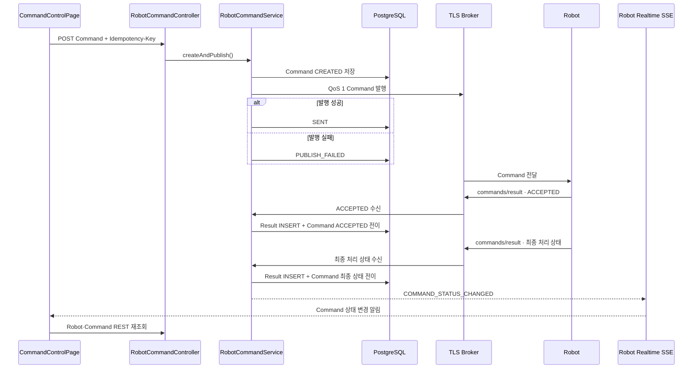

<nav class="project-toc" aria-label="Command 트러블슈팅 목차">
  <p>이 글에서 다루는 내용</p>
  <ol>
    <li><a href="#problem">문제 상황</a></li>
    <li><a href="#solution">해결 과정</a></li>
    <li><a href="#late-result">늦은 Result 방어</a></li>
    <li><a href="#verification">검증 결과</a></li>
    <li><a href="#limits">한계와 후속 검증</a></li>
  </ol>
</nav>

<h2 id="problem">문제 상황</h2>

관리 화면에서 Command POST가 `201 Created`를 반환해도 로봇이 명령을 받거나
실행했다는 뜻은 아닙니다. DB 저장, Backend의 MQTT 발행, Robot이 `commands/result`
토픽으로 보내는 `ACCEPTED`와 최종 처리 상태, Backend의 상태 변경 SSE 알림,
Browser의 최신 Robot·Command 상태 재조회는 각각 독립적으로 실패할 수 있습니다.

이 단계를 하나의 상태로 표현하면 MQTT 발행 실패와 Robot의 명령 거절을 구분할 수
없습니다. `ACCEPTED`도 Robot이 명령을 받았다는 응답일 뿐 최종 실행 성공이 아닙니다.
REST 재시도와 MQTT QoS 1 재전달이 겹치면 같은 Command나 Result가 중복 처리될 수
있습니다.

<h2 id="solution">해결 과정</h2>

`RobotCommandStatus`(ENUM)으로 Command 처리 상태를 구체화하고, MQTT 발행·Robot
수신·실행 결과에 따라 상태 전이를 관리했습니다. REST 접수부터 SSE 알림 이후 최신
상태 재조회까지 각 단계를 하나의 왕복 흐름으로 연결했습니다.

<div class="flow-strip flow-strip--command" aria-label="Command 전체 왕복 흐름">
  <div><span>01</span><strong>React</strong><small>확인 Modal</small></div>
  <i aria-hidden="true">→</i>
  <div><span>02</span><strong>REST · DB</strong><small>201 + commandId</small></div>
  <i aria-hidden="true">→</i>
  <div><span>03</span><strong>TLS MQTT</strong><small>QoS 1 Publish</small></div>
  <i aria-hidden="true">→</i>
  <div><span>04</span><strong>Robot</strong><small>ACCEPTED + 최종 상태</small></div>
  <i aria-hidden="true">→</i>
  <div><span>05</span><strong>SSE · REST</strong><small>최신 상태 재조회</small></div>
</div>

### 구현 클래스별 책임

| 클래스·모듈 | 역할 |
| --- | --- |
| `RobotCommandController` | `Idempotency-Key`가 포함된 Command POST를 받고 생성·발행 Service를 호출합니다. |
| `RobotCommandCreationService` | 사용자·요청·Payload Fingerprint로 중복 요청을 판정하고 `CREATED` Command를 저장합니다. |
| `RobotCommandService` | 저장된 Command를 MQTT Payload로 바꿔 발행하고 결과에 따라 `SENT` 또는 `PUBLISH_FAILED`로 전이합니다. |
| `RobotCommandResultIngestionService` | `commands/result` 토픽의 `ACCEPTED`와 최종 처리 상태를 멱등 저장하고 Command 상태를 전이합니다. |
| `RobotCommandTimeoutService` | TTL이 지난 미완료 Command를 잠근 뒤 `EXPIRED`로 확정합니다. |
| `useRobotRealtime` | `COMMAND_STATUS_CHANGED` SSE를 Backend 상태 변경 알림으로 전달합니다. |
| `RobotDetailPage`·`CommandControlPage` | SSE 대상 Robot을 확인하고 Command 목록과 Robot 상태를 REST로 다시 조회합니다. |



### `commands/result`의 접수 상태와 최종 처리 결과를 구분했습니다

Robot은 명령 접수 상태와 최종 처리 결과를 모두 `commands/result` 토픽으로
발행합니다. `ACCEPTED`는 Robot이 명령을 접수했다는 중간 상태이며, 실행 성공은
`COMPLETED`로 구분합니다. 수행 실패는 `FAILED`, 안전 조건 거절은 `REJECTED`, 제한
시간 초과는 `EXPIRED`, Broker 발행 실패는 `PUBLISH_FAILED`로 나눴습니다.

| 상태 | 의미 |
| --- | --- |
| `CREATED` | Command DB 저장 완료, MQTT 발행 전 |
| `SENT` | Broker 발행 성공, Robot 최종 결과 대기 |
| `PUBLISH_FAILED` | Broker 발행 실패 |
| `ACCEPTED` | Robot이 Command를 수신 |
| `COMPLETED` | Robot 수행 성공 |
| `FAILED` | 수행을 시작했지만 실패 |
| `REJECTED` | 안전·상태 조건으로 실행 거부 |
| `EXPIRED` | 제한 시간 안에 유효 Result가 없음 |

Command를 먼저 저장한 뒤 MQTT 발행 결과를 별도 상태로 기록합니다. Backend가 같은
사용자·`Idempotency-Key`·Robot·Command·Parameters를 REST 중복 요청(네트워크 응답
지연·유실 후 재시도 또는 같은 화면에서 동일 버튼 중복 클릭 등)으로 판정하면 기존
Command를 반환하고 MQTT를 다시 발행하지 않습니다. 이는 브로커의 메시지 보관 여부나
TTL이 아니라 동일한 실행 요청의 중복 발행을 막기 위한 처리입니다.

```java
/* RobotCommandService.java */
public RobotCommandResponse createAndPublish(
        UUID robotId,
        RobotCommandCreateRequest request,
        UUID actorUserId,
        UUID idempotencyKey,
        AuditRequestContext requestContext
) {
    CreatedCommand created = creationService.create(
            robotId,
            request,
            actorUserId,
            idempotencyKey,
            requestContext);

    if (!created.newlyCreated()) {
        return RobotCommandQueryService.toResponse(created.command());
    }

    RobotCommandRecord command = created.command();
    CommandRequestPayload payload = new CommandRequestPayload(
            "2.0",
            command.commandId(),
            command.commandType(),
            command.issuedAt(),
            command.expiresAt(),
            // ... 요청자와 Mission Parameter ...
    );

    try {
        mqttPublisher.publishCommand(command.mqttId(), payload);
        command = lifecycleService.markSent(
                command.commandId(), clock.instant());
    } catch (BusinessException exception) {
        command = lifecycleService.markPublishFailed(
                command.commandId(),
                clock.instant(),
                exception.errorCode().name());
    } catch (RuntimeException exception) {
        command = lifecycleService.markPublishFailed(
                command.commandId(),
                clock.instant(),
                "MQTT_PUBLISH_FAILED");
    }
    return RobotCommandQueryService.toResponse(command);
}
```

`commands/result` 토픽으로 들어오는 Result는 `result_id`를 기준으로 멱등 처리합니다.
Robot이 보낸 `ACCEPTED`와 최종 처리 상태는 한 테이블에 이력으로 남기되 Command의
현재 상태는 별도로 갱신합니다. 이미 저장된 `result_id`와 메시지 내용이 모두 같으면
QoS 1 재전송으로 판단해 추가 INSERT 없이 반환합니다.
반면 `EMERGENCY_STOP` 명령의 `ACCEPTED`에 사용한 `result_id`를 그대로 유지한 채
상태만 `COMPLETED`로 바꾸거나, 같은 `result_id`를 `CLEAR_EMERGENCY_STOP` 명령의
처리 결과에 다시 사용하면 식별자 충돌로 거부합니다. `ACCEPTED`와 최종 처리 상태에는
각각 새로운 `result_id`를 사용합니다.

```java
/* RobotCommandResultIngestionService.java */
@Transactional
public IngestionResult ingest(
        CommandResultPayload payload,
        String rawPayload,
        Instant serverReceivedAt
) {
    CommandTarget target = lockCommand(
            payload.commandId(), payload.mqttId());
    freshnessGuard.validateExpiry(
            MqttTopicType.COMMAND_RESULT,
            target.expiresAt(),
            serverReceivedAt);

    int inserted = jdbcTemplate.update("""
            INSERT INTO robot.robot_command_result (
                result_id, command_id, robot_id, result_status,
                server_received_at, raw_payload
            ) VALUES (?, ?, ?, ?, ?, ?::jsonb)
            ON CONFLICT (result_id) DO NOTHING
            """,
            // ... Result 값 ...
    );

    if (inserted == 0) {
        if (!isSameStoredResult(payload, rawPayload)) {
            throw new BusinessException(ErrorCode.COMMON_CONFLICT);
        }
        return new IngestionResult(false, false, target.status());
    }

    RobotCommandStatus nextStatus = nextStatus(
            target.status(), payload.status());
    boolean changed = nextStatus != target.status();
    if (changed) {
        // ... robot_command 현재 상태 UPDATE ...
        eventPublisher.publishEvent(
                RobotRealtimeEvent.commandStatusChanged(
                        target.robotId(),
                        target.mqttId(),
                        serverReceivedAt));
    }
    return new IngestionResult(true, changed, nextStatus);
}
```

### REST 중복 요청과 MQTT 재전달을 각각 막았습니다

같은 Command가 중복 처리되는 경로는 두 가지입니다.

1. Browser가 네트워크 응답 지연이나 중복 클릭으로 같은 REST 요청을 다시 보낼 수
   있습니다. Browser는 대상 Robot과 Command 내용이 같으면 동일한
   `Idempotency-Key`를 사용합니다. Backend는 이미 만든 Command를 반환하고 DB에 새
   Command를 저장하거나 MQTT로 다시 발행하지 않습니다.
2. MQTT QoS 1은 같은 메시지를 다시 전달할 수 있습니다. Robot은 `command_id`를
   확인합니다. Robot은 동일 프로세스에서 이미 완료한 `command_id`가 다시 들어오면
   Command를 재실행하지 않고 메모리에 보관한 최종 Result를 `commands/result` 토픽으로
   재발행합니다. Backend는 `result_id`를 확인해 같은 Result를 DB에 다시 저장하지
   않습니다.

이전 요청이 끝난 뒤 사용자가 Command를 다시 실행하거나 대상 Robot·Command 내용이
달라지면 Browser는 새로운 `Idempotency-Key`를 생성합니다.

```typescript
/* commandApi.ts · CommandCreateAttempt */
export class CommandCreateAttempt {
  private fingerprint: string | null = null
  private idempotencyKey: string | null = null

  keyFor(robotId: string, input: CommandCreateRequest): string {
    const nextFingerprint = commandFingerprint(robotId, input)
    if (
      this.idempotencyKey === null
      || this.fingerprint !== nextFingerprint
    ) {
      this.fingerprint = nextFingerprint
      this.idempotencyKey = this.uuidFactory()
    }
    return this.idempotencyKey
  }

  // ... 성공 뒤 reset() ...
}

export async function createRobotCommand(
  robotId: string,
  input: CommandCreateRequest,
  attempt: CommandCreateAttempt,
): Promise<CommandResponse> {
  const idempotencyKey = attempt.keyFor(robotId, input)
  const command = await apiJson(robotCommandPath(robotId), {
    method: 'POST',
    headers: { 'Idempotency-Key': idempotencyKey },
    body: jsonBody(input),
    ...REPLAY_SAFE_COMMAND,
  })
  attempt.markCompleted(idempotencyKey)
  return command
}
```

```java
/* RobotCommandCreationService.java */
@Transactional
public CreatedCommand create(
        UUID robotId,
        RobotCommandCreateRequest request,
        UUID actorUserId,
        UUID idempotencyKey,
        AuditRequestContext requestContext
) {
    byte[] principalKeyHash = sha256("USER\0" + actorUserId);
    byte[] idempotencyKeyHash = sha256(idempotencyKey.toString());
    byte[] requestFingerprint = sha256(
            REQUEST_METHOD + "\0"
                    + requestPath + "\0"
                    + request.commandType() + "\0"
                    + serialize(request.parameters()));

    int claimed = jdbcTemplate.update("""
            INSERT INTO request_control.idempotency_request (
                principal_type, principal_key_hash,
                idempotency_key_hash, request_fingerprint,
                request_method, request_path,
                lease_expires_at, expires_at
            ) VALUES (
                'USER', ?, ?, ?, ?, ?,
                NOW() + INTERVAL '1 minute',
                NOW() + INTERVAL '24 hours'
            )
            ON CONFLICT (
                principal_key_hash, idempotency_key_hash
            ) DO NOTHING
            """,
            // ... Hash와 요청 경로 ...
    );

    if (claimed == 0) {
        return new CreatedCommand(
                replayOrReject(
                        principalKeyHash,
                        idempotencyKeyHash,
                        requestFingerprint,
                        requestPath),
                false);
    }

    // ... robot_command CREATED INSERT와 멱등 응답 저장 ...
    RobotCommandRecord command = repository.findById(commandId)
            .orElseThrow();
    return new CreatedCommand(command, true);
}
```

<h2 id="late-result">늦은 Result 방어</h2>

늦게 도착한 Result가 이미 `EXPIRED`로 확정된 Command를 변경하지 못하는지 테스트하기
위해 Mock Robot이 `CANCEL_MISSION` Result를 의도적으로 31초 늦게 보내도록
설정했습니다. 31초는 실제 장애에서 측정한 지연 시간이 아니라 Backend의 30초 만료
기준을 넘기기 위한 테스트 조건입니다. Scheduler가 Command를 먼저 `EXPIRED`로
확정한 뒤 `ACCEPTED`와 `COMPLETED`가 도착했지만, Backend는 늦은 Result를 저장하지
않고 `EXPIRED` 상태를 유지했습니다.

`RobotCommandTimeoutService`는 아직 최종 상태가 아닌 Command만 잠가
`EXPIRED`로 바꿉니다. 그 뒤 도착한 Result는
`RobotCommandResultIngestionService`의 `validateExpiry()`에서 Result INSERT 전에
거부되므로, 이미 확정된 Command 상태를 되돌리지 못합니다.

```java
/* RobotCommandTimeoutService.java */
@Transactional
public int expireCommands(Instant detectedAt) {
    List<ExpiredTarget> targets = jdbcTemplate.query("""
            SELECT command.command_id,
                   command.robot_id,
                   robot.mqtt_id
            FROM robot.robot_command command
            JOIN robot.robot robot
              ON robot.robot_id = command.robot_id
            WHERE command.command_status IN (
                'CREATED', 'SENT', 'ACCEPTED'
            )
              AND command.expires_at <= ?
            FOR UPDATE OF command SKIP LOCKED
            """,
            // ... 만료 기준시각 ...
    );

    int expired = 0;
    for (ExpiredTarget target : targets) {
        int updated = jdbcTemplate.update("""
                UPDATE robot.robot_command
                SET command_status = 'EXPIRED',
                    completed_at = ?,
                    last_error_code = 'COMMAND_TTL_EXPIRED'
                WHERE command_id = ?
                  AND command_status IN (
                      'CREATED', 'SENT', 'ACCEPTED'
                  )
                """,
                // ...
        );
        if (updated == 1) {
            expired++;
            eventPublisher.publishEvent(
                    RobotRealtimeEvent.commandStatusChanged(
                            target.robotId(),
                            target.mqttId(),
                            detectedAt));
        }
    }
    return expired;
}
```

### SSE는 결과 Payload가 아니라 재조회 신호로 사용했습니다

Backend의 상태 전이가 Commit되면 `COMMAND_STATUS_CHANGED`가 Browser에 도착합니다.
`RobotDetailPage`는 현재 보고 있는 Robot의 Event만 받아 Revision을 올리고 Robot
상태를 Backend에서 다시 조회합니다. `CommandControlPage`는 그 Revision 변화에 맞춰
Command 목록을 다시 읽습니다.

```typescript
/* RobotDetailPage.tsx · refreshRobotSnapshot() */
const refreshRobotSnapshot = useCallback(async (
  event?: RobotRealtimeEvent,
) => {
  if (event !== undefined && event.robotId !== robotId) {
    return
  }
  if (
    event === undefined
    || event.eventType === 'COMMAND_STATUS_CHANGED'
  ) {
    setCommandRealtimeRevision((current) => current + 1)
  }

  setRobot(await getRobot(robotId))
}, [robotId])
```

```typescript
/* CommandControlPage.tsx · Command Snapshot 재조회 */
const loadControlData = useCallback(async () => {
  await Promise.all([
    loadCommands(),
    loadMission(),
  ])
}, [loadCommands, loadMission])

useEffect(() => {
  const timer = window.setTimeout(() => {
    void loadControlData()
  }, 0)
  return () => window.clearTimeout(timer)
}, [loadControlData, realtimeRevision])
```

<ol class="process-flow" aria-label="Command 검증 과정">
  <li>
    <span>NORMAL</span>
    <strong>6종 Command를 7회 실행</strong>
    <p>긴급정지 해제 뒤 재개를 한 번 더 수행해 각 Command의 <code>ACCEPTED</code> 메시지와 <code>COMPLETED</code> 메시지를 대조했습니다.</p>
  </li>
  <li>
    <span>FAILURE</span>
    <strong>Broker를 실제로 중단</strong>
    <p>발행 시도 중 Broker를 멈춰 <code>PUBLISH_FAILED</code>를 만들고 재기동 뒤 자동 재연결을 확인했습니다.</p>
  </li>
  <li>
    <span>DELAY</span>
    <strong>Result를 31초 지연</strong>
    <p>만료 뒤 도착한 Result의 DB 저장이 0건이고 Command가 <code>EXPIRED</code>로 유지되는지 확인했습니다.</p>
  </li>
  <li>
    <span>DUPLICATE</span>
    <strong>REST와 MQTT를 각각 중복 전송</strong>
    <p>Command 1건·Publish 1회, Result 행 증가 0건을 DB에서 확인했습니다.</p>
  </li>
</ol>

<h2 id="verification">검증 결과</h2>

### 정상 명령 처리 테스트

2026-08-12에 6개 Command 유형을 7회 실행했습니다. 두 번째 `RESUME_MISSION`은
긴급정지 복구 뒤 다시 진행할 수 있는지 확인하기 위한 실행입니다. 7개 Command는 모두
`COMPLETED`였고 각 Command마다 `ACCEPTED`와 `COMPLETED`가 1건씩 저장돼 Result는
총 14건이었습니다.

<figure class="verification-shot verification-shot--bottom">
  <a href="{{ '/assets/images/projects/gilbom/command-normal-completed.png' | relative_url }}" aria-label="Command 정상 처리 화면 크게 보기">
    
  </a>
  <figcaption>
    <strong>6종·7회 Command 정상 왕복</strong>
    <p>2026-08-12 촬영. 이미지를 누르면 전체 화면을 확인할 수 있습니다.</p>
  </figcaption>
</figure>

### 발행 실패·실행 실패·거절·만료·중복 처리 테스트

명령 처리 단계마다 실패 조건을 의도적으로 만들어 상태가 구분되는지 테스트했습니다.

| 테스트 조건 | 확인할 Command 상태와 처리 |
| --- | --- |
| Backend가 MQTT를 발행할 때 Broker 중단 | `PUBLISH_FAILED` |
| Mock Robot이 `PAUSE_MISSION` 실행 실패 응답 | `FAILED` |
| Mock Robot이 `EMERGENCY_STOP` 실행 거절 응답 | `REJECTED` |
| Mock Robot이 `CANCEL_MISSION` Result를 31초 지연 | `EXPIRED` 유지·늦은 Result 저장 차단 |
| 같은 REST 요청과 MQTT 메시지 중복 전송 | 새 Command·Publish·Result 행 생성 차단 |
| Broker 재기동 | Backend 재시작 없이 MQTT 자동 재연결 후 후속 Command 처리 |

<figure class="verification-shot verification-shot--bottom">
  <a href="{{ '/assets/images/projects/gilbom/command-abnormal-states.png' | relative_url }}" aria-label="Command 실패·거절·만료 상태 화면 크게 보기">
    
  </a>
  <figcaption>
    <strong>실패 원인을 한 상태로 뭉치지 않았습니다</strong>
    <p>2026-08-12 촬영. <code>PUBLISH_FAILED</code>, <code>FAILED</code>, <code>REJECTED</code>, <code>EXPIRED</code>를 UI·REST·DB와 대조했습니다.</p>
  </figcaption>
</figure>

| 검증 | 결과 |
| --- | --- |
| 정상 Command | 6종·7회, 모두 `COMPLETED` |
| 정상 Result | `ACCEPTED` 7건·`COMPLETED` 7건 |
| 늦은 Result | DB 저장 0건·`EXPIRED` 유지 |
| Broker 복구 | Backend `RestartCount=0` |

<h2 id="limits">한계와 후속 검증</h2>

- 실제 Jetson의 모터 제어·안전 조건과 EC2 Network·ACL 지연은 검증하지 않았습니다.
- 운영 표현 전에는 실제 Jetson·EC2에서 정상 1회, 거절 1회, 만료 1회를 다시 확인해야 합니다.

<h2 id="sources">근거 문서</h2>

- `TROUBLESHOOTING/14_CommandNormalRoundtrip.md`
- `CHANGLOGS/2026-07-30_1526_command-frontend-foundation.md`
- `CHANGLOGS/2026-07-30_1602_command-controls-modal.md`
- `CHANGLOGS/2026-07-30_1656_command-status-ack-timeout-ui.md`
- `CHANGLOGS/2026-07-30_1730_command-normal-roundtrip.md`
- `CHANGLOGS/2026-07-30_1759_command-abnormal-roundtrip.md`
