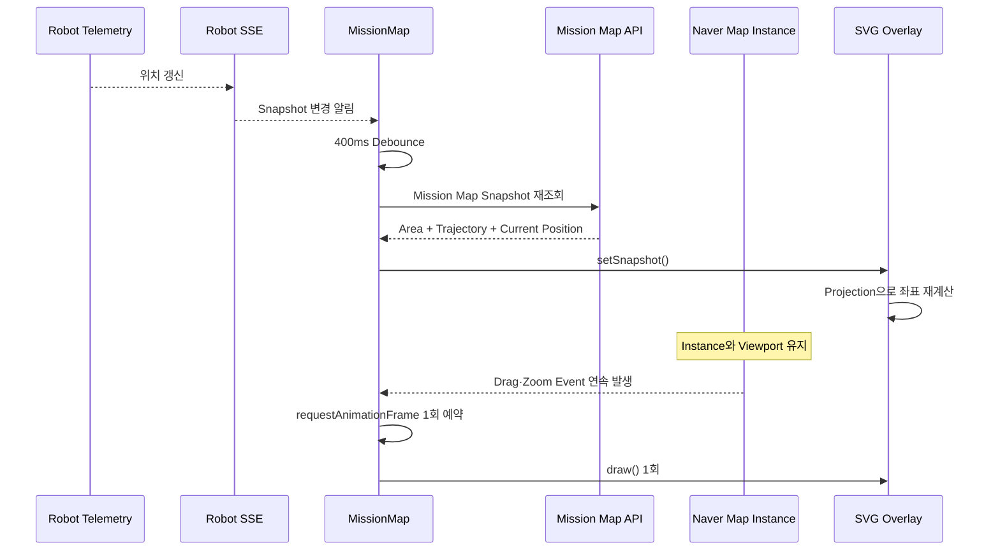

<nav class="project-toc" aria-label="Mission Map 트러블슈팅 목차">
  <p>이 글에서 다루는 내용</p>
  <ol>
    <li><a href="#problem">문제 상황</a></li>
    <li><a href="#cause">원인</a></li>
    <li><a href="#solution">해결 과정</a></li>
    <li><a href="#verification">검증 결과</a></li>
    <li><a href="#limits">한계와 후속 검증</a></li>
  </ol>
</nav>

<h2 id="problem">문제 상황</h2>

Mission 상세는 순찰 구역, 실제 GPS 궤적, 현재 Robot 위치를 같은 지도에
표시합니다. Telemetry SSE가 들어올 때마다 상세 화면 전체를 Loading으로 바꾸면서
`MissionMap`이 언마운트됐습니다. 이때 지도와 Marker가 함께 사라지고 노란색 Loading
Spinner가 잠깐 나타났다 사라졌습니다. Map이 다시 만들어질 때마다 `fitBounds`도
실행돼 사용자가 맞춘 Zoom과 Viewport가 초기화됐습니다. 이 Spinner 교체가 당시 약
3초 주기의 SSE마다 반복돼 지도 전체가 깜빡였으며, 이 글에서 제거한 대상은 이 반복
리마운트입니다.

<h2 id="cause">원인</h2>

문제는 좌표 계산이 아니라 **Map과 실시간 데이터의 수명주기를 같게 둔 것**이었습니다.
Map은 Mission을 선택한 동안 유지해야 하지만 Trajectory와 Marker는 Snapshot마다
바뀌어야 했습니다. Drag·Zoom·SSE 이벤트마다 전체 궤적을 즉시 다시 계산하면 같은
Browser Frame 안에서 중복 렌더링도 발생할 수 있었습니다.

### 문제의 코드: Loading 분기에서 MissionMap을 제거했습니다

`detailLoading`은 지도 생성 Effect의 의존성이 아니었습니다. 하지만 부모 컴포넌트가
이 값을 조건부 렌더링에 사용해, 상세 정보를 다시 조회할 때마다 `MissionMap`을 DOM에서
제거했습니다.

```tsx
{detailLoading ? (
  <div className="admin-loading" role="status">
    <span className="loading-spinner" aria-hidden="true" />
    임무 상세와 상태 이력을 불러오는 중입니다.
  </div>
) : detailError ? (
  <div className="page-alert" role="alert">
    {getApiErrorMessage(detailError)}
  </div>
) : selectedMission === null ? (
  <div className="empty-state mission-detail-empty">
    <h3>임무를 선택해주세요.</h3>
  </div>
) : (
  <>
    {/* 임무 진행률과 상세 정보 */}
    <MissionMap
      missionId={selectedMission.missionId}
      missionCode={selectedMission.missionCode}
      patrolAreaName={selectedMission.patrolAreaName}
    />
    {/* 임무 상태 이력 */}
  </>
)}
```

SSE 재조회가 시작돼 `detailLoading`이 `true`가 되면 React는 `MissionMap`을
언마운트하고 지도 생성 Effect의 정리 함수에서 `destroy()`를 실행했습니다. 조회가
끝나 `false`가 되면 `MissionMap`을 다시 마운트하면서 지도 생성 Effect가 다시
실행됐습니다.

<h2 id="solution">해결 과정</h2>

해결의 핵심은 **Map 생성과 Snapshot 갱신을 서로 다른 Effect로 분리한 것**입니다.
Map 생성 Effect는 지도 인스턴스를 한 번 만들고, Snapshot 갱신 Effect는 기존 지도를
유지한 채 궤적과 현재 위치만 바꿉니다.

<ol class="process-flow" aria-label="Mission 지도 문제 해결 과정">
  <li>
    <span>STEP 01</span>
    <strong>상세 DOM을 유지</strong>
    <p>SSE 재조회 중 기존 상세를 Spinner로 교체하지 않고 현재 화면 위에서 Snapshot을 갱신했습니다.</p>
  </li>
  <li>
    <span>STEP 02</span>
    <strong>Map 생성과 Snapshot 갱신 분리</strong>
    <p>Map 생성 Effect와 Snapshot 갱신 Effect를 나누고, Area·Trajectory·Marker는 하나의 React SVG Overlay에서 갱신했습니다.</p>
  </li>
  <li>
    <span>STEP 03</span>
    <strong>Drag·Zoom 좌표 재투영</strong>
    <p>지도 이동과 확대 이벤트에서 지리 좌표를 화면 좌표로 다시 계산했습니다.</p>
  </li>
  <li>
    <span>STEP 04</span>
    <strong>Browser Frame 단위로 병합</strong>
    <p>연속 이벤트는 <code>requestAnimationFrame</code>당 한 번만 최신 Projection으로 그렸습니다.</p>
  </li>
</ol>

<div class="flow-strip" aria-label="Mission 지도 갱신 흐름">
  <div><span>KEEP</span><strong>Map 1개</strong><small>Mission 수명주기</small></div>
  <i aria-hidden="true">+</i>
  <div><span>KEEP</span><strong>SVG Overlay 1개</strong><small>Map에 부착</small></div>
  <i aria-hidden="true">←</i>
  <div><span>UPDATE</span><strong>REST Snapshot</strong><small>SSE·Drag·Zoom</small></div>
  <i aria-hidden="true">←</i>
  <div><span>MERGE</span><strong>Animation Frame</strong><small>Frame당 1회</small></div>
</div>

### 구현 컴포넌트별 책임

| 컴포넌트·함수 | 역할 |
| --- | --- |
| `MissionManagePage` | SSE 재조회 중에도 기존 Mission 상세 DOM을 유지하고 새 상세 Snapshot만 교체합니다. |
| `MissionMap` | SSE를 변경 신호로 받아 400ms 안에 연속된 알림을 하나의 Mission Map REST 재조회로 병합합니다. |
| `MissionNaverMap` | 같은 Mission을 보는 동안 Naver Map Instance와 Viewport를 유지합니다. |
| `createMissionMapOverlay()` · `MapAttachedMissionOverlay` | `MissionMapOverlay` 타입을 구현한 Overlay를 생성하고, Area·Trajectory·현재 위치를 하나의 SVG Layer에서 최신 Snapshot으로 다시 그립니다. |
| `scheduleOverlayRedraw` | Drag·Zoom에서 발생한 여러 Map Event를 다음 Animation Frame의 `draw()` 한 번으로 합칩니다. |

`MissionMapOverlay`는 `setSnapshot()`을 포함한 Overlay 타입입니다.
`createMissionMapOverlay()` 팩토리 함수가 이 타입을 구현한
`MapAttachedMissionOverlay` 인스턴스를 생성합니다.



### Map과 Overlay의 역할을 나눴습니다

Map SDK는 배경 Tile과 좌표 Projection만 담당합니다. 순찰 구역, 궤적, 현재 위치는
Map에 부착된 하나의 React SVG Overlay에서 그립니다. SSE는 Snapshot REST를 다시
읽게 하지만, 같은 Mission을 보는 동안 Map Instance와 사용자가 맞춘 Viewport는
유지합니다.

<figure class="verification-shot verification-shot--media-crop">
  
  <figcaption>
    <span>LIVE TRAJECTORY UPDATE</span>
    <strong>지도 화면을 유지한 궤적 갱신</strong>
    <p>궤적 좌표 수가 44개에서 47개로 늘고 현재 위치가 이동하는 동안 Loading 화면으로 바뀌지 않고 같은 Zoom과 Viewport를 유지합니다.</p>
  </figcaption>
</figure>

<h4>백그라운드 재조회 중에도 기존 상세 DOM을 유지합니다</h4>

`detailLoading`만으로 전체 상세를 Spinner로 교체하지 않습니다. 처음 열어 아직
`selectedMission`이 없을 때만 Loading을 표시하고, 기존 상세가 있으면 Map을 그대로
둔 채 새 응답으로 상태만 교체합니다.

```typescript
/* MissionManagePage.tsx · Mission 상세 Snapshot */
const loadMissionDetail = useCallback(async (missionId: string) => {
  requestedDetailIdRef.current = missionId
  setDetailLoading(true)
  setDetailError(null)
  try {
    const [mission, statusHistory] = await Promise.all([
      getMission(missionId),
      getMissionHistory(missionId),
    ])
    if (requestedDetailIdRef.current !== missionId) {
      return
    }
    setSelectedMission(mission)
    setHistory(statusHistory.history)
  } finally {
    if (requestedDetailIdRef.current === missionId) {
      setDetailLoading(false)
    }
  }
}, [])

// ... JSX ...
{detailLoading && selectedMission === null ? (
  <div className="admin-loading" role="status">
    임무 상세와 상태 이력을 불러오는 중입니다.
  </div>
) : selectedMission === null ? (
  <div className="empty-state mission-detail-empty">
    임무를 선택해주세요.
  </div>
) : (
  <MissionMap
    missionId={selectedMission.missionId}
    missionCode={selectedMission.missionCode}
    patrolAreaName={selectedMission.patrolAreaName}
  />
)}
```

<h3>핵심: Map 생성과 Snapshot 갱신을 서로 다른 Effect로 분리합니다</h3>

첫 번째 Effect는 Map을 한 번 생성하고 Component가 실제로 해제될 때만
`destroy()`합니다. 두 번째 Effect는 `snapshot`이 바뀌어도 기존 Map과 Overlay를
재사용합니다. `fitBounds`도 Mission ID가 달라질 때만 실행하므로 Telemetry 갱신이
사용자의 Zoom을 초기화하지 않습니다.

```typescript
/* MissionMap.tsx · MissionNaverMap */
const mapRef = useRef<naver.maps.Map | null>(null)
const fittedMissionIdRef = useRef<string | null>(null)
const initialSnapshotRef = useRef(snapshot)
const missionOverlayRef = useRef<MissionMapOverlay | null>(null)

useEffect(() => {
  // ... Naver SDK와 Projection 준비 ...
  const { maps } = window.naver
  const initialSnapshot = initialSnapshotRef.current
  const initialCoordinates = missionViewportCoordinates(initialSnapshot)
  const [centerLongitude, centerLatitude] = coordinateCenter(
    initialCoordinates,
  )
  const map = new maps.Map(mapElementRef.current, {
    center: new maps.LatLng(centerLatitude, centerLongitude),
    zoom: initialCoordinates.length === 1 ? 17 : 15,
  })
  mapRef.current = map

  return () => {
    missionOverlayRef.current?.setMap(null)
    missionOverlayRef.current = null
    mapRef.current?.destroy()
    mapRef.current = null
    fittedMissionIdRef.current = null
  }
}, [])

useEffect(() => {
  if (status !== 'ready' || mapRef.current === null || !window.naver) {
    return
  }
  const map = mapRef.current
  if (missionOverlayRef.current === null) {
    missionOverlayRef.current = createMissionMapOverlay(
      window.naver.maps,
      mapElementRef.current as HTMLElement,
      snapshot,
    )
    missionOverlayRef.current.setMap(map)
  } else {
    missionOverlayRef.current.setSnapshot(snapshot)
  }

  if (fittedMissionIdRef.current !== snapshot.missionId) {
    fitMapToCoordinates(
      map,
      window.naver.maps,
      missionViewportCoordinates(snapshot),
    )
    fittedMissionIdRef.current = snapshot.missionId
  }
}, [snapshot, status])
```

<h4>SSE 여러 건을 Map Snapshot 한 번으로 다시 읽습니다</h4>

SSE Payload로 지도 좌표를 직접 수정하지 않습니다. SSE는 데이터가 변경됐다는
알림으로만 사용합니다. 알림을 받으면 Frontend가
`GET /api/v1/missions/{missionId}/map?limit=5000`을 호출해 Backend DB에 저장된
순찰 구역, 궤적과 현재 위치를 다시 가져옵니다.
400ms 안에 Event가 연속으로 오면 앞 Timer를 취소해 마지막 한 번만 조회하며, 늦게
끝난 이전 요청은 `requestSequenceRef` 비교로 화면을 덮지 못합니다.

```typescript
/* MissionMap.tsx · Mission Snapshot 재조회 */
const loadSnapshot = useCallback(async () => {
  const sequence = requestSequenceRef.current + 1
  requestSequenceRef.current = sequence
  const result = await getMissionMap(missionId)

  if (requestSequenceRef.current === sequence) {
    setSnapshot(result)
    setLastSyncedAt(new Date().toISOString())
  }
}, [missionId])

const scheduleSnapshot = useCallback(() => {
  if (refreshTimerRef.current !== null) {
    window.clearTimeout(refreshTimerRef.current)
  }
  refreshTimerRef.current = window.setTimeout(() => {
    refreshTimerRef.current = null
    void loadSnapshot()
  }, SNAPSHOT_DEBOUNCE_MILLIS) // 400ms
}, [loadSnapshot])

useRobotRealtime(scheduleSnapshot)
```

문제가 발생했을 당시 Telemetry 주기는 약 3초로 400ms 디바운스보다 길었기 때문에
재조회가 계속 밀리지는 않았습니다. 400ms보다 짧은 간격으로 SSE가 끊임없이 들어오는
환경이라면 trailing debounce의 타이머가 계속 초기화될 수 있으므로, 최대 대기 시간을
둔 throttle로 바꿔야 합니다.

### 이벤트를 한 Browser Frame으로 병합했습니다

`drag`, `panning`, `zooming`, `bounds_changed`, `zoom_changed`, `idle`을 같은
재투영 경로로 연결했습니다. 예약된 Frame이 있으면 추가 예약을 생략하고
`requestAnimationFrame`당 한 번만 최신 Projection으로 Area·Trajectory·Marker를
함께 갱신합니다.

```typescript
/* MissionMap.tsx · MissionNaverMap Viewport Event */
useEffect(() => {
  if (status !== 'ready' || mapRef.current === null || !window.naver) {
    return
  }
  const { maps } = window.naver
  const map = mapRef.current
  let redrawFrame: number | null = null

  const scheduleOverlayRedraw = () => {
    if (redrawFrame !== null) {
      return
    }
    redrawFrame = window.requestAnimationFrame(() => {
      redrawFrame = null
      missionOverlayRef.current?.draw()
    })
  }

  const viewportEvents = [
    'drag',
    'panning',
    'zooming',
    'bounds_changed',
    'size_changed',
    'zoom_changed',
    'dragend',
    'idle',
  ] as const
  const listeners = viewportEvents.map((eventName) => (
    maps.Event.addListener(map, eventName, scheduleOverlayRedraw)
  ))

  return () => {
    listeners.forEach((listener) => maps.Event.removeListener(listener))
    if (redrawFrame !== null) {
      window.cancelAnimationFrame(redrawFrame)
    }
  }
}, [status])
```

`draw()`는 그 시점의 Naver Projection으로 Area Polygon, 전체 Trajectory와 현재
Robot Marker를 같은 Frame에서 재투영합니다. Event 수만큼 렌더링하는 것이 아니라
Browser가 실제로 그릴 Frame 수에 맞춰 갱신 횟수를 제한합니다.

<h2 id="verification">검증 결과</h2>

Fake Naver SDK Fixture는 처음에 Trajectory 3점과 영역 안의 현재 위치를
반환합니다. 이후 `ROBOT_TELEMETRY_UPDATED` SSE를 발생시켜 Trajectory 4점과
이동한 현재 위치를 반환했습니다.

<div class="verification-pair">
  <figure class="verification-shot">
    <a href="{{ '/assets/images/projects/gilbom/mission-map-before-sse.png' | relative_url }}" aria-label="Mission 지도 SSE 갱신 전 화면 크게 보기">
      
    </a>
    <figcaption>
      <span>BEFORE / 3 POINTS</span>
      <strong>SSE 갱신 전</strong>
      <p>2026-08-12 촬영. Fake Naver SDK·로컬 Chromium 기준으로 Trajectory 3점, 현재 위치는 순찰 구역 내부입니다.</p>
    </figcaption>
  </figure>
  <figure class="verification-shot">
    <a href="{{ '/assets/images/projects/gilbom/mission-map-after-sse.png' | relative_url }}" aria-label="Mission 지도 SSE 갱신 후 화면 크게 보기">
      
    </a>
    <figcaption>
      <span>AFTER / 4 POINTS</span>
      <strong>SSE 갱신 후</strong>
      <p>2026-08-12 촬영. 같은 Fake Map Instance에서 Trajectory 4점, Marker 이동과 영역 이탈 경고가 반영됐습니다.</p>
    </figcaption>
  </figure>
</div>

두 사진은 같은 Fake Map Instance에서 촬영했습니다. 데이터는 바뀌었지만 Map 생성은
1회, 파괴는 0회, `fitBounds`는 최초 1회를 유지했습니다. Naver Native Polygon,
Polyline, Marker는 각각 0개이고 Map에 부착된 SVG Overlay 1개만 유지했습니다.

| 측정 항목 | SSE 전 | SSE 후 |
| --- | ---: | ---: |
| Map 생성 | 1 | 1 |
| Map 파괴 | 0 | 0 |
| `fitBounds` | 1 | 1 |
| SVG Overlay | 1 | 1 |
| Trajectory | 3점 | 4점 |

2026-08-12 Playwright 1건은 7.1초에 통과했습니다.

<h2 id="limits">한계와 후속 검증</h2>

- 현재 HEAD 수명주기 수치는 Fake Naver SDK·로컬 Chromium 기준입니다.
- 2026-08-01 로컬 실제 Naver SDK 기록은 현재 HEAD 결과와 구분합니다.
- 실제 Naver Tile이 보이는 운영 화면과 실제 Jetson GPS 장시간 궤적은 검증하지 않았습니다.
- 운영 Domain·Key에서 같은 Zoom·Viewport를 유지한 SSE 전·후 연속 화면 또는 5~8초 GIF가 후속 증거로 필요합니다.

현재 결론은 “Fake SDK에서 Map 1회·파괴 0회·`fitBounds` 1회와 SSE 3→4점 갱신을
재검증했다”입니다. 운영 Naver 지도에서 플리커링이 없다고 확대 표현하지 않습니다.

<h2 id="sources">근거 문서</h2>

- `TROUBLESHOOTING/11_MissionMap.md`
- `CHANGLOGS/2026-07-30_1243_mission-map.md`
- `CHANGLOGS/2026-07-30_2303_mission-map-svg-flicker.md`
- `CHANGLOGS/2026-08-01_2153_mission-map-drag-overlay.md`
- `CHANGLOGS/2026-08-01_2241_mission-map-viewport-zoom.md`
- `CHANGLOGS/2026-08-01_2308_mission-map-attached-overlay.md`
- `CHANGLOGS/2026-08-01_2327_mission-map-realtime-overlay-redraw.md`
- `CHANGLOGS/2026-08-01_2335_mission-map-zoom-clip.md`
