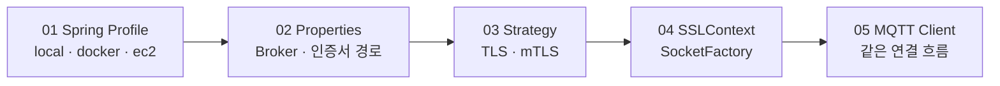

<nav class="project-toc" aria-label="TLS와 mTLS 전략 분리 글 목차">
  <p>이 글에서 다루는 내용</p>
  <ol>
    <li><a href="#problem">문제 상황</a></li>
    <li><a href="#decision">TLS와 mTLS를 바라본 기준</a></li>
    <li><a href="#solution">전략 패턴과 프로필 분리</a></li>
    <li><a href="#acl">인증 이후 Topic ACL</a></li>
    <li><a href="#verification">검증 결과</a></li>
    <li><a href="#limits">한계와 회고</a></li>
  </ol>
</nav>

<h2 id="problem">문제 상황</h2>

MQTT 통신 개발을 시작했을 때 인프라 담당자는 EC2와 Docker 배포 환경을 구성하고
있었습니다. 운영 Broker 주소와 인증서 배치 경로가 확정되기를 기다리면 Backend의
구독·발행과 Robot Command 왕복 테스트도 함께 늦어지는 상황이었습니다. 저는
인프라가 완성된 뒤 연결을 시작하는 데 그치지 않고, **환경에 의존하지 않는 통신
개발 기반을 먼저 만든다**는 목표를 세웠습니다.

로컬 값만 연결 코드에 직접 넣는 방법은 빠르지만, 운영 환경으로 옮길 때 Broker
주소와 인증서 경로뿐 아니라 인증 방식까지 다시 수정해야 합니다. 반대로 처음부터
mTLS만 강제하면 로봇별 인증서 발급, 개인키 전달과 CA 구성이 끝나기 전에는 기본
통신 흐름조차 확인하기 어려웠습니다.

제가 풀어야 했던 문제는 단순히 “TLS와 mTLS 중 무엇을 쓸 것인가”가 아니었습니다.
인프라 준비와 Backend 통신 개발을 병렬로 진행하면서도, 운영 보안 수준으로
전환할 때 연결 코드를 다시 흔들지 않는 구조가 필요했습니다.

<h2 id="decision">TLS와 mTLS를 바라본 기준</h2>

TLS를 “보안에 취약한 방식”, mTLS를 “보안에 강한 방식”으로만 표현하면 정확하지
않습니다. 두 방식 모두 통신을 암호화하고 Backend가 접속한 Broker의 인증서를
검증합니다. 차이는 Broker가 클라이언트의 신원을 어떤 수단으로 확인하는지에
있습니다.

| 구분 | 서버 인증 TLS | mTLS |
| --- | --- | --- |
| 공통 보장 | 전송 구간 암호화·Broker 인증 | 전송 구간 암호화·Broker 인증 |
| 클라이언트 인증 | MQTT ID·비밀번호와 Topic ACL | 클라이언트 인증서·개인키와 인증서 CN 기반 ACL |
| 필요한 자산 | CA 인증서·계정 Secret | CA 인증서·클라이언트 인증서·개인키 |
| 운영 부담 | 계정 발급·회전·폐기 | 인증서 발급·배포·갱신·폐기와 CA 운영까지 필요 |
| 현재 적용 범위 | 로컬 TLS Broker 통신 검증에 사용 | 구현·선택 단위 테스트, 실제 종단 검증은 남음 |

mTLS는 클라이언트가 신뢰된 인증서의 개인키를 보유했는지까지 확인하므로 기기 신원
보장을 강화할 수 있습니다. 그 대신 로봇마다 인증서 수명주기를 관리해야 합니다.
따라서 개발 단계에서는 TLS와 계정 인증으로 통신 기능을 검증하고, 인증서 운영
준비가 끝나면 mTLS로 전환할 수 있도록 변경 지점을 먼저 분리했습니다.

<h2 id="solution">전략 패턴과 프로필 분리</h2>

Spring Profile과 전략 패턴은 서로 다른 문제를 맡겼습니다.

- `local`, `docker`, `ec2` Profile은 **어디에 접속하는가**를 결정합니다. Broker URI,
  Client ID, 컨테이너 안팎의 인증서 경로를 환경별로 분리했습니다.
- `MqttSecurityStrategy`는 **어떻게 인증하는가**를 결정합니다. TLS는 TrustManager를,
  mTLS는 TrustManager와 KeyManager를 조립합니다.



### 인증서 조립 책임을 인터페이스 뒤로 숨겼습니다

아래 코드는 현재 구현에서 import와 예외 변환 부분만 덜어낸 핵심 발췌입니다. 연결
설정은 각 인증 방식에 필요한 파일을 알지 않고 `SSLContext`만 전달받습니다.

```java
/* MqttSecurityStrategy.java · MqttSecurityStrategy */
public interface MqttSecurityStrategy {
    String mode();
    SSLContext createSslContext();
}

@Component
public class TlsMqttSecurityStrategy implements MqttSecurityStrategy {
    private final MqttProperties properties;

    public TlsMqttSecurityStrategy(MqttProperties properties) {
        this.properties = properties;
    }

    @Override
    public String mode() {
        return "tls";
    }

    @Override
    public SSLContext createSslContext() {
        try {
            SSLContext context = SSLContext.getInstance("TLS");
            context.init(
                    null,
                    PemSslContextSupport.createTrustManagers(
                            properties.getSecurity().getTrustCertificate()
                    ),
                    new SecureRandom()
            );
            return context;
        } catch (GeneralSecurityException | IOException exception) {
            throw new BusinessException(
                    ErrorCode.MQTT_SECURITY_CONFIGURATION_INVALID,
                    exception
            );
        }
    }
}

@Component
public class MtlsMqttSecurityStrategy implements MqttSecurityStrategy {
    private final MqttProperties properties;

    public MtlsMqttSecurityStrategy(MqttProperties properties) {
        this.properties = properties;
    }

    @Override
    public String mode() {
        return "mtls";
    }

    @Override
    public SSLContext createSslContext() {
        try {
            MqttProperties.Security security = properties.getSecurity();
            SSLContext context = SSLContext.getInstance("TLS");
            context.init(
                    PemSslContextSupport.createKeyManagers(
                            security.getClientCertificate(),
                            security.getClientPrivateKey()
                    ),
                    PemSslContextSupport.createTrustManagers(
                            security.getTrustCertificate()
                    ),
                    new SecureRandom()
            );
            return context;
        } catch (GeneralSecurityException | IOException exception) {
            throw new BusinessException(
                    ErrorCode.MQTT_SECURITY_CONFIGURATION_INVALID,
                    exception
            );
        }
    }
}
```

TLS 전략은 클라이언트 키를 전달하지 않고 Broker 인증서의 신뢰 체인만 구성합니다.
mTLS 전략은 같은 TrustManager에 클라이언트 인증서와 개인키로 만든 KeyManager를
추가합니다. 공통 PEM 파싱은 `PemSslContextSupport`로 모아 두 전략의 중복도
줄였습니다.

### 조건문 대신 등록된 전략을 찾게 했습니다

`if (tls) ... else if (mtls) ...` 분기를 MQTT 연결 설정 안에 두지 않았습니다.
Spring이 주입한 전략 목록에서 설정값과 같은 `mode()`를 찾도록 했습니다.

```java
/* MqttSecurityStrategyFactory.java · MqttSecurityStrategyFactory */
@Component
public class MqttSecurityStrategyFactory {
    private final String nowStrategy;
    private final List<MqttSecurityStrategy> strategies;

    public MqttSecurityStrategy getNowStrategy() {
        String normalized = nowStrategy == null
                ? ""
                : nowStrategy.trim().toLowerCase(Locale.ROOT);

        return strategies.stream()
                .filter(strategy -> strategy.mode().equalsIgnoreCase(normalized))
                .findFirst()
                .orElseThrow(() -> new IllegalArgumentException(
                        "Unsupported MQTT security strategy: " + nowStrategy
                ));
    }
}
```

```java
/* MqttConnectionConfig.java · MqttConnectionConfig */
options.setSocketFactory(
        securityStrategyFactory
                .getNowStrategy()
                .createSslContext()
                .getSocketFactory()
);
```

이 구조에서 MQTT 구독·발행 설정은 인증 방식이 달라져도 바뀌지 않습니다. 새로운
인증 방식이 필요하면 `MqttSecurityStrategy` 구현을 추가하고 설정값으로 선택할 수
있습니다. 확장 가능성 자체보다, **변경 가능성이 이미 확인된 인증서 조립 책임을
연결 흐름에서 분리했다**는 점이 전략 패턴을 선택한 이유였습니다.

### 실행 위치는 Profile로 나눴습니다

현재 HEAD의 기본 보안 전략은 `tls`입니다. 로컬 실행과 Docker 실행은 같은 로컬
Broker를 사용하되 파일 경로가 다르고, EC2 Profile은 운영 도메인과 컨테이너 외부
인증서 경로를 사용합니다.

```yaml
# application.yml · MQTT Profile 설정
# application.yml
spring:
  profiles:
    default: local

mqtt:
  now-mqtt-security-strategy: tls

# application-local.yml
mqtt:
  broker: ${MQTT_BROKER:ssl://localhost:8883}
  client-id: ${MQTT_CLIENT_ID:gilbom-local}
  security:
    trust-certificate: ${MQTT_TRUST_CERTIFICATE:}

# application-docker.yml
mqtt:
  security:
    trust-certificate: ${MQTT_TRUST_CERTIFICATE:}
    client-certificate: ${MQTT_CLIENT_CERTIFICATE:/app/config/mqtt/certs/client.pem}
    client-private-key: ${MQTT_CLIENT_PRIVATE_KEY:/app/config/mqtt/certs/client-key.pem}

# application-ec2.yml
mqtt:
  broker: ${MQTT_BROKER:ssl://i15d101.p.ssafy.io:8883}
  client-id: ${MQTT_CLIENT_ID:gilbom-backend-ec2}
  security:
    client-certificate: ${MQTT_CLIENT_CERTIFICATE:/opt/gilbom/backend/certs/client.pem}
    client-private-key: ${MQTT_CLIENT_PRIVATE_KEY:/opt/gilbom/backend/certs/client-key.pem}
```

mTLS 전환은 Backend 전략값과 인증서 경로만 바꾸는 것으로 끝나지 않습니다. Broker도
Client CA, `require_certificate true`, 인증서 CN을 사용하는 ACL로 함께 전환해야
합니다. 애플리케이션의 변경 지점을 줄였을 뿐 인증서 운영 절차까지 없앤 것은
아닙니다.

<h2 id="acl">인증 이후 Topic ACL</h2>

TLS와 mTLS는 Broker에 접속한 주체의 신원을 확인하지만, 그 주체가 어느 Topic을
읽고 쓸 수 있는지까지 결정하지는 않습니다. 이 권한은 Mosquitto ACL로 분리했습니다.
Robot의 MQTT username을 `mqtt_id`와 같게 발급하고 `%u`에 대입하면, 각 Robot은
자신의 Namespace만 사용할 수 있습니다.

```conf
/* web/infra/mosquitto/acl · Robot·Backend Topic ACL */
# Robot: 자신의 상태를 발행하고 자신의 명령만 구독한다.
pattern write tbs/v2/robots/%u/presence
pattern write tbs/v2/robots/%u/state
pattern write tbs/v2/robots/%u/telemetry
pattern write tbs/v2/robots/%u/events/incident
pattern write tbs/v2/robots/%u/events/battery
pattern write tbs/v2/robots/%u/events/safety
pattern write tbs/v2/robots/%u/events/mission
pattern write tbs/v2/robots/%u/commands/result
pattern read  tbs/v2/robots/%u/commands/request
pattern read  tbs/v2/robots/%u/ingest/receipt

# Backend: 모든 Robot 응답을 읽고 명령 요청만 발행한다.
user gilbom
topic read  $SYS/broker/version
topic read  tbs/v2/robots/+/presence
topic read  tbs/v2/robots/+/state
topic read  tbs/v2/robots/+/telemetry
topic read  tbs/v2/robots/+/events/+
topic read  tbs/v2/robots/+/commands/result
topic write tbs/v2/robots/+/commands/request
topic write tbs/v2/robots/+/ingest/receipt
```

| 접속 주체 | 허용한 방향 | 차단하려는 동작 |
| --- | --- | --- |
| Robot `%u` | 자신의 State·Telemetry·Event·Command Result 발행 | 다른 Robot Namespace 발행 |
| Robot `%u` | 자신의 Command Request 구독 | 다른 Robot Command 구독 |
| Backend `gilbom` | 모든 Robot 응답 구독, Command Request 발행 | Robot과 Server의 방향 역전 |

예를 들어 `RBT-001`로 인증한 Client가 `RBT-002` Namespace를 구독하거나 발행해도
ACL의 `%u`와 Topic이 일치하지 않아 거부됩니다. mTLS 구성에서는
`use_identity_as_username true`로 인증서 신원을 username으로 사용하므로 같은 ACL
경계를 유지할 수 있습니다.

장애를 확인할 때도 단계를 구분해야 합니다. TLS Handshake가 실패하면 CA·인증서
문제이고, MQTT CONNECT가 거부되면 ID·비밀번호 또는 인증서 신원 문제입니다. Topic
ACL은 CONNECT가 성공한 뒤 SUBSCRIBE나 PUBLISH 권한을 검사합니다. 따라서 CONNECT
단계의 `Not authorized`만으로 ACL 문제라고 단정하지 않았습니다.

<h2 id="verification">검증 결과</h2>

2026-08-14 현재 HEAD에서 전략 선택, 환경 Profile 바인딩, MQTT 연결 설정 단위
테스트를 다시 실행했습니다.

| 현재 HEAD 테스트 | 확인 내용 | 결과 |
| --- | --- | ---: |
| `MqttSecurityStrategyFactoryTest` | TLS·mTLS 선택, 잘못된 값과 인증서 경로 거부 | 5 PASS |
| `MqttProfileConfigurationTest` | local·docker·ec2 Broker와 인증서 경로 바인딩 | 5 PASS |
| `MqttConnectionConfigTest` | 연결 옵션 생성, 재연결 상한과 생명주기 Timeout | 2 PASS |
| **합계** | **전략·Profile·연결 설정** | **12 PASS** |

이 결과는 Java 구성과 선택 로직에 대한 단위 테스트입니다. 실제 클라이언트 인증서를
사용해 mTLS Broker와 직접 연결한 결과는 아니므로 검증 범위를 분리해 기록합니다.
2026년 7월 30일 로컬 TLS Broker 검증 기록에서는 자기 Topic 발행·Command 구독은
성공했고, 다른 Robot Command 구독과 Robot의 Server 전용 Command Request 발행은
거부됐습니다. 이는 현재 Java 단위 테스트 12건과 구분되는 Broker ACL 검증입니다.

<div class="verification-summary" role="note" aria-label="TLS와 mTLS 전략 현재 검증 상태">
  <span>CURRENT HEAD / 2026-08-14</span>
  <strong>12 tests · 12 passed · 0 failed</strong>
  <p>검증 범위: 전략 선택, Profile 바인딩, MQTT 연결 옵션. 실제 Jetson·EC2 mTLS 종단 연결은 미검증입니다.</p>
</div>

<h2 id="limits">한계와 회고</h2>

- 지원 전략이 두 개뿐인 현재는 단순 분기도 가능했습니다. 다만 인증서 입력과
  `SSLContext` 조립이 실제로 달랐고 운영 전환이 예정돼 있어 작은 전략 경계가
  변경 비용을 줄이는 데 유효했습니다.

이 경험을 통해 개발 환경은 운영 환경의 단순한 축소판이 아니라, 운영 의존성이
준비되지 않아도 핵심 기능을 검증할 수 있는 별도의 실행 전략이라는 점을
배웠습니다. 인프라 구성을 기다리는 시간을 대기로 남기지 않고 로컬 TLS Broker와
Profile을 먼저 구성해 통신 개발을 이어갔고, 이후 인증 방식의 차이는 전략으로
격리했습니다. 단순한 기능 구현을 넘어 변경 지점을 예측하고 결합도를 낮춘 경험은,
환경 변화에도 흔들리지 않는 Backend 구조를 설계하는 저만의 기준이 되었습니다.
