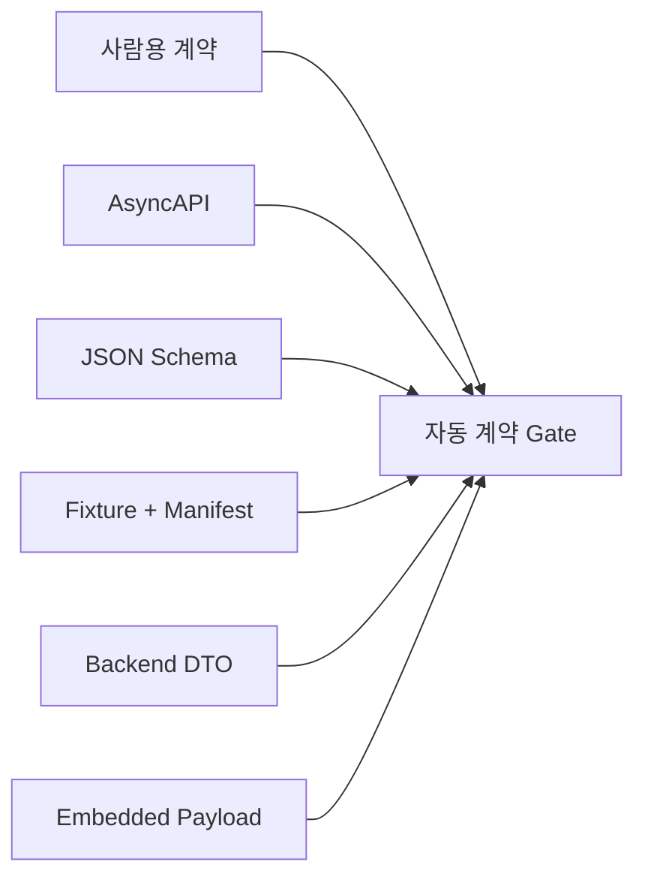

<nav class="project-toc" aria-label="MQTT v2 계약 글 목차">
  <p>이 글에서 다루는 내용</p>
  <ol>
    <li><a href="#problem">계약이 따로 바뀌던 문제</a></li>
    <li><a href="#bundle">계약 묶음과 검증 경계</a></li>
    <li><a href="#implementation">Schema와 Fixture를 Gate로 실행</a></li>
    <li><a href="#verification">검증 기록과 현재 상태</a></li>
    <li><a href="#sources">근거 문서</a></li>
  </ol>
</nav>

<h2 id="problem">계약이 따로 바뀌던 문제</h2>

MQTT Topic을 설명하는 문서, Backend DTO, Embedded Payload가 각각 수정되면서
식별자·TTL·QoS·Retain·방향이 어긋날 수 있었습니다. 양쪽 단위 테스트가 통과해도
실제 Wire Payload의 `robot_id`와 정본 `mqtt_id`가 다르거나 Event의 `ttl_sec`가
빠지면 Broker 이후 엄격 Parser에서 거부됐습니다.

특히 `additionalProperties: false`를 사용하는 계약에서는 Java DTO의 검증용
`isXxx()` 메서드가 예상하지 못한 JSON 필드로 직렬화되는 문제도 실제 Payload를
검사하기 전까지 드러나지 않았습니다.

<h2 id="bundle">계약 묶음과 검증 경계</h2>

MQTT Namespace는 `tbs/v2`, Payload의 `schema_version`은 문자열 `2.0`, 외부 Robot
식별자는 `mqtt_id`로 고정했습니다. 변경 단위도 파일 하나가 아니라 다음 묶음으로
관리했습니다.

| 구성 | 검증하는 내용 |
| --- | --- |
| AsyncAPI 3.1 | Topic 10개, 방향, QoS, Retain |
| JSON Schema Draft 07 | Payload 구조와 필수 필드 |
| 정상·오류 Fixture | 실제 Wire 예시와 거부 입력 |
| Manifest | Schema 결과와 업무 처리 기대값 |
| Python 계약 테스트 | 파일 연결, 의미 규칙과 Secret 문자열 |

JSON Schema만으로 검사하기 어려운 Topic/Payload `mqtt_id` 일치, 시각 선후 관계,
bbox 원소 순서, Replay 판정은 별도 의미 테스트로 고정했습니다. 선택 필드 추가도
엄격 Consumer에는 호환 변경이 아닐 수 있으므로 v2 파일 일부에 조용히 추가하지
않고 계약 묶음 전체를 함께 검토하도록 했습니다.



| 파일·클래스 | 역할 |
| --- | --- |
| `asyncapi-mqtt-v2.yaml` | Topic 10개의 주소·방향·QoS·Retain과 Payload Schema 참조 정의 |
| `mqtt-v2/schemas/*.schema.json` | Payload별 필수 필드·타입·범위·추가 필드 금지 |
| `fixtures/mqtt/v2/manifest.json` | 각 Wire 예시가 Schema·업무 처리·DB에 미쳐야 할 결과 정의 |
| `MqttV2ContractTest` | Schema·AsyncAPI·Fixture·Embedded 상수·의미 규칙을 한 번에 대조 |
| Embedded `contract.py·topics.py` | 실제 발행 Namespace·Version·QoS·Retain 상수 제공 |

<h2 id="implementation">Schema와 Fixture를 Gate로 실행</h2>

### Schema는 허용할 Payload 모양을 고정합니다

Telemetry Schema는 필요한 필드만 나열하는 데 그치지 않고
`additionalProperties: false`로 계약에 없는 필드를 거부합니다. Java DTO나 Python
Payload에 필드가 우연히 추가돼도 Wire 계약이 조용히 넓어지지 않습니다.

```json
/* telemetry.schema.json · MQTT v2 Telemetry Schema */
{
  "$schema": "http://json-schema.org/draft-07/schema#",
  "type": "object",
  "additionalProperties": false,
  "required": [
    "schema_version",
    "message_id",
    "mqtt_id",
    "boot_id",
    "seq",
    "sampled_at",
    "mission_id",
    "position",
    "motion",
    "battery",
    "system",
    "mission"
  ],
  "properties": {
    "mqtt_id": {
      "$ref": "common.schema.json#/definitions/mqttId"
    },
    "seq": {
      "$ref": "common.schema.json#/definitions/seq"
    },
    "sampled_at": {
      "$ref": "common.schema.json#/definitions/utcDateTime"
    }
    /* ... Position·Motion·Battery·System 정의 ... */
  }
}
```

### Manifest는 유효성 이후의 처리 결과까지 고정합니다

Schema 통과만으로는 DB INSERT 여부나 Current State 갱신 여부를 알 수 없습니다.
Manifest에는 Payload 파일·Topic·QoS와 함께 수집기가 만들어야 할 결과를 기록했습니다.

```json
/* manifest.json · valid-telemetry Fixture 기대값 */
{
  "id": "valid-telemetry",
  "file": "valid/telemetry.json",
  "schema": "telemetry.schema.json",
  "topic": "tbs/v2/robots/RBT-001/telemetry",
  "qos": 0,
  "retained": false,
  "received_at": "2026-07-30T01:00:05.050Z",
  "expected": {
    "schema_valid": true,
    "processing": "ACCEPTED",
    "error_code": null,
    "db_insert": true,
    "current_state_update": true,
    "row_delta": 1,
    "execute_command": false
  }
}
```

### 자동 테스트가 정본 파일을 양방향으로 대조합니다

`MqttV2ContractTest`는 Manifest에 등록된 파일이 실제로 존재하는지만 확인하지
않습니다. Fixture Directory의 모든 JSON이 Manifest에 빠짐없이 등록됐는지도 반대로
검사합니다. 정상 Fixture는 오류가 0개여야 하고, 오류 Fixture는 반드시 Schema 오류가
발생해야 합니다.

```python
/* test_mqtt_v2_contract.py · MqttV2ContractTest */
def test_all_fixture_files_are_registered(self) -> None:
    registered = {
        fixture["file"]
        for fixture in self.manifest["fixtures"]
    }
    registered.update(
        fixture["baseline"]
        for fixture in self.manifest["fixtures"]
        if "baseline" in fixture
    )
    actual = {
        path.relative_to(FIXTURE_ROOT).as_posix()
        for directory in ("valid", "invalid")
        for path in (FIXTURE_ROOT / directory).glob("*.json")
    }
    self.assertEqual(registered, actual)

def test_fixture_schema_results_match_manifest(self) -> None:
    for fixture in self.manifest["fixtures"]:
        payload = read_json(FIXTURE_ROOT / fixture["file"])
        errors = list(
            self.validators[fixture["schema"]].iter_errors(payload)
        )
        expected_valid = fixture["expected"]["schema_valid"]
        if expected_valid:
            self.assertEqual(errors, [])
        else:
            self.assertNotEqual(errors, [])
```

JSON Schema로 표현하기 어려운 규칙은 별도 의미 판정으로 실행합니다. 예를 들어
Command의 `expires_at`이 `issued_at`보다 뒤인지, bbox가
`xMin < xMax·yMin < yMax`인지, Topic의 `mqtt_id`와 Payload가 같은지 확인합니다.
Event 재전송은 `sent_at`만 달라야 하고, 같은 `(mqtt_id, boot_id, seq)`를 다른
`event_id`가 사용하면 Sequence 충돌로 판정합니다.

```python
/* test_mqtt_v2_contract.py · _semantic_violation_or_scenario() */
if check == "event_retry":
    baseline = read_json(FIXTURE_ROOT / fixture["baseline"])
    retry = dict(payload)
    original = dict(baseline)
    retry.pop("sent_at")
    original.pop("sent_at")
    return retry == original and payload["sent_at"] != baseline["sent_at"]

if check == "sequence_conflict":
    baseline = read_json(FIXTURE_ROOT / fixture["baseline"])
    same_wire_sequence = all(
        payload[key] == baseline[key]
        for key in ("mqtt_id", "boot_id", "seq")
    )
    return same_wire_sequence and payload["event_id"] != baseline["event_id"]
```

계약 변경은 `Schema → AsyncAPI 참조 → 정상·오류 Fixture → Manifest 기대값 →
Embedded·Backend 회귀`를 한 묶음으로 다룹니다. 이 중 하나만 바꾸면 Gate가 실패해
문서와 실제 Wire 구현의 불일치를 배포 전에 드러냅니다.

<h2 id="verification">검증 기록과 현재 상태</h2>

2026년 7월 30일 계약 동결 기록에는 MQTT 계약 테스트 통과와 Embedded·Backend
집중 회귀 통과가 보존돼 있습니다. 2026년 8월 15일 현재 HEAD 재실행에서는 9개 중
8개가 통과했고 `comms` Module Import 경로 오류 1개가 남았습니다. 따라서 현재 상태를
“계약 Gate 전체 통과”로 표현하지 않습니다.

정적 범위 수치인 Schema 12개와 Fixture 32개는 성능 지표가 아니라 검사 범위입니다.
실제 Jetson 배포와 EC2 Broker의 Credential·ACL·인증서 검증도 로컬 계약 검증과
구분합니다.

<h2 id="sources">근거 문서</h2>

- `TROUBLESHOOTING/9_MqttV2ContractFreeze.md`
- `CHANGLOGS/2026-07-30_1145_mqtt-v2-contract-freeze.md`
- `CHANGLOGS/2026-07-30_1224_time-mission-contract-bundle-verification.md`
- `CHANGLOGS/2026-08-01_1515_jetson-mqtt-v2-day7-runbook.md`
