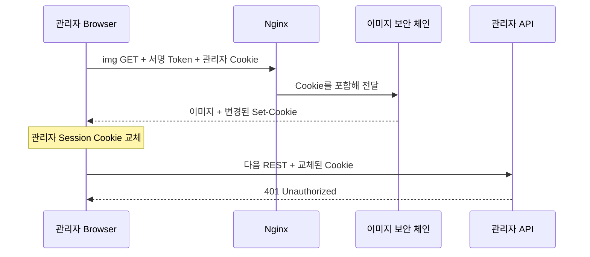
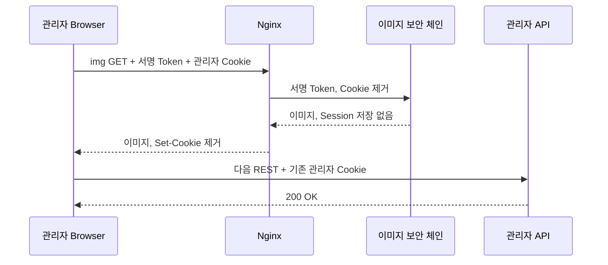

<nav class="project-toc" aria-label="이미지 요청과 관리자 세션 분리 글 목차">
  <p>이 글에서 다루는 내용</p>
  <ol>
    <li><a href="#problem">문제 상황</a></li>
    <li><a href="#cause">Session ID가 바뀐 원인</a></li>
    <li><a href="#solution">Nginx와 Spring Security 분리</a></li>
    <li><a href="#verification">회귀 테스트</a></li>
  </ol>
</nav>

<h2 id="problem">문제 상황</h2>

관리자가 로그인한 화면에서 결함 이미지 여러 장을 불러온 뒤, 정상적으로 유지되던
관리자 API가 갑자기 `401`을 반환하는 문제가 있었습니다. 로그인 만료 시간이 지난 것도
아니고 이미지 자체도 정상적으로 표시돼, 처음에는 관리자 인증과 이미지 조회를 별개의
문제로 보기 쉬웠습니다.

이미지 본문은 관리자 Session이 아니라 짧은 수명의 서명 URL로 인증합니다. 하지만
브라우저의 ``는 같은 Origin으로 요청할 때 관리자 Cookie를 자동으로 첨부합니다.
즉 인증 방식은 달라도 한 HTTP 요청 안에는 서명 Token과 관리자 Session Cookie가 함께
들어오고 있었습니다.

<h2 id="cause">Session ID가 바뀐 원인</h2>

이미지 API에 `SessionCreationPolicy.STATELESS`만 지정해도 충분하다고 생각했지만,
Spring Session의 Servlet Filter는 `SecurityFilterChain` 바깥에서 동작합니다. 이미지
인증이 성공한 응답에서 Session 후처리가 실행되면 기존 Session ID가 회전하거나 새로운
`Set-Cookie`가 만들어질 수 있었습니다. 동시에 내려온 이미지 응답 중 하나의 Cookie를
브라우저가 저장하면, 다음 관리자 REST 요청은 기존 로그인 인증정보와 맞지 않는 Session
ID를 보내 `401`이 됩니다.



| 구성 요소 | 역할 |
| --- | --- |
| `ImageApiSecurityConfiguration` | `/api/v1/images/**`만 담당하는 최우선 Stateless 보안 체인 |
| `SignedImageUrlAuthenticationFilter` | 이미지 ID와 만료 시각을 포함한 서명 Token 인증 |
| `RobotApiKeyAuthenticationFilter` | Robot 이미지 업로드 API Key 인증 |
| `app-locations.conf` | 이미지 본문 경로에서 Cookie 입·출력을 차단하는 Edge 경계 |
| `ImageApiSecurityChainTest` | 기존 로그인 Session이 이미지 요청 전후로 같은지 검증 |

<h2 id="solution">Nginx와 Spring Security 분리</h2>

해결 경계는 두 곳에 뒀습니다. Spring Security에서는 이미지 인증 결과를 Session에
저장하지 않고 Session ID 회전 후처리도 실행하지 않습니다. Nginx에서는 이미지 요청의
관리자 Cookie를 Backend로 보내지 않고, Backend가 실수로 만든 `Set-Cookie`도 Browser에
전달하지 않습니다.

### 변경 전에는 `STATELESS`만으로 Session 회전을 막으려 했습니다

변경 전 이미지 보안 체인도 관리자 체인과 분리돼 있었고, 인증정보를 Session에 저장하지
않도록 `NullSecurityContextRepository`를 사용했습니다. 그러나 인증 성공 뒤 실행되는
Session 전략은 별도로 지정하지 않았습니다.

```java
/* 변경 전 ImageApiSecurityConfiguration.java · ImageApiSecurityConfiguration */
.sessionManagement(session -> session
    .sessionCreationPolicy(SessionCreationPolicy.STATELESS))
.securityContext(context -> context
    .securityContextRepository(
        new NullSecurityContextRepository()))
```

`STATELESS`는 이미지 인증정보를 Session에 보관하지 않는 정책이지만, 이미 Browser가
보낸 관리자 Session Cookie의 후처리까지 자동으로 무효화한다는 뜻은 아닙니다. 따라서
기존 설정을 없애는 대신 Session ID 회전을 담당하는 전략을 명시적으로 교체했습니다.

### 이미지 인증을 별도 Stateless 체인으로 격리했습니다

```java
/* ImageApiSecurityConfiguration.java · ImageApiSecurityConfiguration */
@Bean
@Order(Ordered.HIGHEST_PRECEDENCE + 10)
public SecurityFilterChain imageApiSecurityFilterChain(
        HttpSecurity http,
        SecurityErrorResponseWriter errorWriter,
        RobotApiKeyRepository robotApiKeyRepository,
        ImageUrlSigner imageUrlSigner
) throws Exception {
    http
        .securityMatcher("/api/v1/images/**")
        // ... Form Login·HTTP Basic·Request Cache·CSRF 비활성화 ...
        .sessionManagement(session -> session
            .sessionCreationPolicy(SessionCreationPolicy.STATELESS)
            .sessionAuthenticationStrategy(
                new NullAuthenticatedSessionStrategy()))
        .securityContext(context -> context
            .securityContextRepository(
                new NullSecurityContextRepository()))
        // ... API Key·서명 URL 인증 Filter 등록 ...
        .authorizeHttpRequests(authorize -> authorize
            .anyRequest().authenticated());

    return http.build();
}
```

`NullAuthenticatedSessionStrategy`는 이미지 인증 성공을 관리자 로그인 성공처럼 처리해
Session ID를 회전시키지 않게 합니다. `NullSecurityContextRepository`는 서명 URL이나
API Key로 만든 인증정보를 Session에 저장하지 않습니다. 이미지 요청마다 전달된
자격증명으로만 인증을 만들고 요청이 끝나면 버립니다.

### Edge에서 Cookie의 양방향 이동도 끊었습니다

변경 전 Nginx에는 이미지 본문 전용 Location이 없었습니다. 이미지 요청도 일반 API와
같은 Proxy 경로를 사용했기 때문에 Browser의 관리자 Cookie와 Backend의 `Set-Cookie`가
그대로 통과할 수 있었습니다.

```nginx
/* 변경 전 app-locations.conf · General API Location */
location /api/ {
    proxy_pass http://backend_upstream;
    # ... 공통 Proxy Header 설정 ...
}
```

```nginx
/* 변경 후 app-locations.conf · Signed Image Location */
location ~ "^/api/v1/images/[0-9a-fA-F-]{36}/content$" {
    proxy_pass http://backend_upstream;
    # ... 공통 Proxy Header 설정 ...

    proxy_set_header Cookie "";
    proxy_hide_header Set-Cookie;
}
```

`proxy_set_header Cookie ""`는 Browser가 자동으로 붙인 관리자 Cookie를 이미지
Backend에 전달하지 않습니다. `proxy_hide_header Set-Cookie`는 이미지 응답이 관리자
Cookie를 덮지 못하게 합니다. Backend 설정만으로도 인증 상태를 분리하지만, Edge에도
같은 경계를 둬 이후 보안 체인이 변경돼도 이미지 응답이 로그인 Cookie를 바꾸지 못하게
했습니다.

| 경계 | 변경 전 | 변경 후 |
| --- | --- | --- |
| Spring Session 정책 | `STATELESS`만 지정 | `NullAuthenticatedSessionStrategy`로 Session ID 회전 중지 |
| Security Context | `NullSecurityContextRepository` 사용 | 기존 설정 유지 |
| Nginx 요청 Cookie | 일반 `/api/` 경로로 전달 | 이미지 본문 경로에서 제거 |
| Nginx 응답 Cookie | Backend `Set-Cookie` 통과 가능 | 이미지 본문 응답에서 제거 |



<h2 id="verification">회귀 테스트</h2>

정상 이미지 한 건만 확인하면 동시 응답 순서에 따라 발생하는 Cookie 교체를 놓칠 수
있습니다. 그래서 기존 로그인 Session을 가진 상태에서 정상·거부·병렬 요청을 각각
검증했습니다.

```java
/* ImageApiSecurityChainTest.java · ImageApiSecurityChainTest */
@Test
void twentyParallelImageRequestsKeepTheLoginSessionAuthenticated()
        throws Exception {
    MockHttpSession loginSession = authenticatedLoginSession();
    String originalSessionId = loginSession.getId();
    Object originalLoginContext = loginSecurityContext(loginSession);

    // ... 같은 Session으로 이미지 GET 20건을 동시에 실행 ...

    for (Future<MvcResult> request : requests) {
        MvcResult result = request.get();
        if (result.getResponse().getStatus() != 200) {
            throw new AssertionError(
                "병렬 이미지 요청이 200이 아닙니다: "
                    + result.getResponse().getStatus());
        }
        assertLoginSessionUnchanged(
            result,
            loginSession,
            originalSessionId,
            originalLoginContext);
    }

    mockMvc.perform(get("/api/v1/auth/session-state")
            .session(loginSession))
        .andExpect(status().isOk())
        .andExpect(jsonPath("$.authenticationState")
            .value("AUTHENTICATED"));
}
```

| 검증 항목 | 기대 결과 |
| --- | --- |
| 유효한 서명 이미지 요청 | 기존 Session ID·관리자 인증정보 유지, `Set-Cookie` 없음 |
| 위조·만료·다른 이미지 Token | `401`, 기존 로그인 Session은 그대로 유지 |
| 동일 로그인 Session의 병렬 이미지 요청 20건 | 전부 `200`, 이후 관리자 Session도 `AUTHENTICATED` |
| Nginx Runtime 이미지 요청 | Backend로 전달된 Cookie 없음, Browser 응답의 `Set-Cookie` 없음 |

2026년 8월 16일 현재 HEAD에서 `ImageApiSecurityChainTest` 10건을 다시 실행해
10건 모두 통과했습니다. Nginx의 Cookie 입·출력 차단은 2026년 8월 9일 Runtime 검증
기록을 근거로 하며, Backend 집중 테스트와 같은 실행 결과로 합치지 않았습니다.

이 문제의 핵심은 모든 인증을 Stateless로 바꾸는 것이 아니라, 관리자 로그인은 Session
기반으로 유지하면서 서명 URL·Robot API Key 인증만 별도의 요청 파이프라인으로 격리하는
것이었습니다.
