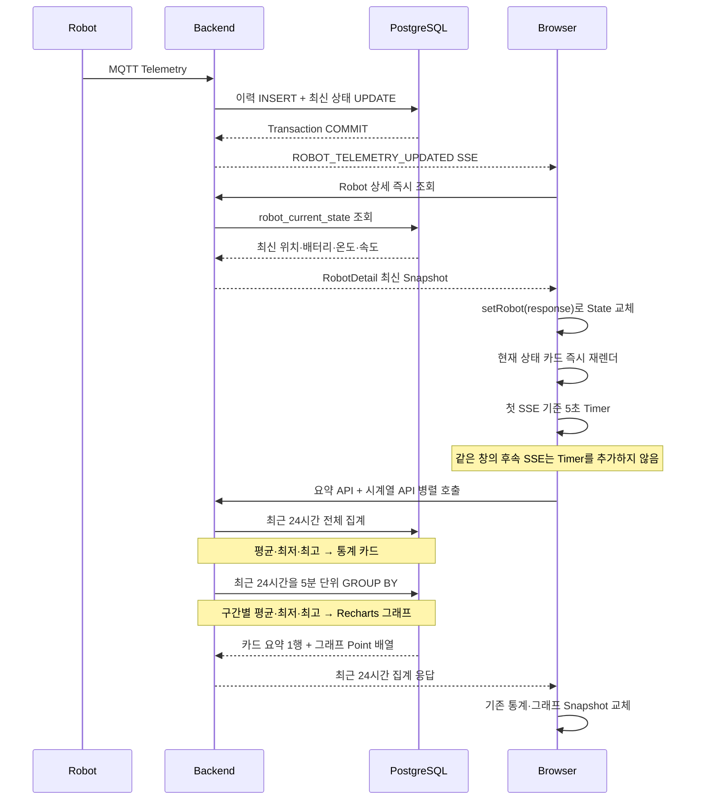

<nav class="project-toc" aria-label="Telemetry 통계 글 목차">
  <p>이 글에서 다루는 내용</p>
  <ol>
    <li><a href="#problem">집계와 실시간 갱신 문제</a></li>
    <li><a href="#solution">조회·갱신 경계</a></li>
    <li><a href="#verification">운영 EC2 Telemetry 확인</a></li>
    <li><a href="#sources">근거 문서</a></li>
  </ol>
</nav>

<h2 id="problem">집계와 실시간 갱신 문제</h2>

Robot 상세 화면은 배터리·Jetson 온도·속도·GPS 품질의 기간 요약과 시계열을
함께 보여줘야 했습니다. 모든 응답에 수천 개의 시계열 점을 넣으면 작은 상태 카드도
큰 Payload를 받고, 5초 Telemetry Event마다 기간 집계를 다시 실행하면 수신 주기가
곧 SQL 실행 주기가 됩니다.

Backend 수신시각 `received_at`으로 집계하면 네트워크 지연이 센서 변화처럼 보이는
문제도 있었습니다.

<h2 id="solution">조회·갱신 경계</h2>

- 요약 API와 시계열 API를 분리했습니다.
- 실제 Robot 측정시각인 `sampled_at`의 `[from,to)`를 사용했습니다.
- 최대 기간은 31일, 구간은 `1m·5m·15m·1h`, 반환 구간은 5,000개로 제한했습니다.
- PostgreSQL `date_bin`으로 고정 구간 집계를 수행했습니다.
- 결측값을 0으로 만들지 않고 `null`로 유지해 그래프 선을 끊었습니다.
- `ROBOT_TELEMETRY_UPDATED`는 정본이 아니라 무효화 신호로만 사용했습니다.

첫 SSE가 오면 5초 Timer 하나만 예약하고, 그 사이의 Event는 같은 재조회로
병합합니다. Event마다 Timer를 뒤로 미루지 않아 지속적인 Telemetry 중에도 갱신이
무한정 지연되지 않습니다. 그래프 라이브러리인 Recharts는 통계 영역을 열 때만 별도
JavaScript 파일로 내려받습니다. 이처럼 필요한 시점에 파일을 불러오는 방식을
`Lazy Loading`, 이때 분리된 파일을 `Lazy Chunk`라고 합니다. `Bundle`은 Browser가
화면을 실행하기 위해 내려받는 JavaScript 묶음입니다. 따라서 일반 Robot 화면의 초기
Bundle에는 무거운 그래프 코드를 넣지 않고, 통계를 열 때만 추가로 불러옵니다.

<h3>SSE가 도착한 뒤 실제로 읽는 데이터</h3>

여기서 병합하는 대상은 Telemetry 값이 아니라 **SSE 재조회 신호**입니다. Browser가
SSE Payload를 기존 평균에 더하는 구조가 아니라, DB에 저장된 기간 전체를 다시 읽어
통계 Snapshot을 교체합니다.



<h3>저장 코드가 하는 일</h3>

아래 코드는 센서 값을 계산하는 코드가 아닙니다. 수신한 MQTT 메시지가 **이력으로
저장할 정상 메시지인지**, 그리고 **현재 화면의 기준값을 바꿀 만큼 최신인지**를 한
Transaction 안에서 판정하는 코드입니다. 흐름을 읽는 데 필요한 부분만 남긴
축약본입니다.

```java
/* TelemetryIngestionService.java */

@Transactional
public TelemetryIngestionResult ingest(TelemetryIngestionCommand command) {
    // Replay 방어 서비스의 판정 결과를 claim 변수에 저장한다.
    ClaimResult claim = replayProtectionService.claim(
        MqttTopicType.TELEMETRY,     // 검사할 MQTT 메시지 종류
        SequenceKind.TELEMETRY,     // 검사할 순번의 종류
        robotId,                    // 메시지를 보낸 Robot의 DB 식별자
        payload.bootId(),           // Robot 재부팅마다 바뀌는 실행 세션 ID
        payload.seq(),              // 실행 세션 안에서 증가하는 메시지 순번
        payload.messageId(),        // 개별 MQTT 메시지 식별자
        payload.schemaVersion(),    // Payload 계약 버전
        command.rawPayload(),       // 충돌 여부를 비교할 원본 Payload
        command.receivedAt());      // Backend가 메시지를 받은 시각

    // 같은 메시지의 재전송이면 이력과 현재 상태를 다시 쓰지 않는다.
    if (claim == ClaimResult.DUPLICATE) {
        // 이력 저장과 현재 Snapshot 갱신이 모두 없었다고 반환한다.
        return new TelemetryIngestionResult(false, false);
    }

    // 정상 메시지의 측정값을 기간 통계용 이력 테이블에 추가한다.
    insertHistory(/* Robot, 측정값, sampledAt, receivedAt */);

    // 최신성 조건부 UPDATE의 성공 여부를 변수에 저장한다.
    boolean currentStateUpdated = updateCurrentState(
        robotId,
        payload,
        sampledAt,
        receivedAt);

    if (currentStateUpdated) {
        // Commit 후 Browser가 최신 값을 다시 읽도록 실시간 Event를 등록한다.
        eventPublisher.publishEvent(
            RobotRealtimeEvent.telemetryUpdated(
                robotId,
                payload.mqttId(),
                payload.sampledAt()));
    }

    // 이력 저장 성공과 현재 Snapshot 갱신 여부를 호출부에 반환한다.
    return new TelemetryIngestionResult(true, currentStateUpdated);
}
```

이 코드에서 각 단계의 역할은 다음과 같습니다.

| 코드 | 역할 |
| --- | --- |
| `@Transactional` | Replay 선점, 이력 저장, 현재 상태 갱신을 하나의 성공·실패 단위로 묶습니다. |
| `claim(...)` | `bootId·seq·messageId·payload`를 기준으로 동일 재전송과 순번 충돌을 먼저 판정합니다. |
| `insertHistory(...)` | 정상 수신된 측정값을 기간 통계와 그래프에서 읽을 이력으로 남깁니다. |
| `updateCurrentState(...)` | `bootId·seq·sampledAt` 최신성 조건을 만족할 때만 `robot_current_state`를 덮어씁니다. |
| `currentStateUpdated` | 값이 이전과 달라졌다는 뜻이 아니라, 수신값이 **최신 Snapshot으로 채택됐는지**를 뜻합니다. |
| `publishEvent(...)` | 최신 Snapshot이 바뀐 경우에만 Browser에 다시 조회하라는 신호를 만듭니다. |

같은 배터리 값이 들어와도 순번과 측정시각이 더 최신이면
`currentStateUpdated=true`가 될 수 있습니다. 반대로 값이 달라도 오래된 측정이면 이력만
남고 현재 상태는 덮어쓰지 않습니다.

| 수신 결과 | 이력 저장 | 현재 상태 갱신 | SSE | 화면에서의 의미 |
| --- | --- | --- | --- | --- |
| 동일 메시지 재전송 | 안 함 | 안 함 | 없음 | 이미 처리한 결과를 다시 반영하지 않음 |
| 정상이며 최신인 측정 | 함 | 함 | 발행 | 상세 계기판을 즉시 다시 읽고 통계 갱신을 예약 |
| 정상이나 현재값보다 오래된 측정 | 함 | 안 함 | 없음 | 기간 이력에는 보존하되 현재 계기판은 되돌리지 않음 |

<h3>Commit 뒤에 SSE를 보내는 이유</h3>

최신 상태로 채택된 Telemetry만 Event를 만들고, 아래 Listener는 Transaction이 실제로
Commit된 뒤 SSE를 전송합니다. 따라서 Browser가 Event를 받고 곧바로 REST 조회를
실행해도, 아직 Commit되지 않은 이전 값을 읽는 순서 역전이 생기지 않습니다.
이 흐름에서 `event`는 `telemetryUpdated(...)`가 만든
`eventType=ROBOT_TELEMETRY_UPDATED` Event입니다. 다만 Listener 자체는 Telemetry
전용이 아니라 다른 `RobotRealtimeEvent` 유형도 함께 전달합니다.

```java
/* RobotRealtimeEventListener.java */

// ... RobotSseService 필드와 생성자 ...
@TransactionalEventListener(phase = TransactionPhase.AFTER_COMMIT)
public void onRobotRealtimeEvent(RobotRealtimeEvent event) {
    // 이 흐름에서는 telemetryUpdated(...)가 만든
    // ROBOT_TELEMETRY_UPDATED Event를 받는다.
    // 이 Listener는 다른 RobotRealtimeEvent 유형도 공통으로 처리한다.
    // DB Commit이 끝난 Event를 연결된 Browser에 SSE로 단방향 전송한다.
    sseService.publish(event);
}
```

SSE에는 배터리나 온도 값이 아니라 `eventType`, `robotId`, `mqttId`, `observedAt`만
들어 있습니다. 즉, 이 Event는 새 값을 직접 전달하는 데이터가 아니라 **DB가
갱신됐으니 다시 읽으라는 단방향 무효화 신호**입니다.

<h3>상세 화면 코드가 하는 일</h3>

Robot 상세 화면은 Event를 받자마자 `getRobot(robotId)`를 호출해
`robot_current_state`의 최신 위치·배터리·온도를 읽고 계기판을 교체합니다. 동시에
통계용 Revision을 올려 그래프 재조회도 예약합니다.

```tsx
/* RobotDetailPage.tsx · RobotDetailPage */

// Robot 상세를 다시 읽는 비동기 함수를 만들고 변수에 저장한다.
const refreshRobotSnapshot = useCallback(async (
  event?: RobotRealtimeEvent,
) => {
  // ... Robot ID와 Event 종류 확인 ...

  if (
    event === undefined
    || event.eventType === 'ROBOT_TELEMETRY_UPDATED'
  ) {
    // 이전 Revision에 1을 더해 통계 Card에 새 재조회 신호를 보낸다.
    setTelemetryRealtimeRevision((current) => current + 1)
  }

  try {
    // getRobot으로 최신 Snapshot을 받고 현재 계기판 State를 교체한다.
    setRobot(await getRobot(robotId))
    // 정상 조회됐으므로 기존 오류 State를 비운다.
    setError(null)
  } catch (nextError) {
    // 조회 실패 원인을 오류 State에 저장해 화면에 표시한다.
    setError(nextError)
  }
// robotId가 바뀌면 새 ID를 참조하도록 함수를 다시 만든다.
}, [robotId])
```

여기서 `setRobot(...)`은 **현재 상태 계기판의 즉시 갱신**, 
`setTelemetryRealtimeRevision(...)`은 **기간 통계·그래프 갱신 예약**을 담당합니다.

<h3>5초 Timer 코드가 하는 일</h3>

Telemetry가 연속으로 도착할 때마다 24시간 통계를 다시 계산하면 요청과 집계가
불필요하게 반복됩니다. 아래 코드는 첫 Revision에서 Timer 하나를 만들고, 5초 안에
추가된 Revision은 그 Timer에 합칩니다.

```tsx
/* RobotTelemetryStatisticsCard.tsx · RobotTelemetryStatisticsCard */

// 여러 SSE를 한 번의 통계 재조회로 합칠 대기 시간을 5초로 정한다.
const REALTIME_REFRESH_INTERVAL_MILLISECONDS = 5_000

// ... Timer Ref와 마지막으로 처리한 Revision Ref 선언 ...
// Live Mode나 Revision이 바뀐 뒤 Timer 예약 여부를 판단한다.
useEffect(() => {
  // ... Live Mode 확인 ...

  if (
    realtimeRevision === lastHandledRealtimeRevisionRef.current
    || realtimeRefreshTimerRef.current !== null
  ) {
    // 이미 처리한 Revision이거나 Timer가 있으면 새 Timer를 만들지 않는다.
    return
  }

  // 이번 Revision을 처리 대상으로 기록한다.
  lastHandledRealtimeRevisionRef.current = realtimeRevision
  // 5초 뒤 실행할 Timer ID를 Ref에 저장한다.
  realtimeRefreshTimerRef.current = window.setTimeout(() => {
    // Timer가 끝났으므로 다음 SSE가 새 Timer를 만들 수 있게 Ref를 비운다.
    realtimeRefreshTimerRef.current = null
    // 현재 시각 기준 최근 24시간 통계와 시계열을 다시 요청한다.
    requestRollingPeriod()
  }, REALTIME_REFRESH_INTERVAL_MILLISECONDS)
// 이 값들이 바뀔 때 위 Timer 예약 로직을 다시 검사한다.
}, [liveMode, realtimeRevision, requestRollingPeriod])
```

Timer가 끝나면 실행 시각을 새 `to`로 잡고 정확히 24시간 전을 `from`으로 다시
계산합니다. 이후 요약과 시계열 Endpoint를 동시에 호출합니다. 요약 API는 최근
24시간 전체의 평균·최저·최고를 계산해 통계 카드에 사용하고, 시계열 API는 같은
원본을 5분 단위로 묶은 구간별 평균·최저·최고를 Recharts 그래프에 사용합니다.

```tsx
/* robotTelemetryStatistics.ts */

export function createRollingTelemetryStatisticsPeriod(
  // 호출부가 시각을 주지 않으면 현재 시각을 기준으로 사용한다.
  reference: Date = new Date(),
): { from: string; to: string } {
  return {
    // 기준 시각에서 24시간을 뺀 값을 조회 시작시각 문자열로 만든다.
    from: new Date(
      reference.getTime() - DAY_MILLISECONDS,
    ).toISOString(),
    // 기준 시각을 조회 종료시각 문자열로 만든다.
    to: reference.toISOString(),
  }
}
```

```tsx
/* RobotTelemetryStatisticsCard.tsx · RobotTelemetryStatisticsCard */

// ... Rolling Period와 조회 구간 계산 ...
// 두 API 호출을 동시에 시작하고 두 응답이 모두 끝날 때까지 기다린다.
void Promise.all([
  // 최근 24시간의 표본 수와 평균·최저·최고를 요청한다.
  getRobotTelemetryStatistics(
    robotId,
    requestedPeriod.from,
    requestedPeriod.to,
  ),
  // 같은 기간의 그래프용 시간 구간 Point 목록을 요청한다.
  getRobotTelemetrySeries(
    robotId,
    requestedPeriod.from,
    requestedPeriod.to,
    interval,
  ),
])
```

두 SQL 모두 증분 구간만 읽는 것이 아니라 같은 Robot의 최근 24시간 이력을
`sampled_at` 기준으로 다시 읽습니다. 따라서 기존 이력과 방금 Commit된 최신 행이
조회 범위 안에 있으면 함께 집계됩니다. 종료 경계와 정확히 같은 행은 `[from,to)`
규칙에 따라 제외되고 다음 Rolling 조회에 포함됩니다.

```sql
/* RobotTelemetrySeriesService.java · SERIES_SQL 일부 */

-- ... SELECT 집계 컬럼과 FROM 절 ...
WHERE t.robot_id = :robotId
  AND t.sampled_at >= :from
  AND t.sampled_at < :to
-- ... GROUP BY와 ORDER BY ...
```

요약 API는 이 범위의 표본 수와 평균·최저·최고를 한 행으로 반환합니다. 최근 24시간의
시계열 API는 같은 원본을 5분 구간으로 묶어 그래프 점을 만듭니다. 여기서 **5초는
화면 재조회 지연**, **5분은 차트 집계 구간**으로 서로 다른 값입니다.

이 병합은 5초 안에 여러 SSE가 몰릴 때만 조회 횟수를 줄입니다. 반대로 Telemetry가
실제로 약 5초마다 한 건씩 들어오면 Event마다 다음 Timer가 만들어져 호출 감소가 거의
없습니다. 또한 Robot 최신 상태 조회는 SSE마다 즉시 실행됩니다. 따라서 이 구현의
최적화 범위는 화면 전체가 아니라 **짧은 Burst 동안 기간 통계·시계열 재집계의 급증을
막는 것**이며, 운영 호출 횟수와 SQL 실행시간을 측정한 개선율은 아직 주장하지 않습니다.

<h3>왜 원본 대신 5분 집계 Point를 반환했나</h3>

5초 주기의 Telemetry를 24시간 보관하면 중단이 없다는 가정에서 Robot 한 대당 원본은
약 17,280행입니다. 배터리·Jetson 온도·속도 그래프가 이 행을 모두 받으면 응답 전송,
JSON 파싱과 차트 렌더링 비용이 함께 증가합니다. 최근 24시간을 5분 구간으로 집계하면
구간 하나에 원본이 약 60개 들어가고, Browser가 받는 시계열 Point는 약 288개로
줄어듭니다.

평균만 반환하면 짧은 이상 상태가 완만해 보일 수 있어 지표의 의미에 따라 최저·최고도
함께 계산했습니다. 배터리는 평균과 최저, Jetson 온도와 속도는 평균과 최고를 반환하고,
각 구간의 전체·유효 표본 수도 함께 내려 데이터가 충분한지 판단할 수 있게 했습니다.
아직 끝나지 않은 마지막 5분 구간은 조회 시각까지 들어온 표본만으로 계산한 부분
구간입니다.

| 조회 기간 | Frontend가 선택하는 구간 | 한 Point의 의미 |
| --- | --- | --- |
| 24시간 이하 | `5m` | 5분 동안 저장된 원본의 평균·최저·최고 |
| 7일 이하 | `15m` | 15분 동안 저장된 원본의 평균·최저·최고 |
| 7일 초과·31일 이하 | `1h` | 1시간 동안 저장된 원본의 평균·최저·최고 |

<h3>Java와 JavaScript의 책임 비교</h3>

| 책임 | Java·PostgreSQL | JavaScript·React |
| --- | --- | --- |
| 원본 데이터 | `robot_telemetry`의 기간 행을 읽음 | 원본 행을 직접 받지 않음 |
| 시간 범위 | `sampled_at >= from AND sampled_at < to` 적용 | 자동 모드에서 `[현재-24h, 현재)` 생성 |
| 집계 단위 | `date_bin`으로 구간을 만들고 평균·최저·최고 계산 | 조회 기간에 맞춰 `5m·15m·1h` 선택 |
| SSE 이후 | Commit된 DB Snapshot을 조회 가능하게 제공 | 최신 상태는 즉시, 통계는 5초 뒤 REST 재조회 |
| 화면 반영 | 요약 DTO 1개와 구간 Point 목록 반환 | 기존 `statistics`와 `series` 상태 전체 교체 |

<h4>구현 클래스·컴포넌트별 역할</h4>

Java 쪽은 클래스와 Record로 구성되고, React 쪽은 클래스가 아니라 함수 컴포넌트·Hook·
유틸 모듈로 구성됩니다. 각 이름을 데이터가 흐르는 순서대로 놓으면 다음과 같습니다.

| 계층 | 이름 | 역할 |
| --- | --- | --- |
| Backend · Java | `TelemetryIngestionService` | MQTT Telemetry의 Replay를 검사하고, 이력 INSERT와 최신 상태 UPDATE를 한 Transaction에서 수행합니다. |
| Backend · Java Record | `RobotRealtimeEvent` | `robotId·mqttId·eventType·observedAt`만 담는 SSE 무효화 신호입니다. Telemetry 측정값은 담지 않습니다. |
| Backend · Java | `RobotRealtimeEventListener` | `AFTER_COMMIT` 시점에 Event를 받아 DB Commit 이후에만 SSE 전송을 요청합니다. |
| Backend · Java | `RobotSseService` | Browser의 SSE 구독을 관리하고 이름 있는 Event를 각 구독자에게 전송합니다. |
| Backend · Java | `RobotQueryService` | `robot_current_state`에서 최신 위치·배터리·온도를 읽어 Robot 상세 Snapshot을 만듭니다. |
| Backend · Java | `RobotTelemetryStatisticsService` | `[from,to)` 원본 이력의 표본 수와 평균·최저·최고를 집계해 요약 DTO 하나를 반환합니다. |
| Backend · Java | `RobotTelemetrySeriesService` | `date_bin`으로 원본을 5분·15분·1시간 구간에 묶어 차트 Point 목록을 반환합니다. |
| Frontend · Hook | `useRobotRealtime` | `EventSource`를 연결하고 SSE를 해석해 화면에 Snapshot 재조회가 필요함을 알립니다. |
| Frontend · Component | `RobotDetailPage` | 해당 Robot의 SSE를 받으면 최신 상세를 즉시 재조회하고 통계 Revision을 증가시킵니다. |
| Frontend · Component | `RobotTelemetryStatisticsCard` | Live·수동 조회 상태와 5초 Timer를 관리하고, 통계·시계열 응답으로 React State를 교체합니다. |
| Frontend · Module | `robotTelemetryStatistics.ts` | Rolling 24시간 범위를 만들고 조회 기간에 따라 `5m·15m·1h`를 선택합니다. |
| Frontend · Component | `RobotTelemetryCharts` | 서버에서 집계한 Point를 Recharts로 그립니다. Browser에서 원본을 다시 집계하지 않습니다. |

Java 쪽은 원본 행을 시간 구간으로 묶고 지표를 계산합니다. 다음 코드는 현재
`RobotTelemetrySeriesService`의 SQL 중 5분·15분·1시간 구간에 공통으로 적용되는
핵심 부분입니다.

```java
/* RobotTelemetrySeriesService.java */

private static final String SERIES_SQL = """
    SELECT
        -- 측정시각을 선택한 5분·15분·1시간 구간의 시작시각으로 묶는다.
        date_bin(
            make_interval(secs => :bucketSeconds),
            t.sampled_at,
            TIMESTAMPTZ '1970-01-01 00:00:00+00'
        ) AS bucket_at,
        -- 한 구간에 포함된 원본 Telemetry 행 수를 센다.
        COUNT(*) AS sample_count,
        -- 유효한 배터리 값만 평균을 내고 소수점 둘째 자리로 반올림한다.
        ROUND(
            AVG(t.battery_percent) FILTER (
                WHERE t.battery_valid IS TRUE
            ),
            2
        ) AS average_battery_percent,
        -- 유효한 배터리 값 중 최솟값을 구한다.
        MIN(t.battery_percent) FILTER (
            WHERE t.battery_valid IS TRUE
        ) AS minimum_battery_percent,
        -- Jetson 온도의 평균과 최댓값을 각각 계산한다.
        ROUND(CAST(AVG(t.jetson_temp_c) AS NUMERIC), 2)
            AS average_jetson_temperature_c,
        ROUND(CAST(MAX(t.jetson_temp_c) AS NUMERIC), 2)
            AS maximum_jetson_temperature_c,
        /* ... 속도와 GPS 유효성 집계 컬럼 ... */
        -- 위치가 유효하지 않은 원본 행 수를 센다.
        COUNT(*) FILTER (
            WHERE t.position_valid IS FALSE
        ) AS invalid_gps_sample_count
    FROM telemetry.robot_telemetry t
    WHERE t.robot_id = :robotId
      AND t.sampled_at >= :from
      AND t.sampled_at < :to
    GROUP BY bucket_at
    ORDER BY bucket_at
    """;
```

JavaScript 쪽은 값을 계산하지 않습니다. 조회 기간에 맞는 구간을 선택하고 요약·시계열
API를 함께 호출한 뒤, 서버가 계산한 응답으로 기존 React State를 교체합니다.

```tsx
/* robotTelemetryStatistics.ts */

export function selectTelemetrySeriesInterval(
  from: string,
  to: string,
): RobotTelemetrySeriesInterval {
  // 종료시각과 시작시각의 차이를 밀리초로 계산해 변수에 저장한다.
  const duration = Date.parse(to) - Date.parse(from)
  if (duration <= DAY_MILLISECONDS) {
    // 조회 기간이 하루 이하면 그래프 Point를 5분 단위로 묶는다.
    return '5m'
  }
  if (duration <= WEEK_MILLISECONDS) {
    // 조회 기간이 일주일 이하면 그래프 Point를 15분 단위로 묶는다.
    return '15m'
  }
  // 더 긴 기간은 그래프 Point를 1시간 단위로 묶는다.
  return '1h'
}
```

```tsx
/* RobotTelemetryStatisticsCard.tsx · RobotTelemetryStatisticsCard */

// ... Loading 상태와 요청 기간 준비 ...
// 조회 기간에 알맞은 그래프 집계 구간을 계산해 interval에 저장한다.
const interval = selectTelemetrySeriesInterval(
  requestedPeriod.from,
  requestedPeriod.to,
)

// 요약 API와 시계열 API를 동시에 호출한다.
void Promise.all([
  // 표본 수와 평균·최저·최고 응답을 요청한다.
  getRobotTelemetryStatistics(
    robotId,
    requestedPeriod.from,
    requestedPeriod.to,
  ),
  // 선택한 interval로 그래프 Point 목록을 요청한다.
  getRobotTelemetrySeries(
    robotId,
    requestedPeriod.from,
    requestedPeriod.to,
    interval,
  ),
]).then(([statisticsResponse, seriesResponse]) => {
  // 요약 API 응답으로 통계 숫자 State를 교체한다.
  setStatistics(statisticsResponse)
  // 시계열 API 응답으로 그래프 Point State를 교체한다.
  setSeries(seriesResponse)
})

// ... 오류와 Loading 상태 처리 ...
```

현재 방식은 새 Event마다 완료된 과거 구간까지 최근 24시간 전체를 다시 집계합니다.
시계열 그래프를 증분 갱신으로 확장한다면 완료된 5분 구간은 그대로 유지하고, 새 표본이
포함된 마지막 미완료 5분 구간만 다시 계산해 교체할 수 있습니다. Rolling 범위가
이동하면서 24시간 밖으로 밀려난 첫 구간은 배열에서 제거합니다.

<figure class="verification-shot">
  
  <figcaption>
    <span>ROBOT DETAIL / TELEMETRY CHART</span>
    <strong>20:45 구간의 배터리·Jetson 온도 확대</strong>
    <p>2026-08-15 촬영. 배터리 최저 79.91%·평균 81.77%, Jetson 온도 최고 53.53°C·평균 53.09°C 툴팁을 확대했습니다.</p>
  </figcaption>
</figure>

<h2 id="verification">운영 EC2에 저장된 원본 행</h2>

<div class="verification-summary">
  <span>EXECUTION CONTEXT</span>
  <strong>AWS EC2 · Docker DB · Read-only PostgreSQL</strong>
  <p>MobaXterm으로 운영 EC2에 SSH 접속한 뒤 `db` 컨테이너의 `psql`에서 조회했습니다. 세션에는 `default_transaction_read_only=on`과 15초 Statement Timeout을 적용했고, 게시 이미지에서는 공개 도메인만 가렸습니다.</p>
</div>

2026년 8월 6일 20:45:03부터 20:57:15까지 EC2 PostgreSQL에서 `RBT-001`의
Telemetry 146건을 조회했습니다. 한 `robot_id`·`mqtt_id`·`serial_number`와 한 개의
Boot Session으로 연결돼 같은 Robot에서 수집된 구간임을 먼저 확인했습니다.

<figure class="verification-shot">
  
  <figcaption>
    <span>MOBAXTERM / EC2 POSTGRESQL</span>
    <strong>동일 Robot 판정과 전체 간격 집계를 함께 강조</strong>
    <p>2026-08-15 조회. 상단은 동일 Robot과 단일 Boot Session, 하단은 평균 5.043초·범위 밖 0건·5초 근접 100.00% 결과입니다. 공개 도메인 두 곳만 빨간색으로 가렸습니다.</p>
  </figcaption>
</figure>

<details class="sql-evidence">
  <summary>동일 Robot 판정표의 근거 SQL 보기</summary>
  <div class="sql-evidence__content">
    <pre><code class="language-sql">/* EC2 동일 Robot 판정 쿼리 */

WITH evidence AS (
    SELECT
        t.robot_id,
        r.mqtt_id,
        r.robot_name,
        r.serial_number,
        t.boot_id,
        t.seq,
        t.sampled_at
    FROM telemetry.robot_telemetry t
    JOIN robot.robot r ON r.robot_id = t.robot_id
    WHERE r.mqtt_id = 'RBT-001'
      AND t.sampled_at &gt;= TIMESTAMPTZ '2026-08-06 20:45:00+09'
      AND t.sampled_at &lt;  TIMESTAMPTZ '2026-08-06 21:00:00+09'
)
SELECT
    STRING_AGG(DISTINCT robot_id::text, ', ') AS robot_id,
    STRING_AGG(DISTINCT mqtt_id, ', ') AS mqtt_id,
    STRING_AGG(DISTINCT robot_name, ', ') AS robot_name,
    STRING_AGG(DISTINCT serial_number, ', ') AS serial_number,
    COUNT(*) AS telemetry_rows,
    COUNT(DISTINCT boot_id) AS boot_sessions,
    MIN(seq) AS first_seq,
    MAX(seq) AS last_seq,
    TO_CHAR(
        MIN(sampled_at) AT TIME ZONE 'Asia/Seoul',
        'HH24:MI:SS'
    ) AS first_sampled_kst,
    TO_CHAR(
        MAX(sampled_at) AT TIME ZONE 'Asia/Seoul',
        'HH24:MI:SS'
    ) AS last_sampled_kst,
    CASE
        WHEN COUNT(DISTINCT robot_id) = 1
         AND COUNT(DISTINCT mqtt_id) = 1
         AND COUNT(DISTINCT serial_number) = 1
        THEN 'PASS · SAME ROBOT'
        ELSE 'FAIL · MIXED IDENTITY'
    END AS identity_result
FROM evidence;</code></pre>
  </div>
</details>

<figure class="verification-shot">
  
  <figcaption>
    <span>EC2 POSTGRESQL / IDENTITY TABLE ZOOM</span>
    <strong>동일 Robot 판정 테이블 확대</strong>
    <p>`RBT-001`·`pigPotatoCar`·`robot-001`이 한 Robot UUID와 한 Boot Session에 연결되고 `PASS · SAME ROBOT`으로 판정된 결과입니다.</p>
  </figcaption>
</figure>

<h4>동일 Robot 판정 테이블의 컬럼</h4>

| 컬럼 | 한글 의미 |
| --- | --- |
| `robot_id` | Backend DB에서 Robot을 식별하는 UUID |
| `mqtt_id` | MQTT Topic과 인증에서 사용하는 Robot 식별자 |
| `robot_name` | 운영 화면에 표시하는 Robot 이름 |
| `serial_number` | Robot 장비의 시리얼 번호 |
| `telemetry_rows` | 조회 시간 범위에 저장된 Telemetry 행 수 |
| `boot_sessions` | 해당 행에서 확인된 서로 다른 `boot_id` 개수 |
| `first_seq` | 조회된 Telemetry 중 가장 작은 공용 메시지 순번 |
| `last_seq` | 조회된 Telemetry 중 가장 큰 공용 메시지 순번 |
| `first_sampled_kst` | 첫 Telemetry를 Robot이 측정한 한국 시각 |
| `last_sampled_kst` | 마지막 Telemetry를 Robot이 측정한 한국 시각 |
| `identity_result` | `robot_id`·`mqtt_id`·`serial_number`가 각각 하나인지 판정한 결과 |

<details class="sql-evidence">
  <summary>145개 연속 간격 집계표의 근거 SQL 보기</summary>
  <div class="sql-evidence__content">
    <pre><code class="language-sql">/* EC2 145개 연속 간격 집계 쿼리 */

WITH ordered AS (
    SELECT
        t.sampled_at,
        LAG(t.sampled_at) OVER (
            ORDER BY t.sampled_at, t.seq
        ) AS previous_sampled_at
    FROM telemetry.robot_telemetry t
    JOIN robot.robot r ON r.robot_id = t.robot_id
    WHERE r.mqtt_id = 'RBT-001'
      AND t.sampled_at &gt;= TIMESTAMPTZ '2026-08-06 20:45:00+09'
      AND t.sampled_at &lt;  TIMESTAMPTZ '2026-08-06 21:00:00+09'
),
gaps AS (
    SELECT
        EXTRACT(
            EPOCH FROM sampled_at - previous_sampled_at
        ) AS gap_sec
    FROM ordered
    WHERE previous_sampled_at IS NOT NULL
)
SELECT
    (SELECT COUNT(*) FROM ordered) AS sample_count,
    COUNT(*) AS measured_gap_count,
    ROUND(MIN(gap_sec)::numeric, 3) AS minimum_gap_sec,
    ROUND(AVG(gap_sec)::numeric, 3) AS average_gap_sec,
    ROUND(MAX(gap_sec)::numeric, 3) AS maximum_gap_sec,
    COUNT(*) FILTER (
        WHERE gap_sec BETWEEN 4.5 AND 5.5
    ) AS near_5_second_count,
    COUNT(*) FILTER (
        WHERE gap_sec NOT BETWEEN 4.5 AND 5.5
    ) AS off_interval_count,
    ROUND(
        100.0 * COUNT(*) FILTER (
            WHERE gap_sec BETWEEN 4.5 AND 5.5
        ) / NULLIF(COUNT(*), 0),
        2
    ) AS near_5_second_ratio
FROM gaps;</code></pre>
  </div>
</details>

<figure class="verification-shot">
  
  <figcaption>
    <span>EC2 POSTGRESQL / TABLE ZOOM</span>
    <strong>145개 연속 간격의 전체 집계 결과 확대</strong>
    <p>최소 5.001초 · 평균 5.043초 · 최대 5.133초 · 범위 밖 0건 · 5초 근접 비율 100.00%입니다.</p>
  </figcaption>
</figure>

<h4>5초 간격 집계 테이블의 컬럼</h4>

| 컬럼 | 한글 의미 | 확인값 |
| --- | --- | ---: |
| `sample_count` | 조회 범위의 전체 Telemetry 행 수 | 146 |
| `measured_gap_count` | 이전 행이 있어 간격을 계산할 수 있는 행 수 | 145 |
| `minimum_gap_sec` | 연속한 두 행 사이의 최소 시간 | 5.001초 |
| `average_gap_sec` | 연속한 두 행 사이의 평균 시간 | 5.043초 |
| `maximum_gap_sec` | 연속한 두 행 사이의 최대 시간 | 5.133초 |
| `near_5_second_count` | 간격이 4.5~5.5초에 포함된 건수 | 145 |
| `off_interval_count` | 간격이 4.5~5.5초를 벗어난 건수 | 0 |
| `near_5_second_ratio` | 계산 가능한 전체 간격 중 4.5~5.5초에 포함된 비율 | 100.00% |

아래 표는 같은 구간의 첫 1분에서 저장된 원본 값입니다. `gap_sec`뿐 아니라
`battery_pct`와 `jetson_c`가 함께 변하므로, 단순 Heartbeat가 아니라 그래프의
기초가 되는 실제 Telemetry 행이 약 5초 간격으로 저장됐음을 확인할 수 있습니다.

<details class="sql-evidence">
  <summary>원본 Telemetry 표의 근거 SQL 보기</summary>
  <div class="sql-evidence__content">
    <pre><code class="language-sql">/* EC2 원본 Telemetry 조회 쿼리 */

WITH telemetry_rows AS (
    SELECT
        t.sampled_at,
        LAG(t.sampled_at) OVER (
            ORDER BY t.sampled_at, t.seq
        ) AS previous_sampled_at,
        t.seq,
        t.battery_percent,
        t.jetson_temp_c
    FROM telemetry.robot_telemetry t
    JOIN robot.robot r ON r.robot_id = t.robot_id
    WHERE r.mqtt_id = 'RBT-001'
      AND t.sampled_at &gt;= TIMESTAMPTZ '2026-08-06 20:45:00+09'
      AND t.sampled_at &lt;  TIMESTAMPTZ '2026-08-06 20:46:05+09'
)
SELECT
    TO_CHAR(
        sampled_at AT TIME ZONE 'Asia/Seoul',
        'HH24:MI:SS'
    ) AS sampled_kst,
    ROUND(
        EXTRACT(EPOCH FROM sampled_at - previous_sampled_at)::numeric,
        3
    ) AS gap_sec,
    seq,
    battery_percent AS battery_pct,
    ROUND(jetson_temp_c::numeric, 2) AS jetson_c
FROM telemetry_rows
ORDER BY sampled_at
LIMIT 13;</code></pre>
  </div>
</details>

<figure class="verification-shot verification-shot--raw-table">
  
  <figcaption>
    <span>EC2 POSTGRESQL / RAW VALUES</span>
    <strong>5초 간격과 함께 변하는 배터리·Jetson 온도</strong>
    <p>2026-08-15 조회. 첫 행의 간격이 `NULL`인 것은 조회 범위 안에 비교할 이전 행이 없기 때문입니다.</p>
  </figcaption>
</figure>

<h4>원본 Telemetry 테이블의 컬럼</h4>

| 컬럼 | 한글 의미 |
| --- | --- |
| `sampled_kst` | Robot이 Telemetry를 측정한 한국 시각 |
| `gap_sec` | 바로 이전 Telemetry 행과의 측정 시각 차이(초) |
| `seq` | 같은 Boot에서 State·Telemetry·Event가 함께 사용하는 공용 메시지 순번 |
| `battery_pct` | 측정 시점의 배터리 잔량(%) |
| `jetson_c` | 측정 시점의 Jetson 온도(°C) |

표에서 `seq` 783과 790이 보이지 않는 것은 누락 행을 숨긴 결과가 아닙니다. `seq`는
State·Telemetry·Event가 함께 사용하는 공용 순번이고, 이 SQL은 그중 Telemetry
테이블만 조회하므로 다른 종류의 메시지가 사용한 번호는 건너뜁니다.

첫 1분만 골라 본 결과에 그치지 않도록 146건 전체의 연속 행 간격도 별도로
집계했습니다. 측정 가능한 간격 145개는 모두 4.5~5.5초에 포함됐고, 평균은
5.043초, 최소는 5.001초, 최대는 5.133초였습니다.

<h2 id="sources">근거 문서</h2>

- `CHANGLOGS/2026-07-30_1901_robot-telemetry-statistics.md`
- `CHANGLOGS/2026-07-30_1947_robot-telemetry-statistics-realtime-refresh.md`
- `CHANGLOGS/2026-07-30_2010_robot-telemetry-recharts-series.md`
