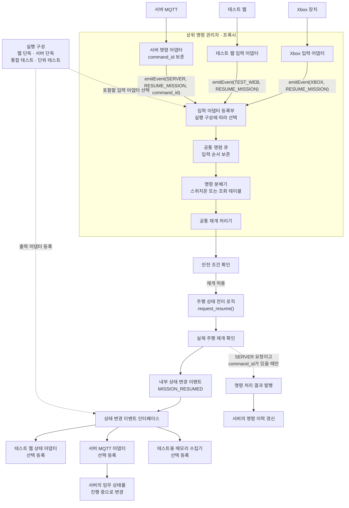

<nav class="project-toc" aria-label="임무 상태 일관성 글 목차">
  <p>이 글에서 다루는 내용</p>
  <ol>
    <li><a href="#problem">문제 사항</a></li>
    <li><a href="#cause">원인</a></li>
    <li><a href="#state-machine">완료·취소·긴급정지 상태 분리</a></li>
    <li><a href="#robot-flow">로봇의 정지 적용 후 임무 이벤트 발행</a></li>
    <li><a href="#completion">예정 시간 경과 후 자동 완료 명령 생성</a></li>
    <li><a href="#reconciliation">이벤트로 상태 일치시키기</a></li>
    <li><a href="#archive">종료 임무 관련 기록 보존</a></li>
    <li><a href="#future">확장 시 고려할 점</a></li>
    <li><a href="#retrospective">느낀 점</a></li>
    <li><a href="#sources">근거 문서</a></li>
  </ol>
</nav>

<h2 id="problem">문제 사항</h2>

<h3>긴급정지 후 다시 시작할 수 없는 좀비 임무</h3>

긴급정지로 로봇은 멈췄지만 서버 화면의 임무는 계속 진행 중으로 표시됐습니다. 재개
명령을 보내려면 서버도 해당 임무가 긴급정지로 멈췄다는 사실을 알고 있어야 했기
때문에, 안전 잠금을 해제한 뒤에도 해당 임무를 다시 시작할 수 없었습니다.

<h3>긴급정지 명령은 완료됐지만 임무는 진행 중으로 남음</h3>

서버는 로봇에 긴급정지 `명령 요청`을 보냈습니다. 로봇은 브레이크를 적용하고 명령을
처리했다는 `명령 처리 결과`를 보냈지만, 임무가 긴급정지로 멈췄다는 `임무 이벤트`는
보내지 않았습니다. 서버에는 해당 임무가 계속 진행 중인 것으로 남았습니다.

<h2 id="cause">원인</h2>

<h3>로봇 통신 연동 문제: 긴급정지 알림을 서버에 보내지 않음</h3>

주행 상태 전이 로직은 긴급정지 요청을 받아 브레이크를 적용했습니다. 누락은 그다음
로봇 통신 처리에서 발생했습니다. 로봇의 주행 상태만 안전 정차로 변경하고, 임무가
긴급정지로 멈췄다는 알림은 서버에 보내지 않았습니다. 서버는 임무 상태를 바꿀 근거를
받지 못해 해당 임무를 계속 진행 중인 것으로 판단했습니다.

<h3>책임 경계</h3>

직접적인 코드 누락은 실제 로봇의 통신 연동 계층에서 발생했습니다. 주행 상태 전이
로직은 정지와 재개 요청을 처리했고, 서버도 임무 이벤트를 받으면 상태를 변경하도록
구현되어 있었습니다. 다만 제가 맡은 서버·MQTT 계약 쪽에서도 임무 상태가 바뀌는
명령 요청에 대해 명령 처리 결과와 해당 임무 이벤트가 함께 오는지 확인하는 과정을
통합 완료 조건으로 두지 못했습니다.
실제 로봇의 긴급정지 처리에서 임무 이벤트 발행을 누락한 구현 문제와 이를 사전에
발견하지 못한 연동 검토 문제가 함께 있었습니다.

| 클래스·모듈 | 역할 |
| --- | --- |
| `RobotCommandCreationService` | 관리자가 실행 중인 임무에 요청한 완료 명령 저장 |
| `MissionAutoCompletionJob` | 예정 시간이 지난 임무를 5초마다 검색하도록 실행 신호 제공 |
| `MissionCompletionCommandCreationService` | 완료 기한이 지난 실행 중 임무를 잠그고 시스템 완료 명령을 중복 없이 생성 |
| `MissionCompletionCommandDispatcher` | 생성된 명령을 MQTT로 발행하고 발행 성공·실패 상태 기록 |
| `DriveCommandRunner` | 명령을 주행 상태 전이 요청으로 바꾸고 물리 적용 후 명령 처리 결과와 임무 이벤트 발행 |
| `StateMachine` | 완료·취소 요청을 대기와 브레이크로, 긴급정지를 비상정지와 브레이크로 전환 |
| `EventPublisher`·`MqttClient` | 임무 이벤트를 SQLite 발신함에 저장하고 MQTT로 발행 |
| `MissionEventIngestionService` | 임무를 잠근 뒤 임무 이벤트와 상태 이력을 하나의 트랜잭션으로 반영 |
| `MissionManagementService` | 실행 전 임무의 물리 삭제와 종료 임무의 논리 삭제 구분 |

<h2 id="state-machine">완료·취소·긴급정지 상태 분리</h2>

| 동작 | 상태 흐름 | 완료 근거 |
| --- | --- | --- |
| 관리자 완료 요청 | `RUNNING` → 관리자 완료 명령 → `COMPLETED` | 로봇의 `MISSION_COMPLETED` 이벤트 |
| 자동 완료 | 예정 시간 경과 `RUNNING` → 시스템 완료 명령 → `COMPLETED` | 로봇의 `MISSION_COMPLETED` 이벤트 |
| 취소 | `READY`·`RUNNING`·`PAUSED` → 취소 명령 → `CANCELLED` | 로봇의 `MISSION_CANCELLED` 이벤트 |
| 긴급정지 | `RUNNING` → `SAFE_STOP`·`PAUSED` | `MISSION_PAUSED` 이벤트 |
| 안전 해제 | `SAFE_STOP` → `PAUSED` 유지 | 별도 재개 명령 전까지 주행하지 않음 |
| 재개 | `PAUSED` → 재개 명령 → `RUNNING` | 명령 처리 결과와 `MISSION_RESUMED` 이벤트 |

임무 완료는 두 경로로 시작합니다. 관리자는 예정 시간이 지나기 전에도 `RUNNING`
상태의 임무에 `COMPLETE_MISSION`을 요청할 수 있습니다. 예정 시간이 지나도록
`RUNNING`인 임무에는 일정 검사 작업이 `SYSTEM/COMPLETE_MISSION`을 자동으로 생성합니다.

두 경로 모두 명령을 생성한 시점에는 임무를 바로 `COMPLETED`로 바꾸지 않습니다.
로봇이 주행을 멈추고 `IDLE`에 도달한 뒤 `MISSION_COMPLETED` 이벤트를 보내야 서버가
임무를 `COMPLETED·100%`로 확정합니다. `PAUSED`는 자동 완료 대상에서 제외되며,
관리자가 완료하려는 경우에도 먼저 `RUNNING`으로 재개해야 합니다.

<h2 id="robot-flow">로봇의 정지 적용 후 임무 이벤트 발행</h2>

정상 완료와 취소는 업무 결과가 다르지만 로봇이 수행하는 물리 동작은 같습니다.
`DriveCommandRunner`는 두 명령을 모두 주행 상태 전이 로직의 `request_cancel()`로
전달합니다. 주행 상태 전이 로직은 임무의 업무 상태를 결정하지 않고 로봇을 `IDLE`로
전환해 브레이크를 적용합니다.

```python
/* communication/commands.py · DriveCommandRunner._request() */
elif command_type == "COMPLETE_MISSION":
    machine.request_cancel()
elif command_type == "CANCEL_MISSION":
    machine.request_cancel()

/* driving/state_machine/machine.py · _guard_remote_control() */
if requests.cancel and context.state is not DriveState.IDLE:
    return (
        _enter(context, DriveState.IDLE, now, "원격 임무 취소", ...),
        BRAKE_COMMAND,
    )
```

메인 제어 반복문은 주행 상태 전이 로직이 반환한 브레이크 명령을 모터에 적용한 다음
`poll_after_step()`을 호출합니다. 따라서 로봇 통신 계층은 `IDLE` 전이만 확인한 것이
아니라 해당 실행 주기의 하드웨어 명령 적용까지 끝난 뒤 임무 이벤트와 명령 처리 결과를
발행합니다.

```python
/* main.py · main() */
command = machine.step(frame, reading, now)
apply_command(motor, servo, command)
comms_runtime.poll_after_step(machine, command, camera_ok=(frame is not None))
```

물리 정지가 끝나면 `DriveCommandRunner`가 처음 수신한 명령 종류를 다시 확인합니다.
`COMPLETE_MISSION`이면 `MISSION_COMPLETED`를 발행하고, `CANCEL_MISSION`이면
`MISSION_CANCELLED`를 발행합니다. `EventPublisher`는 종료 이벤트를 SQLite 발신함에
저장한 뒤 로봇의 임무 보관함을 비웁니다.

```python
/* communication/commands.py · DriveCommandRunner._commit_state() */
elif kind == "COMPLETE_MISSION":
    self._events.mission_completed("OPERATOR_COMPLETED")
    self._state.stand_by()
elif kind == "CANCEL_MISSION":
    self._cancel_mission(pending, snapshot)

/* communication/events.py · EventPublisher._finish_mission() */
self._state.set_mission_state(mission_state)
payload = self._publish_mission(event_type, completion_reason=completion_reason)
self._state.end_mission()
```

임무 이벤트는 `tbs/v2/robots/{mqtt_id}/events/mission`, 명령 처리 결과는
`tbs/v2/robots/{mqtt_id}/commands/result` 토픽으로 발행됩니다. 서버는 두 메시지를
각각 임무 상태 전이와 명령 처리 이력에 사용합니다.

<h2 id="completion">예정 시간 경과 후 자동 완료 명령 생성</h2>

이 절은 두 완료 경로 중 일정 검사 작업의 자동 완료를 다룹니다.
`MissionAutoCompletionJob`은 임무 상태를 직접 바꾸지 않습니다. 일정 간격으로
`MissionCompletionCommandDispatcher`를 호출하고, 실제 작업은 먼저 데이터베이스에
`SYSTEM/COMPLETE_MISSION` 명령을 생성하는 것부터 시작합니다.

```java
/* MissionAutoCompletionJob.java · MissionAutoCompletionJob */
@Scheduled(
        fixedDelayString =
                "${gilbom.robot.mission.completion-scan-interval:5s}"
)
public void completeDueMissions() {
    commandDispatcher.dispatchDueMissions(clock.instant());
}
```

명령 생성 쿼리는 `RUNNING`이고 `started_at + planned_duration_sec`가 지난 임무만
가져옵니다. `PAUSED`를 제외하고, 이미 `CREATED`·`SENT`·`ACCEPTED`·`COMPLETED` 상태의
완료 명령이 있으면 새로 만들지 않습니다. 여러 서버가 같은 임무를 선택하지 않도록
`FOR UPDATE SKIP LOCKED`로 처리 대상을 나눕니다.

```sql
/* MissionCompletionCommandCreationService.java · createDueCommands() */
WITH due_missions AS (
    SELECT
        mission.mission_id,
        mission.robot_id,
        mission.patrol_area_id
    FROM robot.mission mission
    WHERE mission.deleted_at IS NULL
      AND mission.status = 'RUNNING'
      AND mission.started_at IS NOT NULL
      AND mission.started_at
            + mission.planned_duration_sec * INTERVAL '1 second' <= ?
      AND NOT EXISTS (
          SELECT 1
          FROM robot.robot_command existing_command
          WHERE existing_command.mission_id = mission.mission_id
            AND existing_command.command_type = 'COMPLETE_MISSION'
            AND existing_command.command_status IN (
                'CREATED', 'SENT', 'ACCEPTED', 'COMPLETED'
            )
      )
    FOR UPDATE OF mission SKIP LOCKED
    LIMIT 100
)
INSERT INTO robot.robot_command (
    command_id,
    robot_id,
    mission_id,
    command_type,
    command_status,
    requested_by_type,
    issued_at,
    expires_at
)
SELECT
    gen_random_uuid(),
    due_mission.robot_id,
    due_mission.mission_id,
    'COMPLETE_MISSION',
    'CREATED',
    'SYSTEM',
    ?,
    ?
FROM due_missions due_mission
ON CONFLICT DO NOTHING
RETURNING command_id;
```

`MissionCompletionCommandDispatcher`는 저장된 명령으로 MQTT 전송 내용을 만들고,
발행에 성공하면 `SENT`, 실패하면 `PUBLISH_FAILED`를 기록합니다. 이 시점에도 임무는
여전히 `RUNNING`입니다.

```java
/* MissionCompletionCommandDispatcher.java · publish() */
private void publish(RobotCommandRecord command, Instant attemptedAt) {
    CommandRequestPayload payload = new CommandRequestPayload(
            "2.0",
            command.commandId(),
            command.commandType(),
            command.issuedAt(),
            command.expiresAt(),
            new CommandRequestPayload.RequestedBy(
                    CommandRequestPayload.ActorType.SYSTEM,
                    "MISSION-SCHEDULER"),
            new CommandRequestPayload.Parameters(null, null, null));
    try {
        mqttPublisher.publishCommand(command.mqttId(), payload);
        lifecycleService.markSent(command.commandId(), attemptedAt);
    } catch (RuntimeException exception) {
        lifecycleService.markPublishFailed(
                command.commandId(),
                attemptedAt,
                "MQTT_PUBLISH_FAILED");
    }
}
```

<h2 id="reconciliation">이벤트로 상태 일치시키기</h2>

취소 명령에는 서버가 `robot.mission` 테이블에서 조회한 외부 임무 식별자
`mission_code`와 관리자 사유를 넣습니다. 로봇이 저장해 둔 임무 정보를 잃었거나 재개
명령을 처리 중이어도 서버가 보낸 임무 식별자로 취소 이벤트를 회신할 수 있게 했습니다.

명령 처리 결과의 `COMPLETED`만으로 임무를 종결하지 않고 임무 이벤트를 받은 뒤
`status`, `ended_at`, `completion_reason`, 상태 이력을 함께 확정합니다. 종료 임무는
연결된 원격 측정·이벤트·명령·상태 이력을 보존한 채 일반 목록에서 논리적으로 숨깁니다.
활성 임무가 없어진 `ACTIVE` 로봇은 새 임무 후보로 다시 조회합니다.

긴급정지는 정상 완료·취소와 다른 주행 상태로 처리합니다. 로봇은
`EMERGENCY_STOP`을 받으면 주행 상태 전이 로직에 `request_estop()`을 전달합니다.
주행 상태 전이 로직이 비상정지와 브레이크를 적용한 뒤 `DriveCommandRunner`는 로봇
상태를 `SAFE_STOP`으로, 실행 중인 임무를 `PAUSED`로 바꾸고 `MISSION_PAUSED` 이벤트를
발행합니다.

`CLEAR_EMERGENCY_STOP`은 안전 잠금만 해제합니다. 활성 임무는 `PAUSED`로 유지되며,
관리자가 `RESUME_MISSION`을 별도로 보내야 로봇이 다시 주행합니다.

```python
/* communication/commands.py · DriveCommandRunner */
elif command_type == "EMERGENCY_STOP":
    machine.request_estop()

elif kind == "EMERGENCY_STOP":
    self._state.safe_stop("REMOTE_ESTOP")
    if snapshot.mission_id is not None and snapshot.mission_state == "RUNNING":
        self._events.mission_paused()

elif kind == "CLEAR_EMERGENCY_STOP":
    if snapshot.mission_id is not None:
        self._state.pause("REMOTE_PAUSE")
        self._state.set_mission_state("PAUSED")
```

서버의 `MissionEventIngestionService`가 이벤트를 처음 저장한 경우에만 임무 행을
잠급니다. 이벤트 유형을 목표 상태로 변환하고 `ended_at`, 완료 사유와 결과 집계를
갱신한 뒤 같은 트랜잭션에서 상태 이력을 추가합니다.

```java
/* MissionEventIngestionService.java · ingest() */
@Transactional
public RobotEventIngestionResult ingest(
        MissionEventPayload payload,
        String rawPayload,
        Instant receivedAt
) {
    RobotEventIngestionResult event = eventIngestionService.ingest(
            payload,
            payload.eventType(),
            rawPayload,
            receivedAt);
    if (!event.inserted()) {
        return event;
    }

    MissionState current = lockMission(
            event.missionId(),
            event.robotId());
    String targetStatus = targetStatus(payload.eventType());
    updateMission(
            event.missionId(),
            event.robotId(),
            payload,
            targetStatus);
    appendHistory(
            event.missionId(),
            event.eventId(),
            current.status(),
            targetStatus,
            payload,
            receivedAt);
    return event;
}

private String targetStatus(MissionEventPayload.EventType eventType) {
    return switch (eventType) {
        case MISSION_STARTED, MISSION_RESUMED -> "RUNNING";
        case MISSION_PAUSED -> "PAUSED";
        case MISSION_COMPLETED -> "COMPLETED";
        case MISSION_CANCELLED -> "CANCELLED";
        case MISSION_FAILED -> "FAILED";
    };
}
```

<h2 id="archive">종료 임무 관련 기록 보존</h2>

실행 전 `CREATED` 임무는 연결된 원격 측정·이벤트·명령·상태 이력이 없어 물리 삭제할
수 있습니다. 반면 `COMPLETED`·`CANCELLED`·`FAILED` 임무는 이 기록들이 참조하는
대상이므로 `deleted_at·deleted_by`만 기록해 일반 조회에서 숨깁니다.

```java
/* MissionManagementService.java · delete() */
if (current.status() == MissionStatus.CREATED) {
    jdbcTemplate.update(
            "DELETE FROM robot.mission_status_history "
                    + "WHERE mission_id = ?",
            missionId);
    jdbcTemplate.update("""
            DELETE FROM robot.mission
            WHERE mission_id = ?
              AND status = 'CREATED'
            """,
            missionId);
} else {
    jdbcTemplate.update("""
            UPDATE robot.mission
            SET deleted_at = ?,
                deleted_by = ?,
                updated_at = GREATEST(updated_at, ?)
            WHERE mission_id = ?
              AND deleted_at IS NULL
              AND status IN ('COMPLETED', 'CANCELLED', 'FAILED')
            """,
            deletedAt,
            actorUserId,
            deletedAt,
            missionId);
}
```

<h2 id="future">확장 시 고려할 점</h2>

프로젝트 통합 기간에도 주행 테스트 모드를 계속 사용했습니다. 테스트 웹은 일회성 점검
도구가 아니라 Xbox 입력과 웹 버튼으로 실제 주행 상태를 바꾸는 조작 경로였습니다.
동시에 서버 명령도 같은 주행 상태에 영향을 줬지만, 테스트 웹은 주행 함수를 직접
호출하고 서버 명령은 로봇 통신 처리기를 거쳤습니다. 두 입력 경로가 상태 변경 이후의
임무 이벤트 발행까지 공유하지 않아 로봇과 서버의 상태가 달라질 수 있었습니다.

주행 상태 전이 로직은 MQTT 명령뿐 아니라 Xbox와 터치 입력으로도 비상정지를
해제합니다. 그러나 `MISSION_RESUMED` 이벤트는 MQTT `RESUME_MISSION` 처리 경로에서만
발행합니다. 현장 입력으로 재출발하면 로봇은 `CRUISE`로 전환되지만 서버의 임무는
`PAUSED`로 남을 수 있습니다.

현장 입력으로 재출발을 허용하려면 입력 경로와 관계없이 주행 상태 전이를 기준으로
로봇 상태와 임무 이벤트를 함께 갱신해야 합니다. 비상정지 해제와 재출발도 분리해,
해제 후 `IDLE`·`PAUSED`를 유지할지 임무를 `RUNNING`으로 전환할지 하나의 상태 동기화
경로에서 결정해야 합니다.

<h3>개선 방안 구조도</h3>

개선안에서는 상위 명령 관리자가 프록시처럼 Xbox, 테스트 웹, 서버 입력 어댑터를
포함합니다. 각 입력 어댑터는 원래 입력을 공통 명령 형식으로 바꿔 `emitEvent()`로 상위
명령 관리자에 전달합니다. 상위 명령 관리자는 모든 명령을 하나의 큐에 넣고, 스위치문이나
조회 테이블로 같은 재개 처리기에 연결합니다. 입력 어댑터는 주행 상태를 직접 변경하지
않습니다.

재개 처리기는 입력 출처와 관계없이 안전 조건 확인과 주행 재개를 같은 순서로 실행하고,
재개가 끝나면 내부 상태 변경 이벤트를 한 번 발행합니다. 테스트 웹, 서버 MQTT,
테스트용 수집기는 실행할 때 필요한 것만 이 이벤트를 구독합니다. 서버 요청에는 명령
식별자가 있으므로 명령 처리 결과도 발행하지만, Xbox와 테스트 웹 요청에는 서버 명령이
없으므로 명령 처리 결과를 만들지 않습니다.

상위 명령 관리자는 실행 구성에 따라 포함할 입력 어댑터를 선택합니다. 통합 테스트
환경에서는 테스트 웹과 서버 입력 어댑터를 모두 포함합니다. 두 입력이 동시에 들어와도
상위 명령 관리자의 단일 큐와 단일 처리기가 순서대로 처리하므로 하나의 주행 상태만
변경합니다. 처리 결과는 등록된 테스트 웹과 서버 출력 어댑터에 모두 전달됩니다.



상위 명령 관리자는 구체적인 입력 구현 대신 공통 입력 어댑터 인터페이스에 의존합니다.
웹 단독 구성은 테스트 웹 입력만, 서버 단독 구성은 서버 명령 입력만 포함합니다. 통합
테스트 구성은 Xbox·테스트 웹·서버 입력을 함께 포함하고, 단위 테스트 구성은 가짜 입력과
메모리 수집기만 사용합니다. 따라서 하나의 명령 처리 규칙을 유지하면서도 실행 환경마다
필요한 입력과 출력만 조립할 수 있습니다.

이 구조가 모든 입력 경로에 적용됐다면 긴급정지 처리에서 임무 이벤트만 빠지는 문제를
막을 수 있었습니다. Xbox·테스트 웹·서버 입력은 주행 상태를 직접 변경하지 않고 상위
명령 관리자를 거쳐야 합니다. 상위 명령 관리자는 실제 상태 전이가 끝난 뒤 동작별 임무
이벤트를 같은 규칙으로 발행합니다.

| 공통 동작 | 실제 상태 전이 확인 | 발행할 임무 이벤트 |
| --- | --- | --- |
| 임무 시작 | 주행 시작 | `MISSION_STARTED` |
| 임무 정지 | 주행 정차 | `MISSION_PAUSED` |
| 긴급정지 | 비상정지와 브레이크 적용 | 실행 중인 임무가 있으면 `MISSION_PAUSED` |
| 임무 재개 | 주행 재개 | `MISSION_RESUMED` |
| 정상 완료 | 주행 종료와 브레이크 적용 | `MISSION_COMPLETED` |
| 관리자 취소 | 주행 종료 또는 안전 정차 유지 | `MISSION_CANCELLED` |
| 긴급정지 해제 | 안전 잠금 해제 | 임무 이벤트를 발행하지 않고 정지 상태 유지 |

<h2 id="retrospective">느낀 점</h2>

기획 단계에서 상태와 책임의 경계를 충분히 맞추지 않은 채 구현을 나누자, 각 모듈은
동작해도 연결 지점에서는 서로 다른 전제를 갖게 됐습니다. 코드 리뷰도 개별 기능
위주로 진행되어 다른 팀원의 코드를 전체 흐름 안에서 이해하지 못했고, 일부 모듈이
블랙박스처럼 남았습니다. 구현 전에 상태 전이와 완료 조건을 함께 정하고, 리뷰에서는
모듈 간 입력·출력까지 확인해야 팀의 판단 기준을 맞출 수 있다는 점을 배웠습니다.
또한 통합 기간 내내 사용하는 테스트 웹은 임시 도구가 아니라 하나의 제어 클라이언트로
보고, 서버 명령과 동일한 상태 전이·이벤트 발행 규칙을 적용해야 했습니다.

<h2 id="sources">근거 문서</h2>

- `CHANGLOGS/2026-08-02_1430_emergency-stop-mission-resume.md`
- `CHANGLOGS/2026-08-01_2125_mission-ready-delete.md`
- `CHANGLOGS/2026-08-02_0002_mission-management-smart-commit.md`
- `CHANGLOGS/2026-08-02_1454_embedded-communication-handoff.md`
- `CHANGLOGS/2026-08-02_1713_mission-completion-and-archive.md`
- `CHANGLOGS/2026-08-02_1826_mission-terminal-flow.md`
- `CHANGLOGS/2026-08-02_1856_mission-list-scope-dropdown.md`
- `CHANGLOGS/2026-08-02_1918_mission-completion-ui-and-reassignment-refresh.md`
- `CHANGLOGS/2026-08-04_1636_field-integration-open-issues.md`
- `CHANGLOGS/2026-08-04_1751_cancel-mission-reconciliation.md`
- `CHANGLOGS/2026-08-04_1755_cancel-payload-example.md`
