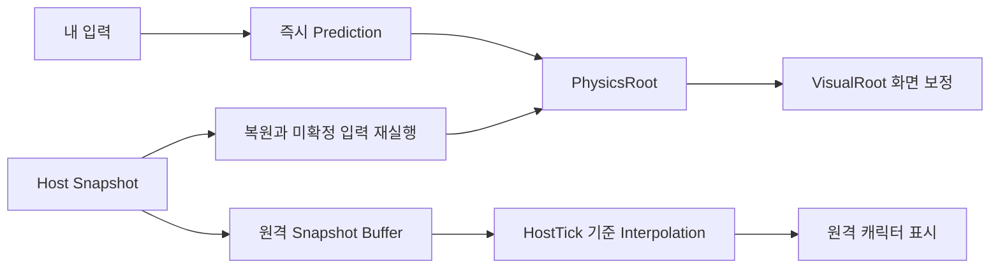
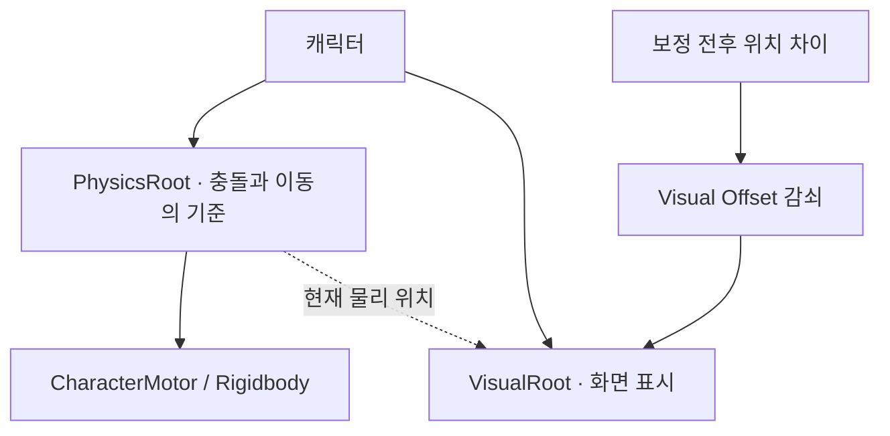
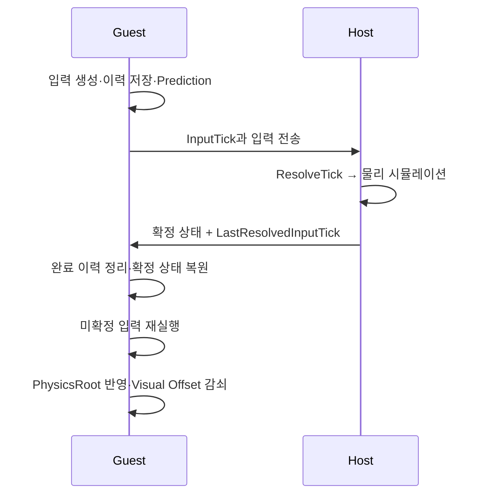
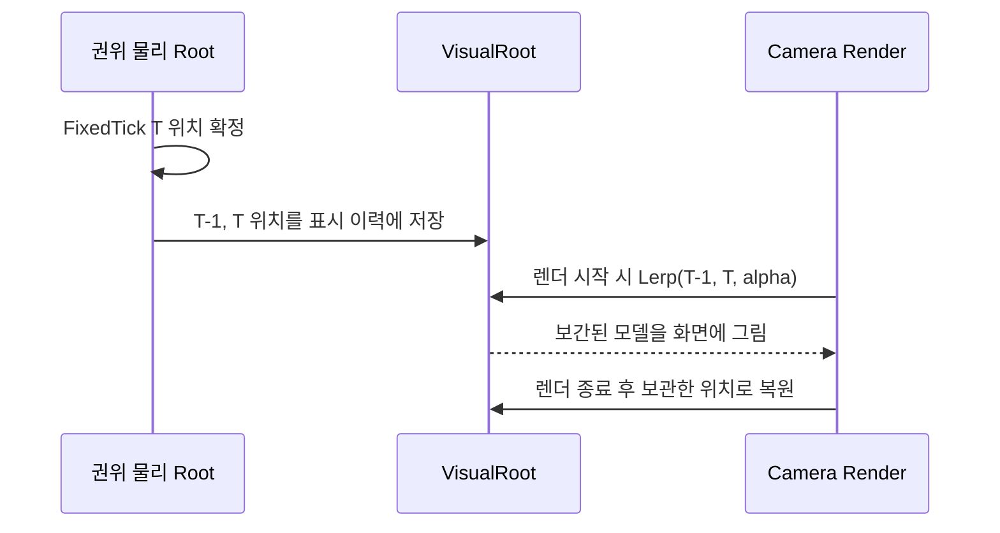

> <span class="ssketch-callout-label ssketch-callout-label--problem">문제</span> 예측 위치와 호스트 확정 위치가 달라지고, 물리 갱신 사이에 캐릭터가 끊겨 보였다.  
> <span class="ssketch-callout-label ssketch-callout-label--cause">원인</span> 입력, 권위 시뮬레이션, 스냅샷 수신, 렌더링의 시간축이 달랐다.  
> <span class="ssketch-callout-label ssketch-callout-label--solution">해결</span> 물리 상태 복원·재예측과 VisualRoot의 화면 보정을 분리했다.  
> <span class="ssketch-callout-label ssketch-callout-label--result">결과</span> 호스트 화면의 Guest 위치 보간 실험에서 표시 속도 변동이 줄었다.  
> <span class="ssketch-callout-label ssketch-callout-label--role">역할</span> 클라이언트 동기화 흐름 구현, 표시 위치 계측 및 보간 전후 비교를 담당했다.

**용어 정리**

| 용어 | 뜻 |
| --- | --- |
| Guest / Host | Guest는 일반 참가자, Host는 물리 판정을 맡은 방장 PC |
| Tick / HostTick | 호스트가 물리 계산을 한 번 하는 단위(초당 60번)와 그 번호 |
| Prediction | 서버 응답을 기다리지 않고 내 화면에서 먼저 움직여 보여주는 것 |
| Reconciliation | 내가 예측한 위치를 호스트가 확정한 값에 맞춰 다시 바로잡는 과정 |
| Interpolation(보간) | 두 위치 사이를 부드럽게 이어서 보여주는 것 |
| Snapshot | 호스트가 확정한 전체 상태를 모두에게 보내는 묶음 |
| PhysicsRoot | 충돌·이동 판정에 쓰는 캐릭터의 실제 물리 위치 |
| VisualRoot | 화면에 그리기만 하는 캐릭터 모델의 위치 |
| 러버밴딩 | 캐릭터가 갑자기 뒤로 당겨지듯 튀어 보이는 현상 |
| fallback | 그 Tick에 받은 입력이 없어서 이전 값을 대신 쓰는 처리 |
| LastResolvedInputTick | 호스트가 "여기까지는 확정했다"고 알려주는 값 |

## 같은 캐릭터에도 여러 시점의 위치가 있다

### 로컬 캐릭터 이동 판정에서의 문제
SSketch의 물리 판정은 Unity 호스트가 담당한다. Guest가 이동 키를 누른 시점과 그 입력을 호스트가 처리하는 시점 사이에는 왕복 통신과 실행 순서에 따른 간격이 생긴다. 호스트의 응답을 받은 뒤 움직이면 이 간격이 조작 지연으로 드러난다. Guest에서는 입력을 생성한 즉시 자신의 캐릭터를 예측 이동시켰다.

이렇게 미리 움직인 위치는 나중에 호스트가 확정한 위치와 달라질 수 있다. 입력이 도착한 시점이 다르거나, 부딪힌 상대의 상태가 달랐거나, 호스트가 그 Tick에서 fallback을 썼을 수도 있다. 그러다 스냅샷을 받으면 그 확정 상태에 맞춰 예측을 바로잡아야 하는데, <span class="ssketch-key ssketch-key--problem">화면까지 그 자리에서 바로 옮겨버리면 캐릭터가 갑자기 뒤로 튕기는 러버밴딩이 보였다.</span>

### 상대 캐릭터 이동 판정에서의 문제
상대 캐릭터는 또 다른 조건을 가진다. 내가 앞으로 실행할 입력을 가지고 있지 않으므로, 도착한 스냅샷 사이의 움직임을 재생해야 한다. 로컬 플레이어와 원격 플레이어를 동일하게 부드럽게 움직이는 함수 하나로 묶으면, 어떤 상태가 물리 기준이고 어떤 상태가 표시용인지 흐려졌다.



### 호스트 확정 상태와 로컬·원격 화면의 연결

<figure class="ssketch-diagram-overview">
  <a href="{{ '/assets/images/projects/ssketch/prediction-reconciliation-flow.svg' | relative_url }}">
    
  </a>
</figure>

## 물리 기준점과 화면 위치를 나눴다

맨 처음 정한 원칙은 <span class="ssketch-key ssketch-key--solution">다음 예측은 화면 보간의 영향을 받지 않은 물리 상태에서 출발해야 한다</span>는 것이었다. 클라이언트는 호스트 확정 상태를 복원하고 미확정 입력을 다시 실행해 다음 예측의 기준을 만든다. 물리 위치와 화면 위치를 하나의 Root로 처리하면, 위치를 천천히 보정하든 즉시 보정하든 문제가 생긴다.

### 1. 물리 Root 자체를 보간하면

- **1-1. 다음 예측이 보간 중인 위치에서 시작한다.**
<br> 클라이언트가 물리 Root를 보정 목표까지 천천히 옮기는 동안 새 입력이 들어오면, 클라이언트는 아직 보정을 끝내지 못한 위치에서 다음 이동을 계산한다. 호스트 확정 상태에서 미확정 입력을 다시 실행해 얻은 물리 상태에 **<span class ="notice-pink">화면 보간 오차가 섞여</span> 시뮬레이션으로 되돌아간다.**<br><br>
- **1-2. 물리 상태를 보정 목표에 즉시 맞추지 못한다.**<br> 클라이언트가 화면을 부드럽게 만들려고 물리 Root의 이동을 늦추면, 충돌·접지·공격 판정도 보간 중인 위치를 사용한다. 화면 표시를 위한 지연이 물리 판정의 기준까지 바꾼다.<br><br>
- **1-3. 새 스냅샷이 올 때마다 보간 목표가 바뀐다.** <br> 이전 보정이 끝나기 전에 다음 확정 스냅샷이 도착하면, 클라이언트는 보간 도중의 위치에서 새 목표를 향해 다시 움직인다. 이 과정이 반복되면 물리 Root가 보정 목표를 계속 뒤따라갈 수 있다.

### 2. 보간 없이 물리 Root를 즉시 고치면

- **1-1. 화면에서도 캐릭터가 순간이동하듯 보인다.** <br>클라이언트가 호스트 확정 상태를 복원하고 미확정 입력을 다시 실행하면 물리 기준은 바로잡을 수 있다. 하지만 화면도 같은 Root를 사용하므로 보정 전후의 위치 차이가 그대로 드러난다.<br><br>
- **1-2. 보정이 반복되면 화면이 흔들리거나 고무줄처럼 되돌아간다.** <br>클라이언트의 예측 위치와 호스트 기준으로 다시 계산한 위치가 다를 때마다 화면 위치도 즉시 바뀐다. 플레이어에게는 이동 중 캐릭터가 갑자기 앞뒤로 튀는 현상으로 보인다.

### 물리 보정과 화면 보정을 분리한다

그래서 물리 판정에 쓰는 위치와 화면에 보여주는 위치를 PhysicsRoot와 VisualRoot로 나눴다. 예를 들어 호스트에게서 받은 확정 위치가 10.0m에서 9.9m로 바뀌었다면, <span class ="notice-yellow">PhysicsRoot</span>는 그 <span class ="notice-yellow">즉시 9.9m로 고쳐서</span> 다음 물리 계산에 쓰고, <span class ="notice-pink">VisualRoot</span>는 화면에서만 <span class ="notice-pink">0.15초에 걸쳐 천천히 9.9m로 움직인다.</span> 두 위치의 차이는 화면 전용 값으로 남겨두고, 렌더링하면서 서서히 줄여나갔다.



개념적으로 화면 위치는 `physicsPosition + visualOffset`이다. offset은 충돌 판정이나 다음 입력의 시작 위치에 섞지 않는다. 한 프레임 동안 예쁘게 보이기 위해 바꾼 좌표가 다음 Tick의 물리 상태로 흘러들어 가지 않도록 경계를 만들었다.

**분리한 효과**

- 다음 입력은 **화면 보간의 영향을 받지 않은 물리 위치에서 계산**한다.
- 충돌체 위치와 접지 상태는 **물리 보정에 바로 반영**된다.
- 화면에서는 **순간이동이나 떨림이 덜 보인다.**  
  (입력 fallback이 늘거나 예측 위치 오차가 크게 흔들리면 떨림이 체감될 수 있음)
- 카메라는 **화면에 보이는 캐릭터 위치를 따라가도록 구성할 수 있다.**

모든 오차를 다 오래 보간하는 것도 피해야 했다. 순간이동이나 리스폰처럼 위치가 뚝 끊겨서 바뀌는 상황에서는, 이전 위치와 억지로 이어 붙이면 오히려 이상하게 움직이는 걸로 보인다. <span class="ssketch-key ssketch-key--solution">이렇게 위치가 통째로 바뀌는 순간에는 이전에 보간하던 기록을 다 비우고, 새 위치를 바로 기준으로 삼았다.</span>

## 로컬 플레이어: 확정한 뒤 남은 입력을 다시 실행한다

로컬 Guest는 InputTick과 입력 내용을 이력에 남기고 즉시 Prediction을 수행한다. <span class ="notice-yellow">스냅샷</span>을 받으면 호스트가 어디까지 처리했는지 확인해 <span class ="notice-yellow">완료된 입력</span>을 정리한다. 이어서 호스트 확정 상태를 복원하고, <span class ="notice-yellow">아직 확정되지 않은 입력을 순서대로 다시 적용</span>한다. 최종 예측 상태가 <span class ="notice-yellow">새 PhysicsRoot</span>의 기준이 된다.



`LastResolvedInputTick`을 해석할 때는 주의가 필요했다. 호스트가 그 Tick을 끝냈다는 사실과 실제 입력을 소비했다는 사실은 구분해야 한다. fallback으로 처리한 Tick도 시간축은 앞으로 진행한다. <span class ="notice-yellow">이미 끝난 Tick의 점프</span>를 재전송한다고 과거 판정이 <span class ="notice-yellow">다시 열리지는 않는다.</span> 점프가 예측에서는 실행됐는데 호스트에서는 실행되지 않은 문제는 [<span class ="notice-yellow">단발 입력 동기화</span>]({{ '/projects/ssketch/technical/jump-edge/' | relative_url }})에서 따로 추적했다.

현재 Reconciliation은 호스트가 보낸 내 캐릭터의 확정 상태를 기준으로, 아직 확정되지 않은 내 입력만 다시 적용하는 방식이다. 다른 플레이어나 월드 오브젝트의 과거 상태까지 복원하는 전체 Rollback은 수행하지 않는다. 따라서 다른 플레이어와의 충돌처럼 외부 객체가 내 이동 결과에 영향을 준 상황에서는 과거 물리 상황을 완전히 재현할 수 없으며, 이후 호스트 Snapshot을 통해 오차를 다시 보정한다.

### 입력부터 화면 보정까지

```text
화면:       예측 위치로 즉시 이동 ───────── 부드럽게 보정
권위:       아직 미확정 ─── HostTick T에서 물리 확정
네트워크:   입력 전송 ───── 확정 스냅샷 수신
```

1. 게스트는 `LastResolvedInputTick` 이하의 입력을 제거하고, 호스트 확정 상태부터 **미확정 입력을 다시 적용**한다.
2. 게스트는 재시뮬레이션 결과를 **물리 상태에 즉시 반영**하고, 화면 모델만 짧은 보간으로 보정한다.
3. 순간이동·리스폰이나 큰 위치 오차는 **보간하지 않고 즉시 스냅**한다.

## 원격 플레이어: 조금 과거의 상태를 재생한다

Guest가 보는 다른 플레이어는 HostTick이 붙은 스냅샷을 버퍼에 저장했다. 수신 즉시 최신 위치로 옮기는 대신, 표시할 Tick을 약간 과거에 두고 그 시점을 감싸는 두 스냅샷 사이를 보간했다. 패킷 도착 간격이 조금 흔들려도 렌더링은 연속된 위치를 사용할 수 있다.

물리는 60Hz, 스냅샷 전송은 30Hz로 구성했다. 렌더링이 60Hz일 때 새 스냅샷이 없는 프레임도 있으므로, 수신 횟수와 화면 갱신 횟수를 일치시키려 하면 계단식 이동이 드러난다. 보간은 두 갱신 주기 사이를 연결하는 역할을 한다. 실제 렌더 프레임은 장치와 부하에 따라 달라진다.

**보간 전후의 화면 위치**

```text
확정 상태:       A ───────── B ───────── C

보간 없음:       A A A A A   B B B B B   C
                └ 같은 위치 반복 ┘ → 다음 위치로 한 번에 이동

보간 적용:       A · · · ·   B · · · ·   C
                └ A→B 사이 ┘ └ B→C 사이 ┘
                  중간 위치를 계산해 부드럽게 표시
```

144Hz 화면처럼 상태 갱신보다 화면 갱신이 빠르면, 같은 위치를 여러 프레임 표시하게 된다. 보간은 A–B, B–C 사이의 중간 위치를 계산해 계단식 움직임을 줄인다. 원격 플레이어의 A·B·C는 **30Hz로 받은 확정 스냅샷**이며, 그림의 점은 그 사이에 표시할 위치를 뜻한다.

이 선택에는 표시 지연이 따른다. 두 상태 사이를 안정적으로 보간하려면 뒤쪽 상태가 도착할 시간을 확보해야 한다. 버퍼가 비는 구간에서는 가진 상태만으로 움직임을 무한히 정확하게 예측할 수 없다. 지연이 커졌을 때의 표시 정책과 큰 위치 오차에서의 snap은 별도로 다뤄야 한다.

### 렌더 Tick에 맞는 두 상태를 고른다

다른 플레이어의 미래 입력은 알 수 없으므로, 게스트는 자신의 캐릭터처럼 입력을 재실행하지 않는다. 게스트는 추정 HostTick에서 보간 지연을 뺀 **과거의 렌더 Tick**을 선택한다.

```text
renderTick = estimatedHostTick - interpolationDelayTicks
alpha = (renderTick - from.HostTick) / (to.HostTick - from.HostTick)
화면 위치 = Lerp(from.Position, to.Position, alpha)
```

`from`과 `to`는 렌더 Tick을 앞뒤로 감싸는 두 확정 스냅샷이다. 두 위치 사이의 보간은 **임의의 미래 이동을 만들어 내지 않는다.**

새 스냅샷이 늦어 표시 시점이 최신 상태를 넘으면, 게스트는 마지막 확정 위치와 속도로 **제한된 외삽**을 수행한다. 외삽 시간에 상한을 두어 패킷 공백 동안 캐릭터가 계속 이동하지 않게 한다. 이는 다른 플레이어의 미래 입력을 추측하는 예측과 구분한다.

## 호스트 화면에서도 Guest가 끊겨 보였다

호스트는 Guest의 물리를 직접 시뮬레이션하므로 스냅샷 수신 지연 없이 최신 권위 상태를 가지고 있다. 그런데도 화면에서 작은 끊김이 보였다. 60Hz 물리 단계 사이에 렌더 프레임이 끼면 같은 물리 위치를 한 번 더 표시하거나, 다음 위치로 한꺼번에 이동할 수 있었다.

이 경로에는 원격 스냅샷 보간과 별도로, 직전·현재 권위 물리 위치 사이를 렌더 시점에 연결하는 위치 보간을 적용했다. 렌더 경계에서 VisualRoot 위치만 바꾸고 표시가 끝난 뒤 복원해 물리 로직으로 영향이 돌아가지 않게 했다. 실험 대상은 위치 보간이며 회전이나 로컬 Prediction 전체를 한 번에 바꾼 실험으로 확대 해석하지 않았다.

### 물리 Tick 사이의 화면 위치

```text
물리 Tick:      A ───── B ───── C
보간 없음:     A A A   B B     C C C
               같은 위치 유지 → 다음 위치로 한 번에 이동

보간 적용:     A · ·   B · ·   C
               A–B, B–C 사이의 중간 위치를 화면에 표시
```

144Hz 화면에서는 60Hz 물리 상태 하나가 여러 렌더 프레임에 걸쳐 표시될 수 있다. 호스트는 **권위 물리 Root를 유지**하고, 카메라가 그리는 순간에만 VisualRoot를 이전·현재 물리 위치 사이로 보간한다. 표시 보간은 설정으로 켜고 끌 수 있다.

### 렌더 한 번의 동작

이전 물리 위치를 A, 현재 물리 위치를 B라고 하면 렌더 한 번의 동작은 다음과 같다.

```csharp
// 1. 렌더 후 복원할 현재 위치 B를 보관
_authoritativeVisualPosition = _visualRoot.position;

// 2. 마지막 물리 갱신 이후 경과 시간으로 진행률 계산
float alpha = Mathf.Clamp01(
    (float)((Time.timeAsDouble - Time.fixedTimeAsDouble) / fixedDeltaTime));

// 3. 화면에 그릴 위치를 임시 적용
_visualRoot.position = Vector3.Lerp(A, B, alpha);

// 4. 카메라가 보간된 모델을 렌더링

// 5. 렌더 종료 후 보관한 위치 B로 복원
_visualRoot.position = _authoritativeVisualPosition;
```

**alpha는 렌더 프레임 수가 아니라 시간으로 계산한다.** 60Hz의 물리 갱신 간격 약 16.67ms를 기준으로 하면 다음과 같다.

| 마지막 물리 갱신 후 경과 시간 | alpha |
| --- | ---: |
| 2ms | 약 0.12 |
| 7ms | 약 0.42 |
| 13ms | 약 0.78 |



공격·충돌·스냅샷 생성은 계속 권위 물리 Root를 사용한다. 화면 모델만 최대 한 물리 Tick 늦게 표시하므로, 화면 보간이 게임 판정에 섞이지 않는다.

## 관찰자에 따라 화면 위치를 선택한다

| 관찰 상황 | 화면 위치의 출처 | 시간 특성 |
| --- | --- | --- |
| 호스트가 자신을 봄 | 현재 권위 물리 상태 | 최신 HostTick |
| 호스트가 게스트를 봄 | 직접 계산한 이전·현재 물리 위치의 표시 전용 보간 | 최대 약 한 물리 Tick 지연 |
| 게스트가 자신을 봄 | 로컬 예측 + 호스트 확정 상태로 재조정 + 화면 보정 | 입력에 즉시 반응한 뒤 확정 결과에 맞춤 |
| 게스트가 다른 캐릭터를 봄 | 과거의 두 HostTick 스냅샷 사이 보간 | 보간 지연만큼 과거 |

**최종 판정은 호스트의 물리 상태를 기준으로 하고, 화면은 관찰자에 따라 예측하거나 과거 상태를 보간한다.**

## 검증: 등속 구간과 프레임 조건을 나눠 비교했다

### 보간으로 인해 일정한 속도로 이동하는 구간에서 화면 움직임이 얼마나 고르게 이어졌을까??
### 툭툭 끊겨보이는지/얼마나 부드러운지를 화면 속도 표준편차로 표현했다.

2026년 9월 20일, PC 두 대에서 Host 1명과 Guest 1명으로 비교했다. 동일한 일반 Windows 빌드 `23bcf381`을 사용했고 Development Build와 Profiler는 사용하지 않았다. 호스트가 보는 Guest를 대상으로, 1초 계측 창에서 권위 평균 속도가 3.95~4.05m/s이고 전체 렌더 프레임이 이동 중인 구간을 골랐다.



| 선택한 등속 이동 구간 | 보간 OFF | 보간 ON |
| --- | ---: | ---: |
| 1초 창 수 / 렌더 프레임 | 94 / 5,664 | 63 / 3,808 |
| 평균 표시 속도 | 4.030m/s | 4.010m/s |
| 표시 속도 표준편차 | 0.906m/s | 0.355m/s |
| 표시 위치가 멈춘 프레임 | 93개, 1.642% | 0개 |

선택한 구간에서는 표시 속도 표준편차가 약 60.8% 줄었다. 다만 OFF와 ON의 프레임 상태까지 같지는 않았다. 보간 효과와 프레임 간격 차이가 섞일 수 있어, 프레임 간격 p95가 20ms 이하이고 최댓값이 25.5ms 이하인 로그들(1초 구간)만 다시 골라 집계 후 비교했다.

| 프레임 조건을 추가한 부분집합 | OFF | ON |
| --- | ---: | ---: |
| 1초 창 수 / 렌더 프레임 | 33 / 1,998 | 62 / 3,747 |
| 평균 프레임 간격 | 16.664ms | 16.669ms |
| 표시 속도 표준편차 | 0.404m/s | 0.350m/s |
| 표시 위치가 멈춘 프레임 비율 | 0.250% | 0% |

이 부분집합에서도 변동은 약 13.4% 감소했다. 두 표를 함께 남겨 전체 선택 구간의 큰 차이를 보간 하나의 효과로 단정하지 않았다. 관측한 결과는 등속 이동의 화면 연속성을 개선했다.


## 부드러움의 비용과 남은 문제

같은 실험의 창별 추정 표시 지연 p95 중앙값은 10.03ms에서 16.67ms로 늘었다. 이는 위치 표시의 지연 추정치이며 키 입력부터 화면까지의 전체 지연 측정값과 구분했다. 60Hz의 한 Tick은 약 16.67ms이므로, 이전·현재 물리 위치를 연결하는 방식이 갖는 시간 비용을 함께 확인한 셈이다.

보간은 이미 존재하는 상태를 화면에 연결한다. Host hitch로 물리 진행 자체가 멈추거나 입력이 deadline을 넘긴 문제는 해당 경로에서 해결해야 한다. 그래서 입력 소비 문제에는 Pre-Tick Pump를, 예측 오차에는 Reconciliation을, 표시 불연속에는 VisualRoot 보정을 각각 적용했다. 이 경계를 나누자 화면의 끊김을 보았을 때 어느 단계의 데이터를 먼저 확인할지 명확해졌다.
