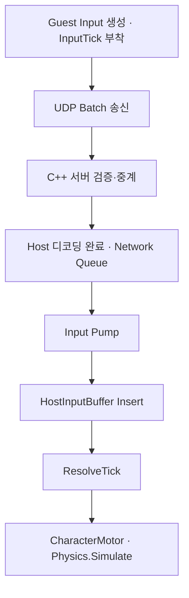
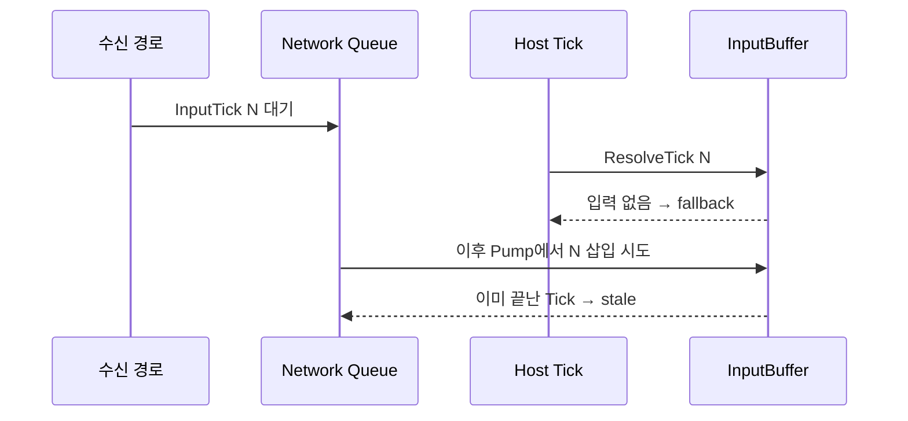
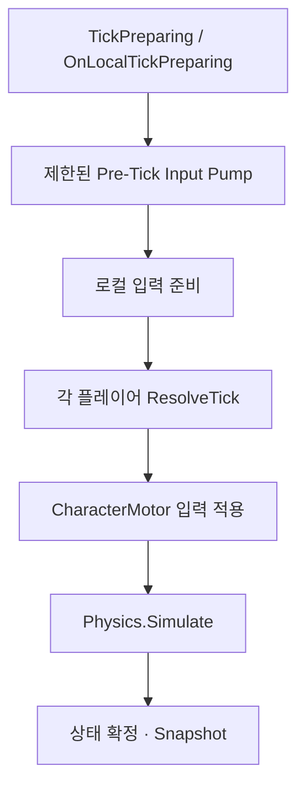

> <span class="ssketch-callout-label ssketch-callout-label--problem">문제</span> 4인 실행에서 이동이 간헐적으로 끊기고 fallback이 21.95~24.14% 발생했다.  
> <span class="ssketch-callout-label ssketch-callout-label--cause">원인</span> 수신 큐의 입력이 해당 Tick의 Resolve 전에 InputBuffer에 반영되지 않았다.  
> <span class="ssketch-callout-label ssketch-callout-label--solution">해결</span> 권위 Tick 시작 직전에 제한된 입력 큐 처리를 수행하는 Pre-Tick Pump를 넣었다.  
> <span class="ssketch-callout-label ssketch-callout-label--result">결과</span> 같은 PC의 수동 비교에서 fallback 3.09~4.57%, 실제 입력 소비 95.43~96.91%를 관측했다.  
> <span class="ssketch-callout-label ssketch-callout-label--role">역할</span> 입력 단계별 계측, lifecycle 순서 수정, Profiler 분석과 2PC 검증을 담당했다.

**용어 정리**

| 용어 | 뜻 |
| --- | --- |
| Guest / Host | Guest는 일반 참가자, Host는 물리 판정을 맡은 방장 PC |
| Tick | 호스트가 물리 계산을 한 번 하는 단위(초당 60번) |
| ResolveTick | 호스트가 그 Tick에 쓸 입력을 하나로 확정하는 함수 |
| InputBuffer | 호스트가 플레이어별로 받은 입력을 Tick 번호별로 모아두는 곳 |
| fallback | 그 Tick에 받은 입력이 없어서 이전 값(Held)이나 중립 값(Neutral)을 대신 쓰는 처리 |
| 입력 소비율 | 호스트가 실제로 받은 입력으로 처리한 Tick의 비율 |
| Pre-Tick Pump | Tick을 확정하기 직전에 이미 도착한 입력을 InputBuffer로 먼저 옮기는 처리 |
| Backfill | 입력이 빈 Tick에 이전 입력을 채워 넣는 처리 |
| batch | 여러 Tick의 입력을 한 패킷에 묶은 것 |
| stale | 이미 판정이 끝난 Tick을 대상으로 뒤늦게 온 입력 |
| RTT | 패킷이 갔다가 돌아오는 데 걸리는 시간 |
| 2PC | Host와 Guest를 서로 다른 PC 두 대에서 실행한 실험 |
| Update / FixedUpdate | Unity가 화면 프레임마다 / 고정 물리 주기마다 부르는 함수 |
| Physics.Simulate | Unity 물리를 한 단계 진행시키는 함수 |
| Profiler | Unity에서 함수별 실행 시간을 재는 도구 |

## 패킷은 보이는데 움직임이 끊겼다

Host 1개와 Guest 3개, 총 4개 프로그램을 같은 PC에서 동시에 실행해 이동을 확인하던 중, 캐릭터가 일정하게 움직이다가 짧게 끊기는 현상을 발견했다.

<video class="ssketch-video" controls preload="metadata" width="1920" height="1080" poster="{{ '/assets/images/projects/ssketch/input-fallback-comparison.png' | relative_url }}">
  <source src="{{ '/assets/videos/projects/ssketch/input-fallback-symptom.mp4' | relative_url }}" type="video/mp4">
</video>
<p class="ssketch-source">개발 당시 녹화한 문제 상황. 이동이 일정하게 이어지다가 순간적으로 끊기거나 튀는 걸 볼 수 있다.</p>

처음에는 초당 60번 도는 물리 계산과 별개로 <span class="ssketch-key ssketch-key--cause">FPS가 떨어지면 `Update` 호출 주기가 불안정해지고, 그 결과 한 프레임 안에서 `FixedUpdate → Physics.Simulate`가 몰아서 여러 번 실행되면서 일부 Tick의 입력이 누락된다</span>고 추정했다. 이 추정에 맞춰 입력이 빈 Tick에는 이전 입력값을 잠깐 유지하는 Backfill 방식을 넣어봤지만, 현상은 크게 나아지지 않았다.

호스트의 입력 처리 기록을 다시 보니, 실제 입력 대신 이전 상태를 유지하는 Held fallback과 중립 상태를 쓰는 Neutral fallback이 쌓여 있었다. 초기 비교 구간에서 Guest별 fallback 비율은 약 22~24%였다.

UDP를 쓰고 있어서 처음엔 패킷 유실이나 RTT 증가도 의심했다. 하지만 Guest에서 생성한 입력이 실제로 호스트의 네트워크 수신 버퍼까지 도착해 있는 걸 로그로 확인했다. <span class="ssketch-key ssketch-key--result">패킷이 유실된 게 아니라, 입력이 도착한 시점과 호스트가 그 Tick을 확정하는 시점 사이의 처리 순서가 어긋난 것</span>이었다.

그래서 문제 자체를 다시 정의했다. "왜 이동이 끊기는가"가 아니라 <span class="ssketch-key ssketch-key--solution">"입력 소비율을 어떻게 끌어올릴 것인가"</span>로 바꿔서 보기로 했다. 네트워크 변수를 최대한 걷어내기 위해 로컬 PC의 루프백 주소로 접속한 상태에서도, 클라이언트 로직만으로 입력값이 제대로 소비되는지부터 다시 확인했다.

정확한 원인을 보려고 Guest에서 입력이 만들어진 시점부터 호스트가 그 입력을 실제로 쓰는 시점까지, 단계마다 로그를 남겼다.

## 입력 생성부터 Resolve까지 경계를 나눴다

입력은 Guest에서 생성된 뒤 곧바로 호스트 물리 함수에 들어가지 않는다. 직렬화와 UDP 전송, 서버 중계, 호스트의 수신·디코딩을 거친다. 이후 네트워크 큐에 보관된 데이터를 메인 실행 흐름에서 꺼내 HostInputBuffer에 삽입해야 ResolveTick이 사용할 수 있다.



각 단계에는 입력 Tick과 Entity를 함께 남겼다. 방이나 호스트가 바뀌는 경우를 섞지 않도록 Room과 World/Authority epoch도 대조했다. 중복 batch의 행 수를 그대로 더하면 하나의 입력이 여러 번 도착한 것이 여러 개의 새 입력처럼 보이므로, 생성·최초 삽입·최종 결정을 나눴다.

수신 시점의 의미도 고정했다. 후속 2PC 계측에서 사용한 수신 경계는 Unity 호스트에서 디코딩을 마친 뒤 메인 스레드 큐에 넣기 직전이다. NIC나 OS 소켓에 처음 도착한 시점까지 직접 측정한 값으로 확장하지 않았다. 이 경계 이후의 큐 대기와 그 이전의 전송 경로를 구분할 수 있었다.

## 수신 큐에 있어도 현재 Tick은 fallback이 될 수 있었다

기존 실행 흐름에서는 입력 수신 큐 처리와 권위 Tick의 Resolve 순서가 어긋날 수 있었다. 네트워크 경로에서는 이미 입력을 큐에 넣었지만, 해당 입력을 InputBuffer에 삽입하기 전에 ResolveTick이 호출되는 경우다. Resolve는 버퍼에 있는 상태만 확인하므로 목표 Tick의 입력이 없다고 판단하고 fallback을 선택했다.



이 순서에서는 네트워크 전송이 빨라져도 메인 실행 흐름에서 반영이 늦으면 같은 문제가 남는다. Guest에서 빠진 Tick을 backfill하거나 재전송 횟수를 늘리는 것만으로도 해결되지 않는다. 입력을 충분히 생성하는 문제와, 생성한 입력을 호스트가 제때 사용하는 문제는 별개의 경계였다.

deadline을 지난 입력을 과거 Tick에 뒤늦게 적용하는 방법도 쉽게 선택할 수 없었다. 호스트는 이미 그 Tick의 물리와 충돌을 진행했고 결과를 다른 Guest에게 전송했을 수 있다. 현재 구조에서는 끝난 Tick을 다시 여는 대신, 진행 중인 Tick이 사용할 수 있는 입력을 먼저 반영하도록 순서를 바꿨다.

## Pre-Tick Pump를 권위 Tick 앞에 배치했다

권위 시뮬레이션의 Tick 준비 단계에서 입력 큐를 제한적으로 처리한 뒤, 로컬 입력 준비와 ResolveTick을 진행하도록 연결했다. 중요한 위치는 물리 단계 직전이라는 막연한 표현보다 **해당 Tick의 입력을 결정하기 전**이다. 같은 프레임 안에 들어오더라도 Resolve 뒤에 처리하면 늦다.



큐 처리는 무제한 drain으로 만들지 않았다. 한 Tick을 준비하다가 네트워크 작업에 시간을 계속 사용하면 물리 일정 자체가 밀릴 수 있기 때문이다. 처리 예산과 남은 입력을 관측해, 큐를 비우는 작업이 시뮬레이션 전체를 독점하지 않는지 확인했다. 후속 별도 실행에서는 20,242개 batch와 73,232개 command를 처리하는 동안 budget exhausted와 처리 후 최대 잔여 큐가 모두 0으로 기록됐다.

이 실행에서는 설정한 처리 예산 안에서 큐를 비울 수 있었다. 이전 Profiler 기록과는 입력 수와 실행 시점이 달라 처리 시간 비교를 별도로 남겼다.

또한 Pump 시점까지 큐에 들어온 입력만 현재 결정에 참여할 수 있다. 목표 deadline 이후에 호스트에 도착한 입력은 이 순서 변경으로 복구되지 않는다. 개선 후에도 fallback이 남는 이유를 확인할 때 이 한계를 기준으로 다음 계측을 설계했다.

## 먼저 지표의 분모를 정리했다

기존 기록에는 입력 생성률, 패킷 수신률, 실제 소비율이 함께 등장했다. 숫자가 비슷해 보여도 의미가 달랐다. 이 글의 소비율은 호스트의 최종 Resolve 결과를 기준으로 계산했다.

```text
resolvedTicks = receivedResolved + heldFallback + neutralFallback
실제 입력 소비율 = receivedResolved / resolvedTicks
fallback 비율 = (heldFallback + neutralFallback) / resolvedTicks
```

반면 Guest 쪽의 "확정 구간 공급률"은 `generatedInAckCohort / expectedAuthorityTicks`로 계산한다. 호스트의 확정 신호가 나아간 만큼, Guest가 그동안 입력을 얼마나 만들었는지를 본다. 생성한 입력이 deadline을 지켜 도착했는지까지 보여주지는 않는다. 후속 실험의 공급률 99.49%를 실제 소비율이라고 적으면 개선 결과를 과장하게 된다.

중복 입력 비율도 별도로 봤다. 최근 입력을 묶어 재전송하므로 중복 수신은 설계상 발생한다. Duplicate, stale, fallback의 개수는 서로 다른 사건과 분모를 가지며 단순히 합쳐 패킷 손실률로 계산할 수 없다. 어떤 경계에서 무엇을 세는지 정리한 뒤에야 전후 결과를 비교할 수 있었다.

## 같은 PC의 4인 실행에서 fallback이 줄었다

Host 1개와 Guest 3개를 같은 PC에서 실행한 수동 비교 결과다. 수정 전후를 별도로 실행해 여러 프로세스의 CPU 경쟁과 창 포커스, 조작 시점 차이가 포함될 수 있다.



4인 비교에 사용한 `fallback-4player` 빌드의 저장 설정은 창 모드 960×540, 그래픽 프리셋 보통, VSync OFF다. 뒤에서 다루는 2PC 입력 실험의 로컬 호스트 빌드는 창 모드 2880×1800, 보통, VSync OFF로 저장돼 있다. 같은 PC의 전후 비교와 별도 2PC 결과는 이 실행 조건을 나눠 기록했다.

| Guest Entity | 수정 전 fallback | 수정 후 fallback | 수정 후 실제 입력 소비 |
| --- | ---: | ---: | ---: |
| 2 | 21.95% | 4.57% | 95.43% |
| 3 | 22.94% | 4.45% | 95.55% |
| 4 | 24.14% | 3.09% | 96.91% |


*개발 당시 입력 비교 기록. 본문의 소비율은 위 표의 Resolve 결과 기준으로 구분했다.*

세 Guest 모두 fallback 비율이 낮아졌다. 이 결과와 함께 입력 큐에 대기한 상태에서 Resolve를 먼저 실행하던 경로가 바뀌었는지 확인했다. 관측된 수치 변화와 실행 순서의 변화를 함께 봐야, 단순히 이번 실행의 네트워크 상태가 좋았던 것인지에 대한 설명을 보강할 수 있었다.

## 느린 Pump를 열어 보니 계측 비용이 컸다

개선 후 Profiler에서는 Pump 구간이 크게 보이는 프레임이 있었다. 큐에서 입력을 꺼내 삽입하는 코드 자체가 느린지, 그 안에서 함께 수행하는 진단이 느린지 분리했다. 9월 19일 기록의 느린 프레임 2209에서 Pump는 23.2457ms였지만 실제 SubmitInput은 0.0483ms였다.

| Profiler 관측 프레임 | Pump | SubmitInput | Diagnostics 비중 | 할당량 |
| --- | ---: | ---: | ---: | ---: |
| 느린 프레임 | 23.2457ms | 0.0483ms | 98.26% | 161,303B |
| 비교 프레임 | 5.2627ms | 0.0248ms | 92.21% | 246,927B |

상세 payload를 해석하고 기록하는 진단 경로가 대부분을 차지했다. 평상시에는 상세 기록을 끄고 1초 요약을 사용하도록 분리했다. 문제가 재현될 때 필요한 범위의 추적만 켤 수 있게 해, 측정 코드가 측정하려던 실행 순서를 다시 흔드는 일을 줄였다.

할당량도 같이 봤지만 GC.Alloc만으로 해당 프레임에 GC 수거가 발생했다고 결론 내리지는 않았다. 비교 프레임의 할당량이 더 컸는데 Pump 시간은 짧았다. 할당, 문자열 처리, 진단 함수 CPU 시간, 실제 GC pause를 나눠 확인해야 했다. 이 과정에서 큰 부모 마커 하나만 보고 입력 처리 알고리즘을 바꾸는 접근을 피할 수 있었다.

## 2PC에서 남은 deadline miss를 다시 봤다

9월 25일 별도 실험에서는 PC A에 Host 1개, PC B에 Guest 3개를 실행했다. 분석 대상으로 잡은 경과 시간 30~205초의 완결 계측 창은 약 173.936초였다. 이 구간의 실제 입력 소비는 합계 30,633 / 31,308 Tick, **97.8440%**였다. 같은 PC의 전후 실험과 실행 환경·관측 구간이 다르므로 하나의 연속된 개선율로 연결하지 않았다.

| Guest Entity | 실제 입력 / Resolve | 소비율 |
| --- | ---: | ---: |
| 2 | 10,206 / 10,436 | 97.7961% |
| 3 | 10,208 / 10,436 | 97.8153% |
| 4 | 10,219 / 10,436 | 97.9207% |

남은 입력을 추적하니, 최초 삽입 시도 기준으로 계측 수신 경계에서 이미 stale인 비율이 약 2.0222~2.1752%였다. 반면 수신 시점에는 유효했지만 삽입할 때 stale이 된 비율은 0.0096~0.0288%였다. 이 비율의 분모는 Resolve가 아닌 최초 삽입 시도이므로 위 표의 fallback과 직접 더하지 않았다.

이 실행에서는 호스트 큐 이후의 대기보다 수신 경계 이전의 경로를 더 살펴볼 필요가 있었다. 그 앞에는 Guest의 입력 생성과 송신 요청, OS와 네트워크, C++ 중계 서버가 함께 있다. 관측 경계를 기준으로 후보를 줄일 수 있었지만, 그중 어느 하나가 모든 잔여 miss의 원인이라고 확정할 자료는 부족했다.

## 이후 확인할 기준

이번 수정의 핵심은 큐 처리 위치를 Tick의 소비 deadline과 맞춘 것이다. 입력을 많이 보내는 것만큼, 실제 시뮬레이션이 그 입력을 언제 볼 수 있는지가 중요했다. 수신·삽입·Resolve를 나눈 계측 덕분에 개선 후 남은 문제도 같은 원인으로 뭉뚱그리지 않고 다시 조사할 수 있었다.

실험 장비와 설정은 그대로 유지했다. 다음 비교에서는 전원 상태와 창 포커스까지 실행 시작 시점에 기록하고, 같은 입력을 재생해 수동 조작의 차이를 줄이려 한다. 평균 소비율이 높더라도 드문 hitch나 단발 입력의 deadline miss가 남을 수 있어, 점프는 별도의 이벤트 이력으로 검증했다.
