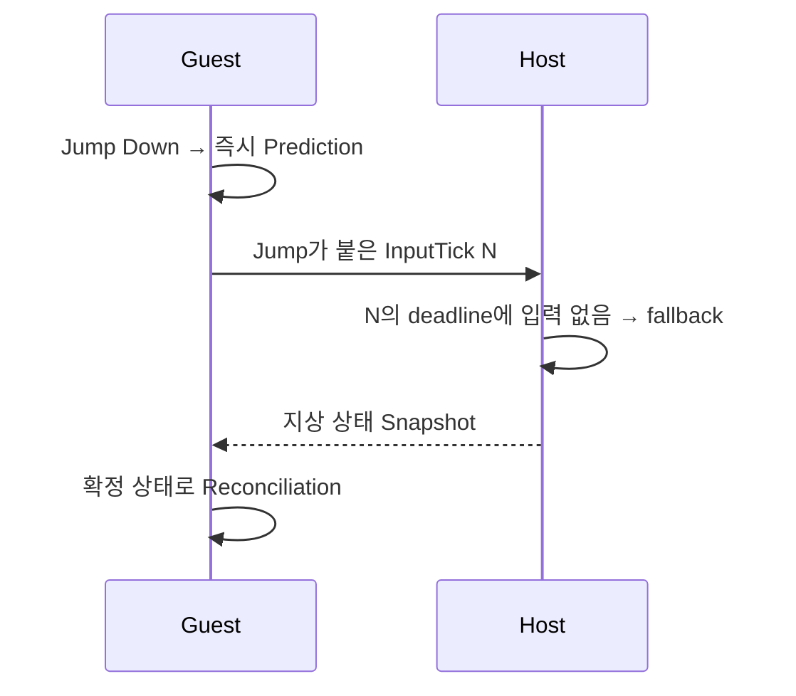
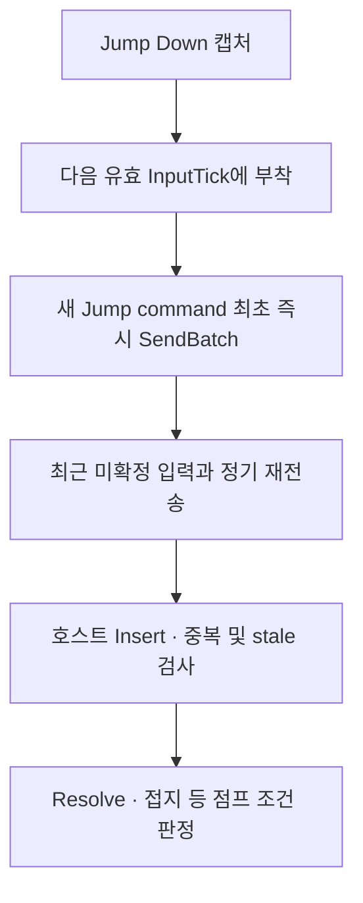

> 문제 Guest에서 예측한 점프가 다음 호스트 스냅샷에서 지상으로 되돌아갔다.  
> 원인 단발 입력이 목표 Tick의 결정 전에 반영되지 않으면 점프 판정이 사라졌다.  
> 해결 Jump edge를 새 InputTick에 부착할 때 최초 1회 즉시 전송했다.  
> 결과 3 Guest 재실험의 점프 369건을 호스트 삽입과 연결했고, 362건 수락·7건 stale을 확인했다.  
> 역할 점프 lifecycle 계측, 최초 송신 경로 수정, Guest·Host 로그 대조를 담당했다.

**용어 정리**

| 용어 | 뜻 |
| --- | --- |
| Tick | 호스트가 물리 계산을 한 번 하는 단위(초당 60번) |
| InputTick | 이 입력이 실행될 목표 Tick 번호 |
| edge | 버튼을 새로 누른 그 순간에만 한 번 생기는 입력 |
| Prediction | 서버 응답을 기다리지 않고 내 화면에서 먼저 움직여 보여주는 것 |
| Reconciliation | 내가 예측한 위치를 호스트가 확정한 값에 맞춰 다시 바로잡는 과정 |
| fallback | 그 순간 받은 입력이 없어서 이전 값을 대신 쓰는 처리 |
| deadline | 그 Tick이 입력을 받아줄 수 있는 마감 시점 |
| datagram | UDP로 한 번에 보내는 패킷 한 덩어리 |
| LastResolvedInputTick | 호스트가 "여기까지는 확정했다"고 알려주는 값 |
| RejectedStale | 이미 그 Tick 판정이 끝나서 뒤늦게 도착한 입력이 거절되는 것 |
| RejectedNotGrounded | 착지 상태가 아니라서 점프가 거절되는 것 |
| Pre-Tick Pump | 호스트가 Tick을 확정하기 직전에 이미 도착한 입력을 먼저 반영해두는 처리 |

## 점프했다가 다시 바닥으로 돌아왔다

Guest에서 점프 키를 누르면 로컬 Prediction이 바로 상승을 시작했다. 그런데 잠시 후 캐릭터가 지상으로 되돌아오는 경우가 있었다. 화면만 보면 점프 애니메이션이 취소되거나 물리 보정이 과도하게 적용된 것처럼 보였다.

  <video class="ssketch-video" controls preload="none" playsinline></video>
  <button class="ssketch-video-load" type="button" data-video-src="{{ '/assets/videos/projects/ssketch/jump-before-fix-durl.mp4' | relative_url }}">영상 재생</button>
  

개선 전 녹화. 오른쪽 아래 화면에서 호스트가 점프를 확정하지 못해 거절하고, 예측 위치에서 곧바로 확정 위치(지상)를 받아 바닥으로 꽂히는 장면이다.

호스트 기록을 따라가 보니, Guest가 점프를 예측한 입력 Tick을 호스트에서는 fallback으로 처리할 수 있었다. 호스트의 확정 상태에는 점프가 없고, Guest는 이후 그 상태를 받아 Reconciliation을 수행한다. 화면의 복귀는 마지막에 드러난 결과였다. 그 앞에서 점프 입력이 어디까지 전달됐는지를 먼저 확인해야 했다.

## 이동은 유지되지만 Down은 한 번 발생한다

앞으로 이동하는 입력은 여러 Tick 동안 같은 상태가 유지된다. 한 Tick에서 실제 입력을 사용하지 못해도 Held fallback이 직전 방향을 유지하면 이동이 이어질 수 있다. 물론 방향 전환이나 정지 시점에는 이 차이도 오차로 나타난다.

반면 Jump Down은 버튼을 새로 누른 그 순간에만 한 번 발생하는 edge다. 이 한 번을 놓쳤다고 다음 Tick에도 계속 "눌렀다"고 복제하면 점프가 여러 번 반복될 수 있다. 반대로 다음 Tick부터 바로 지우면, 호스트가 하필 그 Tick을 놓쳤을 때 점프 자체가 일어나지 않는다.

렌더 프레임에서 캡처한 edge를 어느 InputTick에 붙일지도 중요했다. 그 시점의 command가 이미 생성됐다면 같은 Tick을 뒤늦게 덮어쓰기보다, 다음으로 사용할 수 있는 새 command까지 edge를 유지해야 한다. 단순히 버튼을 읽었는지 기록하는 것만으로는 이 연결이 정상인지 확인할 수 없었다.

## 다섯 단계에 같은 입력 키를 남겼다

점프를 다음 다섯 경계로 나눴다. Guest와 Host의 로그는 `(room, world, authority, entity, inputTick)`으로 연결했다. 서로 다른 PC의 monotonic 시계 값은 직접 빼지 않았다. 프로세스별 시간의 시작점이 달라, 그 차이를 전송 지연으로 해석하면 잘못된 결과가 나온다.

| 단계 | 확인하려던 내용 |
| --- | --- |
| Captured | Guest가 Jump Down을 읽었는가 |
| Attached | edge가 실제 새 InputTick의 command에 연결됐는가 |
| FirstSendRequested | 그 command의 최초 UDP 송신을 요청했는가 |
| Inserted | 호스트가 해당 Tick을 버퍼에 수락했는가 |
| Resolved | 호스트가 입력을 처리하고 어떤 점프 결정을 내렸는가 |

`FirstSendRequested`는 UDP SendAsync 호출을 시작하는 경계다. 소켓의 물리 송신 완료나 상대의 수신 응답까지 확인한 시점으로 확대하지 않았다. `Inserted`도 최종 점프 성공과 구분했다. 입력을 수락한 뒤에도 접지 조건이 맞지 않으면 게임 규칙상 점프가 거절될 수 있다.

이렇게 나누자 동일한 “점프가 안 됨” 안에 서로 다른 사건이 있음을 확인할 수 있었다. edge가 command에 붙지 않은 경우, 송신 요청이 늦은 경우, 도착했지만 deadline을 지난 경우, 입력을 처리했지만 접지 조건이 맞지 않은 경우는 각각 다른 수정이 필요했다.

## 새 점프 command의 첫 전송을 앞당겼다

일반 이동 입력은 주기적인 batch로 묶어 전송한다. 30Hz 송신 주기라면 새 입력이 만들어진 뒤 다음 정기 송신까지 대기할 수 있다. Jump edge가 새 InputTick에 붙는 순간에는 이 대기를 추가하지 않도록 최초 1회 즉시 송신을 요청했다.

최초 송신과 정기 재전송은 역할을 나눴다. 첫 전송은 command 생성 후 대기 시간을 줄이고, 최근 미확정 입력 최대 8개를 포함하는 재전송은 개별 datagram이 사라질 때 다시 전달될 기회를 만든다. 호스트는 동일한 Tick을 중복 적용하지 않도록 구분하고, Guest는 LastResolvedInputTick에 따라 완료된 이력을 정리한다.

이 재전송 방식에는 한 가지 짚어야 할 점이 있다 — RejectedStale이 하나 나왔다고 해서 그 점프가 실제로 실패했다는 뜻은 아니다. 첫 전송으로 점프가 이미 성공했더라도, Guest가 아직 LastResolvedInputTick을 못 받은 사이에는 같은 명령이 미확정 history에 남아 재전송된다. 호스트는 그 Tick을 이미 확정했으므로 이 재전송분을 RejectedStale로 거절한다. 즉 "이미 성공한 점프의 뒤늦은 사본이 거절된 경우"와 "진짜로 제때 못 들어가서 실패한 경우"가 같은 RejectedStale 안에 섞여 있을 수 있다. 실제로 수동 플레이 중에는 점프가 눈에 띄게 되돌아가는 느낌을 받지 못했는데, 이 구분과도 맞아떨어진다.

  <video class="ssketch-video" controls preload="none" playsinline></video>
  <button class="ssketch-video-load" type="button" data-video-src="{{ '/assets/videos/projects/ssketch/jump-after-fix-durl.mp4' | relative_url }}">영상 재생</button>
  

수정 후 전체 플레이 녹화(3분 40초). 점프 입력 전송 경로를 수정한 뒤 실제 플레이를 이어서 확인한 장면이다.

호스트가 fallback으로 그냥 Tick을 끝내도, "여기까지 끝났다"는 확정 신호는 앞으로 나아간다. 완료된 Tick의 판정은 확정되므로 첫 전송을 deadline 안에 넣는 것이 중요했다. 최초 즉시 송신과 [Pre-Tick Pump]({{ '/projects/ssketch/technical/input-deadline/' | relative_url }})가 각각 Guest의 대기와 Host의 반영 순서를 맡았다.

## 검증: 입력을 수락했는지, 점프했는지 따로 셌다

9월 25일 재실험에서는 Host에 연결된 Guest를 1개, 2개, 3개로 늘리며 실행 로그를 분리했다. 실행 길이와 수동 조작 시점이 달라 Guest 수에 따른 성능 곡선으로 사용하지 않았다. 목적은 캡처한 특정 입력을 호스트의 최종 결정까지 대조하는 것이었다.



로컬 점프 재실험 빌드의 저장 설정은 창 모드 1280×720, 그래픽 프리셋 보통, VSync OFF다. 호스트 로그에서도 Unity 6000.3.22f1과 RTX 4050 Laptop GPU의 Direct3D 11 실행을 확인했다.

| Guest 수 / Entity | Attached | 삽입 매칭 | Accepted | stale | Executed | NotGrounded |
| --- | ---: | ---: | ---: | ---: | ---: | ---: |
| 1 / 2 | 323 | 323 | 323 | 0 | 189 | 134 |
| 2 / 3 | 123 | 123 | 123 | 0 | 88 | 35 |
| 2 / 2 | 133 | 133 | 133 | 0 | 86 | 47 |
| 3 / 4 | 100 | 100 | 100 | 0 | 70 | 30 |
| 3 / 2 | 98 | 98 | 98 | 0 | 54 | 44 |
| 3 / 3 | 171 | 171 | 164 | 7 | 68 | 96 |

*위 표를 그대로 그래프로 그린 것이다. RejectedStale(주황)은 (3 guests, 3) 조건에서만 살짝 보일 만큼 적고, RejectedNotGrounded(초록)가 거절 대부분을 차지한다.*

이 표는 Guest의 Attached Tick을 기준으로 연결한 결과다. 서로 다른 Entity와 반복 판정이 섞인 전체 로그 행 수를 나눠 성공률을 계산하지 않았다. 3 Guest 실행에서는 369개 입력이 모두 호스트 삽입 기록에 연결됐고, 그중 362개는 수락 후 Resolved 결정까지 이어졌다. 192개가 실제 점프를 실행했고 170개는 접지 조건에서 거절됐다.

따라서 362건 수락을 362회 점프 성공이라고 적을 수는 없다. 반대로 NotGrounded 170건을 패킷 유실로 세어서도 안 된다. 공중에서 추가로 누른 점프처럼 유효하게 도착해도 실행 조건을 만족하지 않는 입력이 포함된다.

송신 경로의 변경은 같은 Guest 시계 안에서도 확인했다. 3 Guest의 Attached→FirstSendRequested는 각각 p95 1ms였고, 최대 1~2ms였다. 반면 Captured→Attached의 최대는 Entity별 14~78ms였다. command가 만들어진 뒤의 대기는 짧아졌지만, edge가 다음 유효 Tick에 붙기까지의 지연은 별도로 남을 수 있었다.

## 남은 7건은 어느 경계에서 늦었나

stale로 거절된 7건은 전부 Entity 3에서 나왔고, 모두 `queuedBeforeResolve=0`이었다. 이건 호스트가 큐에서 이 입력을 확인했을 때 그 Tick의 판정이 이미 끝나 있었다는 뜻이다. 실제로 호스트가 그 Tick 판정을 마친 시각은, 우리가 "입력을 받았다"고 기록한 시각보다 1.6~12.2ms 더 빨랐다. 즉 "큐에서 기다리다가 놓친 것"과는 다른 패턴이었다.

입력이 버퍼에 들어가기 직전까지 4.3~14.7ms를 기다리긴 했지만, 그 사이에 목표 Tick을 넘겨버리는 새 판정이 일어난 건 아니었다. 입력은 "도착했다"고 기록한 그 순간부터 이미 늦어 있었다. 그래서 Pre-Tick Pump를 더 자주 실행한다고 이 7건이 되살아나지는 않을 거라고 봤다.

이 7건은 버튼을 누른 순간부터 명령에 붙기까지 0~27ms, 그 뒤 전송 요청까지는 0~1ms 걸렸다. 그래서 의심할 곳이 두 군데로 좁혀졌다 — edge가 명령에 붙기까지 기다린 시간, 그리고 그 이후의 송신·중계·수신 경로다. 같은 실행에서 Guest 화면이 크게 멈춘 구간이 있긴 했지만, 그게 정확히 이 7건과 같은 순간에 일어났다는 증거는 없어서 "프레임 끊김 때문"이라고 단정하지는 않았다.

## 단발 입력은 평균 비율만으로 확인하기 어려웠다

이동 입력이 99% 넘게 잘 도착해도, 점프 버튼 딱 한 번이 제시간에 못 들어가면 플레이어는 바로 눈치챈다. 그래서 이번에는 "평균적으로 입력이 얼마나 잘 갔나"만 보지 않고, 사건 하나하나가 언제 명령이 됐고 어떤 판정을 받았는지 끝까지 따라갔다. 화면에서 보이는 "점프가 안 됨"을 입력이 아예 안 들어간 경우와 게임 규칙상 거절된 경우로 나눠서 볼 수 있게 된 게, 이번에 얻은 가장 큰 변화였다.

다음 검증에서는 입력을 똑같이 재생하고 접지 상태도 고정해서, 같은 점프 시퀀스가 같은 조건에서 매번 어떻게 판정되는지 비교해볼 필요가 있다. 지금 로그는 최초 전송 경로와 이번에 놓친 7건을 설명해주지만, 어떤 지연 상황에서도 점프 누락이 절대 안 생긴다고 보장해주지는 않는다. 그래도 비슷한 사례가 또 나오면 같은 방식(room, world, authority, entity, inputTick)으로 계속 연결해서 추적할 수 있도록 계측 기준은 그대로 남겨뒀다.

