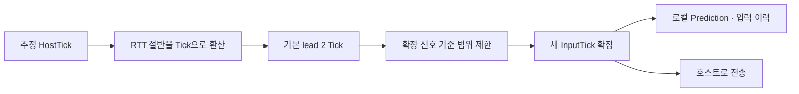

> <span class="ssketch-callout-label ssketch-callout-label--problem">문제</span> Guest가 현재 Tick의 입력을 보내도 호스트에 도착할 때는 그 Tick이 끝날 수 있었다.  
> <span class="ssketch-callout-label ssketch-callout-label--cause">원인</span> 서로 다른 실행 시점과 전송 지연을 입력의 대상 시간에 반영해야 했다.  
> <span class="ssketch-callout-label ssketch-callout-label--solution">해결</span> 추정 HostTick에 RTT 절반의 Tick 수와 lead를 더해 미래 입력을 예약했다.  
> <span class="ssketch-callout-label ssketch-callout-label--result">결과</span> 생성·전송·소비·확정 신호를 InputTick 하나로 연결해 deadline을 추적할 수 있게 됐다.  
> <span class="ssketch-callout-label ssketch-callout-label--role">역할</span> 입력 시간축과 이력 관리, 호스트 Resolve 연결 및 경계 계측을 담당했다.

**용어 정리**

| 용어 | 뜻 |
| --- | --- |
| Tick | 호스트가 물리 계산을 한 번 하는 단위(초당 60번, 한 번에 약 16.67ms) |
| Guest / Host | Guest는 일반 참가자, Host는 물리 판정을 맡은 방장 PC |
| RTT | 패킷이 갔다가 돌아오는 데 걸리는 시간 |
| lead | 네트워크 지연 외에 추가로 주는 여유 Tick 수 |
| Resolve | 호스트가 그 Tick에 쓸 입력을 하나로 확정하는 것 |
| fallback | 그 Tick에 받은 입력이 없어서 이전 값이나 중립 값을 대신 쓰는 처리 |
| stale | 이미 판정이 끝난 Tick을 대상으로 뒤늦게 온 입력 |
| deadline | 그 Tick이 입력을 받아줄 수 있는 마감 시점 |
| batch | 여러 Tick의 입력을 한 패킷에 묶은 것 |
| backfill | Guest가 놓친 Tick의 입력을 뒤늦게 채워 넣는 것 |
| Prediction | 서버 응답을 기다리지 않고 내 화면에서 먼저 움직여 보여주는 것 |
| Snapshot | 호스트가 확정한 전체 상태를 모두에게 보내는 묶음 |

## 현재 만든 입력은 미래에 도착한다

멀티플레이 입력을 처음 연결할 때는 버튼과 이동 방향을 보내는 것보다, 그 입력을 호스트가 언제 적용해야 하는지가 중요했다. Guest가 보는 현재와 호스트가 실행 중인 현재는 완전히 같지 않다. <span class="notice-yellow">Guest에서 읽은 입력</span>이 <span class="notice-yellow">서버 중계</span>를 거쳐 도착하는 동안 <span class="notice-yellow">호스트의 물리 시뮬레이션은 계속 진행</span>한다.

60Hz에서는 한 Tick이 약 16.67ms다. 입력이 도착하기까지 한두 Tick만 지나도, 보낸 쪽에서 현재라고 붙인 번호를 <span class="notice-yellow">호스트는 이미 처리</span>했을 수 있다. <span class="notice-yellow">늦게 도착한 command</span>를 임의의 다음 Tick에 <span class="notice-yellow">적용</span>하면 입력 생성 순서와 <span class="notice-yellow">물리 결과를 대조하기 어려워진다.</span> 재전송한 입력을 새 입력으로 오인할 위험도 생긴다.

그래서 <span class="ssketch-key ssketch-key--solution">HostTick을 물리 시뮬레이션의 기준 시간으로 두고, <span class="notice-pink">InputTick</span>을 "이 입력이 실행될 <span class="notice-pink">예약 Tick 번호</span>"로 따로 붙였다.</span> Guest가 화면에 표시 중인 프레임 번호를 그대로 보내는 대신, 이 입력이 호스트의 어느 물리 Tick에서 쓰일지를 먼저 정해서 보냈다.

## HostTick과 InputTick이 맡은 역할

<span class="notice-yellow">HostTick</span>은 "호스트가 지금 <span class="notice-yellow">몇 번째 물리 계산</span>을 하고 있는가"를 나타내는 숫자다. <span class="notice-yellow">InputTick</span>은 "이 입력을 몇 번째 계산에서 써 달라"고 붙이는 span class="notice-yellow">목표 예약 번호</span>다. 둘 다 같은 기준 시간(호스트의 Tick)을 쓰지만, 입력을 막 만든 순간에는 보통 <span class="notice-yellow">InputTick이 조금 더 미래</span>를 가리킨다.

| 값 | 의미 | 쓰이는 곳 |
| --- | --- | --- |
| <span class="notice-yellow">HostTick</span> | 호스트가 지금 처리 중인 Tick ,<span class="notice-yellow">기준 물리 시간</span>| 물리 계산, Snapshot 기준 |
| EstimatedHostTick | Guest가 짐작한 지금의 호스트 Tick | 새 입력에 붙일 번호를 정할 때 |
| InputTick | 이 입력을 적용하고 싶은 목표 Tick | 입력 버퍼, 중복·stale 판별 |
| LastResolvedInputTick | 호스트가 마지막으로 처리를 끝낸 Tick | 이력 정리, 전진 범위 제한 |

이 구분은 재전송에서도 필요했다. 같은 InputTick을 다시 받으면 새 물리 입력을 한 번 더 실행하는 대신 중복으로 판별할 수 있다. 반대로 버퍼에 처음 들어왔더라도 이미 Resolve한 Tick보다 뒤처져 있으면 stale로 처리한다. 그래서 패킷이 도착한 순서와 이 입력이 적용될 Tick 번호를 서로 다른 것으로 다뤘다.

또한 Tick만으로 모든 세션을 식별하지 않았다. 방이 재사용되거나 호스트가 변경되면 같은 번호가 다른 실행을 가리킬 수 있다. RoomIdentifier와 WorldEpoch, AuthorityEpoch를 함께 확인해 이전 세계나 이전 권한의 입력이 현재 시뮬레이션에 섞이지 않게 했다.

## Guest에서 호스트 시간을 추정했다

### EstimatedHostTick
Guest는 수신한 호스트 시간 정보와 자신의 경과 시간을 이용해 현재 HostTick을 추정한다. 개념적으로 기준점의 HostTick에 로컬에서 흐른 시간을 시뮬레이션 주기로 환산해 더한다. 각 PC의 벽시계를 일치시켜 놓고 계산하는 구조에 의존하지 않았다.

```text
EstimatedHostTick ≈ anchorHostTick + floor(localElapsedSeconds × simulationHz)
```

이 값은 호스트에서 직접 읽은 현재값과 차이가 날 수 있다. 기준점을 받은 시점의 지연과 로컬 실행 간격이 포함되기 때문이다. 새 스냅샷이나 시간 정보는 이 기준을 갱신하는 데 사용하고, 과거에 만들어 이미 보낸 command의 InputTick은 해당 입력의 식별자로 유지했다.

시간 추정과 입력 전송은 서로 다른 문제다. 시계 추정이 잘 맞아도 생성 직후 command가 큐에 오래 머물면 deadline을 넘길 수 있다. 반대로 전송이 빠르더라도 기준 Tick을 너무 과거로 잡으면 도착 즉시 stale이 된다. 두 경로를 각각 계측할 수 있어야 원인을 좁힐 수 있었다.

## RTT와 기본 lead로 도착할 시간을 확보했다

### networkTicks Offset 
새 입력의 예약값은 추정 HostTick에 편도 지연 추정과 기본 lead를 더하는 형태다. 실제 계산에는 왕복 시간의 절반을 사용하고, Tick 수를 올림해 정수 시간축으로 옮겼다.

```text
networkTicks = ceil(RoundTripSeconds × 0.5 × SimulationHz)
NextInputTick = EstimatedHostTick + networkTicks + inputLeadTicks
```

RTT/2는 양방향 지연이 비슷하다는 가정 아래의 추정이다. 송신·수신 경로가 비대칭이거나 프레임 대기가 포함되면 실제 편도 지연과 차이가 난다. 이 값을 편도 지연을 직접 측정한 결과처럼 설명하지 않았다.

### LeadTicks Offset
기본 lead는 계산한 지연 외에 실행 순서와 짧은 변동을 받아 줄 여유다. 코드의 `HostAuthoritySession.DefaultInputLeadTicks`는 2다. 60Hz 기준 약 33.3ms에 해당한다. 이 값이 모든 장치와 RTT에서 최적임을 입증한 실험은 없으며, 실제 deadline 계측을 보면서 조정해야 하는 정책값으로 두었다.



계산 예로 추정 HostTick을 100, 편도 추정을 1 Tick이라고 가정하면 lead 2를 더한 후보는 103이다. 호스트가 103을 결정하기 전에 입력이 버퍼에 들어오도록 시간을 배정한다.

## 미래로 보내는 범위도 제한했다

RTT가 커질 때마다 대상 Tick을 계속 미래로 밀면, 호스트의 처리 진도와 Guest의 입력 이력이 멀어질 수 있다. 아직 확정되지 않은 입력이 길게 쌓이고, 시간 추정의 일시적인 변동이 큰 Tick 점프로 이어질 수 있다. 그래서 미래 예약값에는 별도의 전진 제한을 적용했다.

현재 구현의 `PlayerInputStream.MaximumResolvedTickLead`는 **12**다. `ConstrainGuestTick`은 마지막으로 받은 확정 신호를 기준으로, 아직 그 신호를 못 받았다면 시작 HostTick을 기준으로 범위를 정한다. 허용 범위는 기준값 다음 Tick부터 기준값 +12까지다.

| 설정 | 현재 값 | 기준 |
| --- | ---: | --- |
| DefaultInputLeadTicks | 2 | 추정 HostTick + 편도 추정 뒤에 더하는 여유 |
| MaximumResolvedTickLead | 12 | 마지막 확정 신호 또는 시작 HostTick으로부터의 최대 전진 |

이 두 값은 서로 다른 것을 제한한다. "기본 lead의 최대치가 12"라는 뜻으로 읽으면 계산이 달라진다. 12 Tick은 60Hz 기준 200ms지만, 확정 신호를 늦게 받으면 기준점도 과거에 머무른다. 따라서 지금 호스트 시각 기준으로 항상 200ms까지 미래 입력을 허용한다고 볼 수도 없다.

제한을 두면 이력이 너무 앞서 쌓이는 건 막을 수 있지만, RTT가 높을 때 원하는 만큼 미래로 보낼 수 없다는 비용이 생긴다. 숫자를 무조건 크게 만든다고 deadline을 놓치는 문제가 다 풀리지도 않아서, 확정 신호가 얼마나 잘 나아가는지와 후보 Tick이 얼마나 자주 막히는지도 함께 봐야 한다.

## 60Hz 입력과 30Hz 송신을 나눴다

시뮬레이션은 60Hz로 진행하고 일반 입력 전송은 30Hz batch로 묶었다. 한 패킷이 반드시 한 Tick을 뜻하지 않는다. batch에는 새 입력과 최근 미확정 입력이 함께 들어갈 수 있고, 호스트는 각 command의 InputTick을 기준으로 삽입 여부를 판단한다.

```text
Client
──────────────────────────────────────────────────────────────────────▶ Time

 Input 101      Input 102      Input 103      Input 104      Input 105
    │              │              │              │               │
    └──────┬───────┘              └──────────────┬───────────────┘
           │                                     │
           ▼                                     ▼
   Batch [101, 102]                     Batch [103, 104, 105]
           │                                      │
           └────────────── Network ───────────────┘
                              │
                              │  Async Receive
                              ▼
                    ┌─────────────────────┐
                    │   Host Input Queue  │
                    │                     │
                    │ 101 102 103 104 105 │
                    └──┬───┬───┬───┬───┬──┘
                       │   │   │   │   │
                       │   │   │   │   │
                       ▼   ▼   ▼   ▼   ▼

Host
──────────────────────────────────────────────────────────────────────▶ Time

   Tick 101        Tick 102        Tick 103        Tick 104        Tick 105
      │               │               │               │               │
      ▼               ▼               ▼               ▼               ▼

┌────────────┐   ┌────────────┐   ┌────────────┐   ┌────────────┐   ┌────────────┐
│ Consume    │   │ Consume    │   │ Consume    │   │ Consume    │   │ Consume    │
│ Input 101  │   │ Input 102  │   │ Input 103  │   │ Input 104  │   │ Input 105  │
│     ↓      │   │     ↓      │   │     ↓      │   │     ↓      │   │     ↓      │
│  Physics   │   │  Physics   │   │  Physics   │   │  Physics   │   │  Physics   │
│ Simulation │   │ Simulation │   │ Simulation │   │ Simulation │   │ Simulation │
│     ↓      │   │     ↓      │   │     ↓      │   │     ↓      │   │     ↓      │
│   State    │   │   State    │   │   State    │   │   State    │   │   State    │
│ Confirmed  │   │ Confirmed  │   │ Confirmed  │   │ Confirmed  │   │ Confirmed  │
└────────────┘   └────────────┘   └────────────┘   └────────────┘   └────────────┘
```

두 batch로 나눠 보낸 101~105가 Host에서는 각 Tick 한 개씩 순서대로 소비된다. 그림의 "Host Input Queue"는 별도 클래스 이름이 아니라 이 글에서 계속 쓴 네트워크 수신 큐(`InputBatches`)를 가리킨다. Pump가 이 큐에서 batch를 꺼내 Entity별 `HostInputBuffer`로 옮기면, 그다음에야 각 Tick의 `ResolveTick`이 해당 InputTick을 찾아 소비한다.

Guest의 렌더 Update가 잠시 멈추면 입력 생성이 권위 시간축을 따라가지 못할 수 있다. 이때 누락된 Tick을 채우는 <span class="notice-yellow">backfill은 입력 공급을 이어 주는 역할</span>을 한다. 하지만 그 입력이 이미 끝난 호스트 Tick을 대상으로 하면, 많이 생성해 보내도 실제 소비율은 올라가지 않는다. 공급량과 <span class="notice-yellow">도착 deadline을 분리해 보아야 하는 이유</span>다.

Jump처럼 한 번 발생한 edge에는 정기 batch까지 기다리는 시간이 특히 중요했다. 새 Tick에 edge를 부착하는 순간 최초 송신을 요청하는 경로를 추가했다. 시간 예약 정책을 바꾸는 일과 첫 전송 대기를 줄이는 일을 분리해, 어떤 변경이 어느 경계의 지연을 줄이는지 확인했다.

## 호스트가 보내는 "여기까지 끝났다"는 신호


### LastResolvedInputTick

호스트는 각 Tick에서 실제 입력이 있으면 그걸 쓰고, 없으면 정해진 fallback으로 시뮬레이션을 진행한다. 그 결과인 `LastResolvedInputTick`, 즉 <span class="ssketch-key ssketch-key--solution">"여기까지는 확정했다"는 신호</span>를 받은 Guest는 끝난 입력 이력을 정리하고, <span class="notice-yellow">아직 안 끝난 입력만 다시 예측 대상</span>으로 남긴다. 이 신호가 입력 이력을 어디까지 지워도 되는지 정하는 기준이 된다.

이때 "끝났다"와 "실제로 썼다"를 혼동하면 안 된다. <span class="ssketch-key ssketch-key--result">fallback으로 그냥 넘어간 Tick도 이 신호는 앞으로 나아간다.</span> Guest가 입력을 열심히 만들어서 보낸 양이 많아 보여도, 호스트가 그 입력을 실제로 썼는지는 Resolve 결과를 따로 봐야 안다. [ <span class="notice-yellow">입력 deadline 글</span>]({{ '/projects/ssketch/technical/input-deadline/' | relative_url }})에서는 이 기준으로 <span class="notice-yellow">소비율</span>을 다시 계산했다.

실행 로그에서도 평균은 높은데 가끔 크게 멈추는 구간이 함께 나타났다. 평균만 보면 짧은 정지나 특정 Jump 하나의 실패가 묻힐 수 있었다. Tick마다 번호를 유지해 둔 덕분에, 문제가 된 그 한 번이 어느 지점에서 끝났는지 따로 찾아볼 수 있었다.

## 검증 범위와 다음 조정

### 요약
이번 설계는 입력을 호스트 시간축에 예약하고, 전송·중복·소비·보정을 같은 Tick으로 연결하는 기반을 만들었다. 후속 4인 실행에서 확인한 소비율은 Pump 순서와 송신 정책까지 포함한 파이프라인의 결과다. 
### 동적 InputTick 예약
남은 과제는 RTT 평균뿐 아니라 jitter, 확정 신호가 늦게 오는 정도, 최근 deadline miss까지 함께 반영하는 동적 여유 정책이다. 지금은 기본값과 전진 제한을 두고 운영하며, 환경별로 적정 lead를 자동 탐색하는 완결된 정책까지 확장하지 않았다. 순간적인 RTT 상승에 과도하게 반응하지 않으면서도 늦는 입력을 줄이려면 증가·감소 속도와 관측 구간을 함께 설계해야 한다.
### 다음 실험 측정 대상
다음 실험에서는 고정 lead별 fallback, 실제 소비율, 미확정 이력 길이와 표시 지연을 같은 조건에서 비교하려 한다. 여유를 더 주면 deadline을 지킬 가능성은 높아지지만 호스트 판정까지의 간격도 길어진다. 이 비용을 수치로 같이 남겨야 플레이 반응성과 안정성 사이에서 설정을 결정할 수 있다.
