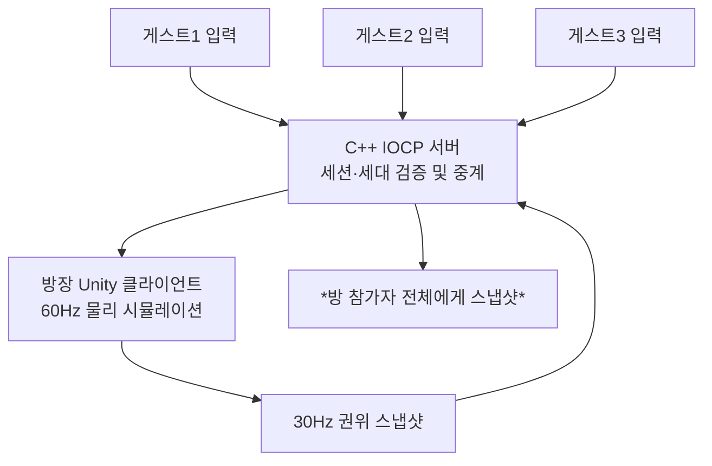
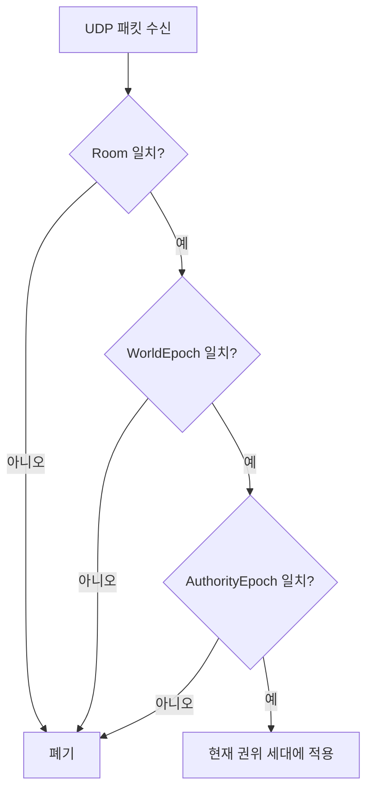

> <span class="ssketch-callout-label ssketch-callout-label--problem">문제</span> 여러 플레이어의 이동·충돌·그림 쟁탈 결과를 일관되게 보여줘야 했다.  
> <span class="ssketch-callout-label ssketch-callout-label--cause">원인</span> 각 클라이언트가 자기 물리 결과를 확정하면 서로 다른 판정이 생길 수 있었다.  
> <span class="ssketch-callout-label ssketch-callout-label--solution">해결</span> Unity 호스트에 물리 권위를 두고 C++ 서버에서 Room·권한·중계를 관리했다.  
> <span class="ssketch-callout-label ssketch-callout-label--result">결과</span> 입력 → 권위 시뮬레이션 → Snapshot 흐름을 구성하고 실제 4인 실행으로 검증했다.  
> <span class="ssketch-callout-label ssketch-callout-label--role">역할</span> Unity 클라이언트 프레임워크와 C++ 서버 사이의 입력·상태 전달 구조를 담당했다.

**용어 정리**

| 용어 | 뜻 |
| --- | --- |
| <span class="notice-yellow">Host Authority</span> | 참가자 중 <span class="notice-yellow">한 명(방장)</span>의 PC가 <span class="notice-yellow">물리 판정의 기준</span>이 되는 구조 |
| <span class="text-emphasis">Guest / Host</span> | <span class="notice-yellow">Guest</span>는 일반 참가자, <span class="notice-yellow">Host</span>는 물리 판정을 맡은 방장 PC |
| <span class="notice-yellow">Tick</span> | <span class="notice-yellow">호스트가 물리 계산</span>을 한 번 하는 단위/<span class="notice-yellow">기준 시간 번호</span>(초당 60번) |
| <span class="notice-yellow">Snapshot</span> | 호스트가 <span class="notice-yellow">확정한 전체 상태</span>를 모두에게 보내는 묶음 |
| <span class="text-emphasis">Room</span> | 참가자들이 모여 대기하고 함께 게임을 진행하는 공간 |
| <span class="text-emphasis">WorldEpoch / AuthorityEpoch</span> | 같은 방에서 몇 번째 판인지, 몇 번째 호스트인지 구분하는 <span class="notice-yellow">문맥 번호</span> |
| <span class="text-emphasis">IOCP</span> | Windows에서 여러 소켓의 통신 완료를 한 곳에서 받아 처리하는 <span class="notice-yellow">비동기 I/O 커널 객체</span> |

## 그림을 빼앗는 게임에 필요한 판정

SSketch는 같은 주제로 그림을 그리고, 밤에는 다른 플레이어의 그림을 가져와 자신의 집에 전시하는 게임이다. 이동만 서로 보여 주는 수준을 넘어, 충돌과 넉백, 상호작용이 여러 화면에서 일관된 결과로 이어져야 했다. 현재 공개 게임은 4인 구성이다.


6주라는 기간 안에 서버에서 모든 클라이언트의 물리 판정을 대신 해 주는 서버 구조를 만들기에는 시간이 부족하다고 판단했다. 물리를 전용 서버에 새로 구현하려면 Unity 물리와 같은 이동·중력·경사·충돌 규칙을 서버에서 재현하고, 그림과 전투 오브젝트를 포함한 월드 상태를 관리하고, 클라이언트 예측과 서버 상태 사이의 재조정 체계까지 따로 만들어야 했다. 그래서 게임에 참여하는 <span class="notice-yellow">방장이 호스트 역할을 맡아 물리 시뮬레이션</span>을 직접 수행하도록 구성했다.


```
                          ┌──────────────────────┐
                          │     Relay Server     │
                          │                      │
                          │ Input / Snapshot 중계│
                          └──────▲────────▲──────┘
                                 │        │
                       Snapshot  │        │ Input
                                 │        │
                    ┌────────────┘        └────────────┐
                    │                                  │
             ┌──────┴───────┐                   ┌──────┴───────┐
             │  Host Client │                   │ Guest Client │
             │              │                   │              │
             │ Host Input   │─────────────────▶│ Input 생성    │
             │ Guest Input  │◀─────────────────│               │
             │      ↓       │   Server가 중계    │              │ 
             │ Unity Physics│                   │              │
             │      ↓       │                   │              │
             │ 상태 확정    │                    │              │
             │      ↓       │                   │              │
             │ Snapshot 생성│                    │ Snapshot 수신│
             └──────────────┘                   └──────────────┘

```


## 권위를 둘 위치를 비교했다

| 후보 | 얻는 점 | 감수할 비용 |
| --- | --- | --- |
| 각 Client의 상태를 신뢰 | 즉시 반응하고 연결이 단순함 | 충돌 결과 충돌, 상태 조작 검증 부담 |
| Dedicated Authority | 플레이어와 독립된 권위 실행 | 별도 권위 실행 환경·배포·운영 필요 |
| Unity Host Authority | 기존 Unity 물리와 게임 코드를 권위 실행에 그대로 사용 | 호스트 성능·이탈·신뢰에 의존 |

방에 참여한 Unity 클라이언트 중 방장을 물리 권위 호스트로 지정했다.<br> 호스트는 자신과 게스트 캐릭터를 같은 60Hz 월드에서 물리 시뮬레이션하고, 계산이 끝난 상태를 30Hz 간격으로 스냅샷으로 만들어 모든 게스트에게 보낸다.<br> C++ 서버는 현재 호스트와 월드 컨텍스트를 검증한 뒤 그 결과를 방 참가자에게 중계한다.
<br><br>
(계산이 끝난 상태 = 플레이어와 오브젝트의 확정된 물리 위치·상태)

## 호스트가 매 Tick마다 하는 일

호스트(방장)는 다음 순서를 반복한다.

1. **입력 수집** 
<br>이동·점프·조준·발사 <span class="notice-yellow">입력</span>을 <span class="notice-lavender">EntityId + InputTick</span> 기준으로 입력 버퍼에 저장한다.<br> 매 HostTick마다 해당 틱의 입력을 꺼내고, 입력이 도착하지 않았다면 짧은 <span class="notice-pink">held fallback</span> 또는 <span class="notice-pink">neutral fallback</span>으로 틱을 계속 진행한다.
<br><br>
2. **캐릭터 물리 시뮬레이션** 
<br>자신과 모든 게스트 캐릭터의 입력을 CharacterMotor에 적용한 뒤 <span class="notice-pink">Physics.Simulate()</span>를 한 번 실행해 이동·점프·중력·접지·충돌·넉백 결과를 확정한다. <span class="notice-pink">Physics.Simulate()</span>는 <span class="notice-pink">FixedUpdate()</span> <span class="notice-pink">직후</span> 실행된다. 부하로 인해 이전 호출과 현재 호출 사이 간격이 커지면 <span class="notice-pink">FixedUpdate → Physics.Simulate</span>가 한 프레임에 여러 번 몰아서 실행될 수 있다.
<br><br>
3. **캐릭터 상태 캡처** 
<br> 물리 처리가 끝나면 플레이어마다 확정 위치·몸 방향, 이동·외력 속도, 접지·점프·낙하 상태, 기절·순간이동 상태, 그림 운반 여부, 마지막으로 확정한 InputTick을 캡처한다.
<br><br>
4. **월드 스냅샷 생성 및 전송** 
<br> 60Hz로 물리를 실행하는 동안 2틱마다 한 번씩 30Hz 월드 스냅샷을 만든다. 스냅샷에는 호스트·게스트 플레이어 전원과 바닥에 놓인 그림의 위치·회전·선속도·각속도가 들어간다.
<br><br>
5. **공격 결과 확정** 
<br> 발사 입력이 들어오면 장비 상태·조준 여부·쿨다운을 검사하고 공격 결과를 결정한다.

* <span class="notice-pink"> HostTick</span>: 물리 시물레이션 기준 시점(실제 게임 시간)
* <span class="notice-pink"> InputTick</span>: 원하는 시점의 HostTick을 예약하기 위한 목표 시점 
* <span class="notice-pink">held fallback</span> : 입력이 없으면 직전 입력이나 <span class="notice-pink">마지막 확정 상태</span>를 계속 사용합니다.(back fill)
* <span class="notice-pink">neutral fallback</span> : 입력이 없으면 직전 상태도 이어받지 않고 미리 정한 중립값을 새 입력처럼 사용합니다.(입력 없음)

## 무엇을 동기화하고 무엇을 이벤트로 처리했나

무기 판정까지 모두 같은 방식으로 옮기지는 않았다. <br><span class="ssketch-key ssketch-key--solution">호스트가 매 틱 계산하는 값은 스냅샷으로 흘려보내고, 한 순간에 결정되는 값은 이벤트로 한 번만 전달</span>하는 것으로 나눴다.

| 대상·기능 | 처리 방식 | 판정 주체 |
| --- | --- | --- |
| 플레이어 위치와 그림(Transform/Rigidbody) | 호스트가 계산한 상태를 30Hz 스냅샷으로 전송 | 호스트 |
| 권총·스턴건 같은 히트스캔 | 탄환 오브젝트를 만들지 않고, 호스트의 즉시 Raycast 결과만 이벤트로 전송 | 호스트 |
| 로켓런처·섬광탄·연막탄의 화면용 투사체 | 각 클라이언트가 발사 정보를 받아 로컬에서 투사체를 이동·폭발시킴 | 각 클라이언트 |
| 로켓런처의 넉백·기절 | 호스트가 거리÷탄속만큼 대기한 뒤 미리 정한 위치에서 넉백·기절을 확정 | 호스트 |
| 캐릭터 넉백·기절 | 클라이언트는 판정하지 않고 호스트가 최종 확정 | 호스트 |
| 섬광탄에 맞은 플레이어 | 호스트가 피격 대상을 확정하지 않음. 클라이언트마다 폭발 위치와 결과가 달라질 수 있음 | 각 클라이언트 |

## Unity 호스트와 C++ 서버의 역할 분리

| 구분 | Unity 호스트 | C++ 서버 |
| --- | --- | --- |
| 담당 권한 | 시뮬레이션 권한 | 세션·중계 권한 |
| 책임 | <span class="ssketch-key ssketch-key--solution">입력 선택, 캐릭터 이동·중력·점프·충돌, 최종 위치 계산, Snapshot 생성</span> | 현재 호스트 확인, 세션과 Entity 연결, 월드 세대 검증, UDP 중복 제거, 입력·Snapshot 중계 |

중앙 서버는 호스트가 보낸 좌표의 형식과 범위는 검사하지만, 그 좌표가 물리적으로 가능한지 다시 시뮬레이션하지 않는다. <span class="ssketch-key ssketch-key--result">게임 물리의 원본은 Unity 호스트이고, 그 원본을 안전하게 유통하는 주체는 C++ 서버</span>라는 뜻이다.




## 이전 월드의 패킷을 막는 권위 경계

모든 입력과 스냅샷은 다음 세 값으로 구성된 `WorldContext`를 포함한다.

| 필드 | 의미 |
| --- | --- |
| `RoomIdentifier` | 어느 방의 패킷인지 식별 |
| `WorldEpoch` | 같은 방에서 몇 번째 월드 실행인지 식별 |
| `AuthorityEpoch` | 현재 권위 호스트가 몇 번째인지 식별 |

방 번호만 검사하면 이전 게임의 늦은 UDP 패킷이나 교체 전 호스트의 패킷이 새 게임에 적용될 수 있다. 세 값을 함께 검사해야 이런 패킷을 걸러낼 수 있다.



방 내부 상태를 변경하는 작업은 <span class="notice-pink">Room Job Queue</span>로 직렬화했다. 동시에 여러 I/O 완료가 들어와도 한 Room의 변경은 순서대로 실행된다. IOCP·Room 작업 큐의 세부 구조는 [<span class="notice-sky">TCP·UDP 통신 글</span>]({{ '/projects/ssketch/technical/iocp-tcp-udp/' | relative_url }})에서 다뤘다.

## 선택의 비용은 실제 플레이에서 드러났다

Host Authority는 Unity 물리를 한 곳에서 실행하는 장점이 있지만, 호스트가 멈추면 권위 진행도 영향을 받는다. Guest가 자신의 움직임을 예측하고 있어도 확정 결과가 늦어지는 문제까지 없앨 수는 없다.

호스트 이탈도 고려해야 한다. 지금은 진행 중 호스트 이탈을 게임 종료 경로로 처리한다. (호스트의 연결이 끊겼다는  Sysytem UI를 띄운다.)

호스트가 신뢰 경계 안에 들어오는 비용도 남는다. 중앙 서버가 Session과 권한을 확인하더라도, 호스트가 만든 물리 결과의 정당성을 독립적으로 증명하려면 별도의 검증이나 권위 실행이 필요하다.

## 구조를 만든 뒤에 확인한 문제들

로그를 파일로 찍어보고 ipynb파일로 집계해보니, 4인 실행에서는 패킷이 호스트까지 도착해도 Resolve 전에 입력 버퍼에 들어가지 않아 fallback이 생겼다.
   <br>Pre-Tick Pump로 실행 순서를 수정한 수동 비교에서 fallback은 21.95~24.14%에서 3.09~4.57%로 낮아진 것을 확인했다.<br>

또한 Guest가 예측한 점프가 호스트에서 거절되는 문제와, 물리 위치를 그대로 렌더링할 때의 화면 캐릭터가 불연속적으로 움직이는 이상현상을 만났다. 
이 문제들은 전체 구조 그림만으로 드러나지 않았고, <span class="notice-pink">시간축 / 입력 deadline / 상태 보정 / 화면 보간</span>을 나눠 구현하고 측정해야 했다.
<br><br>
이어지는 글은 [<span class="notice-pink">HostTick과 InputTick</span>]({{ '/projects/ssketch/technical/host-input-tick/' | relative_url }})부터 시작한다. 입력을 언제 실행할지 정한 뒤, 실제로 deadline을 놓친 경로와 단발 입력을 추적하고, 최종 상태를 화면에 자연스럽게 표시한 과정으로 이어진다. 
