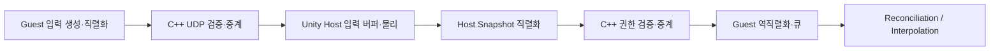
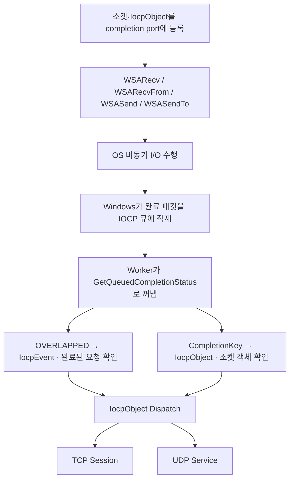
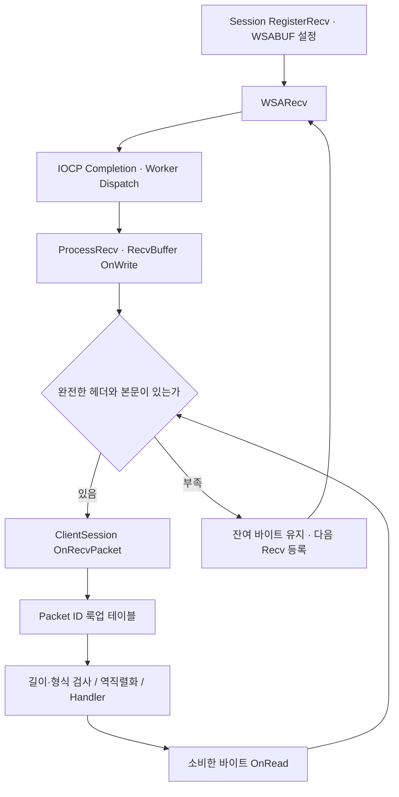
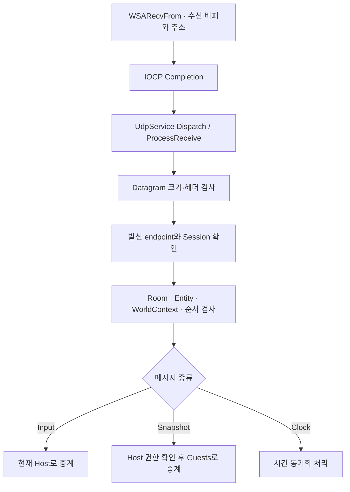
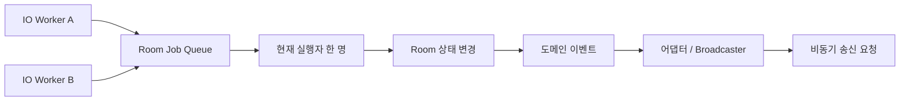

> <span class="ssketch-callout-label ssketch-callout-label--problem">문제</span> Unity 입력·Snapshot 중계와 Room 제어를 동시에 처리할 통신 기반이 필요했다.  
> <span class="ssketch-callout-label ssketch-callout-label--cause">원인</span> 메시지마다 전달 특성과 검증 대상이 다르고, 여러 I/O 작업이 동시에 완료될 수 있었다.  
> <span class="ssketch-callout-label ssketch-callout-label--solution">해결</span> IOCP 위에 TCP 스트림 처리와 UDP datagram 경로를 두고 Room 변경을 직렬화했다.  
> <span class="ssketch-callout-label ssketch-callout-label--result">결과</span> 실제 게임 연결과 별도로 최대 200개 합성 클라이언트 조건의 지연·수신 수를 기록했다.  
> <span class="ssketch-callout-label ssketch-callout-label--role">역할</span> C++ 송수신·Room 연계와 Unity 메시지 처리 흐름을 구성했다.

**용어 정리**

| 용어 | 뜻 |
| --- | --- |
| IOCP | Windows에서 여러 소켓의 통신 완료를 한 곳에서 받아 처리하는 기술 |
| TCP / UDP | 순서를 보장하며 느린 통신 프로토콜 / 순서를 보장 안 하지만 빠른 통신 프로토콜 |
| <span class="notice-pink">Session</span> | 서버가 <span class="notice-pink">클라이언트 한 명</span>과 유지하는 <span class="notice-pink">연결 단위</span> |
| Room | 참가자들이 모여 대기하고 함께 게임을 진행하는 공간 |
| datagram | UDP로 한 번에 보내는 패킷 한 덩어리 |
| worker | 통신 완료 처리를 실제로 수행하는 스레드 |
| <span class="notice-pink">Packet ID</span> | 패킷이 어떤 종류인지 구분하는 번호 |
| <span class="notice-pink">WorldContext / AuthorityEpoch</span> | 어느 방·어느 판·몇 번째 호스트의 메시지인지 구분하는 정보 |

## Unity 입력이 호스트까지 가는 기반

Host Authority 구조에서는 Guest의 입력과 호스트의 Snapshot이 계속 오가는 동안 방 입장, 퇴장과 게임 진행도 처리해야 한다. 이 흐름에 필요한 Session·Room·Relay(중계)·GameLoopRule을 직접 구성하기 위해 C++ 서버를 만들었다. Windows 비동기 소켓의 완료 통지는 IOCP로 모았다.

Guest에서 직렬화한 입력은 UDP로 서버에 도착한다. 서버는 발신 Session과 Entity, 현재 Room과 권한 문맥을 확인한 뒤 호스트로 중계한다. 그리고, 서버는 호스트의 확정 상태를 검증해 Guest로 보낸다. Guest가 역직렬화한 데이터는 Reconciliation 또는 Snapshot Interpolation으로 이어진다.
<br><br>
<span class="notice-pink">Reconciliation</span> : 최근 확정된 HostTick의 위치 및 상태를 해당 틱 이후의 예측 입력을 적용하는 것
<span class="notice-pink">Snapshot Interpolation</span>: Reconciliation의 결과와 현재 예측 상태의 차이가 많이 나면 Reconciliation값을 타깃으로 천천히 보간하는 것 



이 글에서는 큐에서 입력을 꺼내 물리에 적용하는 시점보다, 그 데이터를 운반하는 네트워크 경로에 초점을 맞췄다. 실제 소비 deadline은 [<span class="notice-pink">입력 파이프라인 글</span>]({{ '/projects/ssketch/technical/input-deadline/' | relative_url }})에서 이어진다.

## IOCP-Core와 완료 큐

`IocpCore`는 <span class="notice-pink">completion port</span>를 만들고 <span class="notice-pink">소켓 핸들</span>을 등록한다. 비동기 요청에는 OVERLAPPED를 포함한 이벤트 객체와 <span class="notice-pink">버퍼를 연결</span>한다. 이후 <span class="notice-pink">OS가 I/O를 완료</span>하면 completion packet을 큐(completion port)에 넣고, `GetQueuedCompletionStatus`에서 <span class="notice-pink">기다리던 worker</span>가 완료 정보를 받는다.



TCP 수신 시 WSARecv가 RecvBuffer의 현재 쓰기 위치를 직접 가리키도록 구성했다. 수신 완료 후에는 `ProcessRecv`를 통해 실제 수신된 바이트 수만큼 버퍼의 쓰기 위치를 갱신하고, 동일한 버퍼에서 완성된 패킷을 순차적으로 해석한다.

요청한 I/O가 끝나면 Windows는 <span class="notice-pink">전송 바이트 수, completion key, OVERLAPPED 포인터를 담은 완료 패킷</span>을 IOCP 큐에 넣는다. 각 IOCP worker 스레드는 `GetQueuedCompletionStatus`를 호출해 큐에서 완료 패킷을 기다린다. 패킷이 도착하면 Windows가 이를 큐에서 꺼내 해당 worker 스레드에 완료 정보를 돌려준다. worker는 completion key로 소켓을 처리하는 IocpObject를 찾고, OVERLAPPED 포인터로 완료된 IocpEvent를 확인한 뒤 해당 객체의 <span class="notice-pink">Dispatch</span>에 이벤트를 넘긴다. TCP의 `ProcessRecv`는 완료 바이트 수만큼 기록 위치를 갱신하고 같은 버퍼에서 패킷을 해석한다. UDP 수신 경로도 완료 이벤트를 받은 뒤 해당 수신 버퍼를 처리한다.

completion key에는 처리할 객체를 연결해 두고, 이벤트가 그 객체를 붙잡고 있는 동안은 <span class="ssketch-key ssketch-key--solution">Session이나 버퍼가 완료되기 전에 먼저 사라지지 않도록 살려 둔다.</span> 함수 호출이 끝나서 반환됐다는 것과, 실제 데이터 송수신이 끝났다는 것은 서로 다른 시점이라는 점이 중요했다.

## TCP: 받은 바이트에서 완전한 패킷을 꺼낸다

TCP는 순서 있는 바이트 스트림을 제공한다. 한 번의 WSARecv 완료가 한 게임 패킷과 일치하지 않는다. 헤더 일부만 올 수도 있고, 여러 패킷이 합쳐져 도착할 수도 있어 RecvBuffer에 받은 바이트를 누적했다.



헤더 길이와 패킷 크기를 확인한 뒤 완전한 본문이 있을 때만 handler로 넘겼다. 고정 길이 패킷과 가변 길이 패킷의 wrapper는 각각 필요한 형식을 확인하고 메시지를 해석한다. 룩업 테이블은 packet ID에 대응하는 처리 함수를 찾는 역할을 한다.

여기서 바이트 수를 잘못 소비하면 다음 패킷의 헤더 위치까지 틀어진다. 일부만 도착한 패킷은 버퍼에 남기고, 처리한 만큼만 읽기 위치를 이동한 뒤 다음 수신을 등록한다. 소켓의 수신 완료와 애플리케이션 메시지 하나의 완성을 분리한 구조다.

## UDP: datagram 하나의 문맥을 확인한다

UDP는 WSARecvFrom으로 datagram과 발신 주소를 받는다. TCP처럼 이전 데이터 뒤에 이어 붙여 패킷을 조립하는 대신, 현재 datagram의 크기와 헤더를 먼저 검사한다. 이후 packet ID에 따라 입력, 호스트 Snapshot, 시간 동기화 등의 경로로 나눈다.

`WSARecvFrom`이 datagram을 수신 버퍼에 기록하고, 완료 후 `UdpService::ProcessReceive`가 같은 버퍼의 데이터와 발신 주소를 읽어 검사한다.



입력은 보내는 사용자가 해당 Entity를 제어할 수 있는지 확인하고, Snapshot은 현재 호스트가 보낸 것인지 확인한다. 방과 world/authority epoch가 다르면 이전 게임에서 지연된 datagram이 현재 상태에 섞일 수 있으므로 함께 검증한다.


## Room 작업은 한 번에 하나씩 실행한다

여러 IOCP Worker가 같은 Room의 입장·퇴장·게임 진행 상태 변경을 동시에 처리할 수 있기 때문에, Room 상태를 변경하는 작업은 Room::PushJob()을 통해 JobQueue에 넣어 직렬화했다. 하나의 Room에서는 한 실행자만 Job을 순차적으로 처리하고, 서로 다른 Room의 Job은 각각 독립적으로 실행될 수 있도록 구성했다.

또한 lock은 Job의 `추가·추출`과 `실행자 상태를 보호하는 구간`에서만 사용하고, 실제 Job 실행 중에는 잡고 있지 않도록 분리했다. 이를 통해 같은 Room의 상태 변경 순서는 보장하면서도, 서로 다른 Room의 작업까지 하나의 lock으로 직렬화되는 것을 피했다.




## 도메인 이벤트에서 송신 완료까지

### 이벤트 버스(발행 구독 패턴 적용)
std:variant와 visit을 활용해 이벤트 객체와 익명함수를 연결하여 호출하도록 하였다.<br>
이벤트를 publish로 전달하면 이벤트를 매개변수로 받는 람다함수들을 조회해서 시그니처가 일치하는지의 여부를 판단해서 매핑한다. 

게임 진행 로직이 발생시킨 이벤트는 방에 등록된 이벤트 수신기가 받아 네트워크 알림으로 연결한다. 브로드캐스터는 알림을 패킷으로 만들어 참가자에게 송신을 요청한다. 운영체제가 비동기 송신을 완료하면 IOCP worker가 완료 통지를 처리한다.

<br>TCP에서는 Session의 SendBuffer를 송신 큐에 넣고, 등록 상태를 확인해 WSASend를 요청한다. 완료될 때까지 버퍼를 유지하고 부분 송신이면 남은 offset을 이어 처리한다. 완료 처리 후 다음 송신을 등록한다. 
<br>UDP의 WSASendTo도 별도 send event와 버퍼의 수명을 완료 시점까지 유지한다.

```text
도메인 상태 변경 → Publish(event) → 어댑터 → Broadcaster
→ Session Send Queue / UDP Send Event → WSASend / WSASendTo
→ OS I/O 완료 → IOCP Worker → 송신 상태·버퍼 정리
```

송신 완료는 로컬 비동기 I/O의 완료다. 상대 클라이언트가 역직렬화를 끝냈거나 Tick에 적용했다는 응답까지 뜻하지 않는다. 게임 쪽에서 정말 끝났다는 확인은 별도의 확정 신호나 상태 메시지로 따로 정의해야 한다. 수신에서도 송신에서도 이 경계를 유지해야 로그를 잘못 해석하지 않는다.

## Python 콘솔 클라이언트로 서버 중계를 확인했다

이 실험의 목적은 Unity 플레이가 아니라, 여러 클라이언트가 접속했을 때 C++ 서버가 게임 프로토콜을 처리하고 Input과 Snapshot을 중계하는지 확인하는 것이었다. Python 콘솔 클라이언트는 TCP·UDP 소켓으로 로그인, 방 생성·입장, 게임 시작 절차를 진행한 뒤 30Hz Input을 보냈다. 각 방의 호스트 역할을 맡은 클라이언트는 4개 캐릭터의 합성 상태를 담은 30Hz Snapshot을 보냈다. 서버는 이 메시지를 실제 소켓에서 수신해 검증하고 방 참가자에게 중계했다.



4·40·100·200클라이언트 실행에서 Input과 Snapshot의 관측 수는 각 조건의 집계 기준과 일치했고, 중계 누락은 집계되지 않았다. 따라서 짧은 합성 부하에서 소켓 연결과 서버 중계 경로가 동작한 것은 확인했다.

