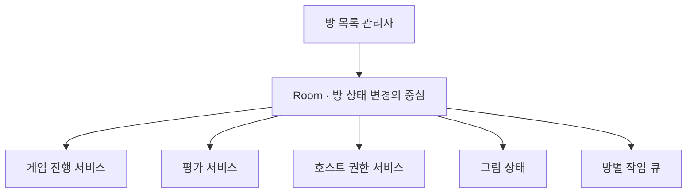
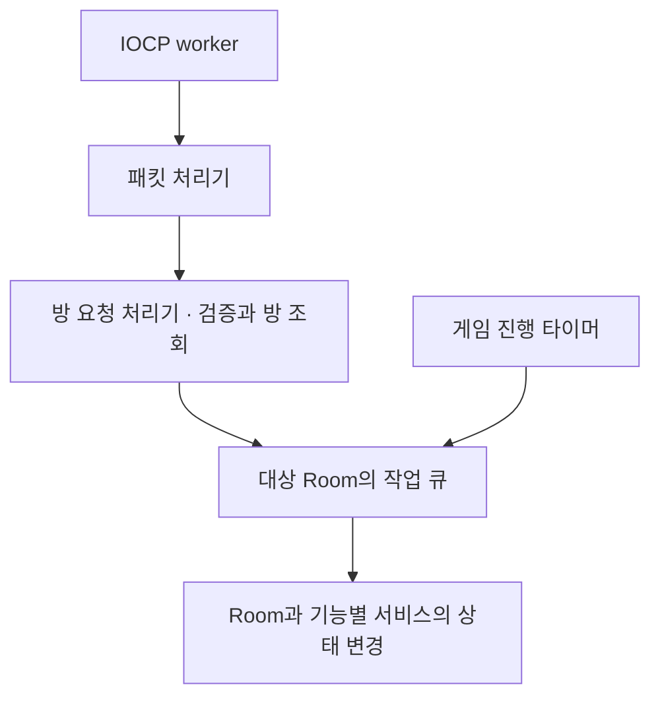

## Room에 모을 상태와 나눌 책임

Room은 참가자들이 모여 대기하고 함께 게임을 진행하는 공간이다. 참가자와 준비 상태뿐 아니라 게임 시작 이후의 캐릭터·그림 상태도 같은 방에 속한다. 서버는 이 상태들을 Room에서 관리하고, 요청 처리기는 Room의 상태 변경 기능을 호출하도록 구성했다.

방 상태와 게임 진행에는 서로 다른 책임이 있다. Room은 참가자와 방 설정을 관리한다. 게임 진행 서비스는 라운드와 페이즈를 전환하고, 평가 서비스는 점수와 결과를 관리한다. 호스트 권한 서비스는 물리 판정을 맡을 호스트와 월드·권한 세대를 관리한다.

| 구성 | 책임 |
| --- | --- |
| RoomManager | 방 생성·조회·제거, 방 ID와 입장 코드로 방 찾기, 방 객체 보관 |
| Room | 참가자·Ready·Host·게임 상태, 플레이어와 Entity 연결, 캐릭터 상태 관리 |
| GameLoopService | 게임 진행과 라운드·페이즈 전환 |
| EvaluationService | 평가 진행과 점수·결과 관리 |
| HostAuthorityRoomService | 호스트 권한과 월드·권한 세대 관리 |
| DrawingState | 방에 속한 그림 상태 보관 |
| JobQueue | 같은 방의 상태 변경 작업을 순서대로 실행 |

Room은 필요한 서비스를 멤버로 가진다. 구현하다 보니 룸의 기본기능 뿐 아니라 플레이어들과 호스트 권위, 게임의 라이프사이클을 관리하는 기능 등 Room의 책임이 너무 많아져 해더파일만 해도 1000줄이 넘어가서 기능을 확장하기 어려워지는 문제가 생겼었다.   모든 기능을 룸에 구현하는 대신 구성 관계(Has-A)로 책임을 나눴다. 방 상태의 변경 진입점은 Room에 두면서, 각 기능의 계산과 진행은 해당 서비스가 맡는다.
 

## 요청 처리기는 방 상태를 소유하지 않는다

패킷 처리기는 요청 종류에 맞는 담당 처리기를 선택한다. 방 요청 처리기는 세션과 요청 형식을 확인하고, 방 목록 관리자에서 대상 Room을 찾는다. 처리기는 방에 수행할 작업을 전달하고, Room과 기능별 서비스가 참가자 여부·준비 상태 등 방 규칙을 적용한다.

입장 요청을 처리할 때 서버는 새 참가자에게 초기 방 상태를 응답한다. 기존 참가자에게는 입장 알림을 보내 명단을 갱신한다. 요청 검증, 방 상태 변경, 응답과 알림 전송을 각각의 책임으로 나눴다.

## 여러 실행 주체의 작업을 방별로 직렬화한다

IOCP worker 여러 개가 같은 방의 입장·퇴장·준비 요청을 처리할 수 있다. 타이머도 게임 진행 작업을 전달한다. 이 실행 주체들이 방 상태를 동시에 변경하면 참가자 목록과 게임 진행 상태 사이의 순서를 유지하기 어렵다.

서버는 방 상태를 바꾸는 작업을 해당 Room의 작업 큐에 넣는다. 같은 방에서는 한 실행자가 작업을 차례로 처리한다. 서로 다른 방은 각자의 큐에서 독립적으로 작업을 처리한다.

### 여러 요청을 큐에 모아 처리한다

발표 자료의 JobQueue 장표는 여러 클라이언트에서 전달한 작업이 두 개의 큐에 모이고, 서버가 각 큐의 작업을 처리하는 흐름을 보여준다. 서버 구현에서는 Room마다 작업 큐를 두어 같은 방의 상태 변경 순서를 유지했다.

<figure>
  
</figure>

같은 방으로 들어온 작업은 해당 큐에 쌓인 순서대로 처리한다. 서버는 방마다 작업의 실행 순서를 관리한다.

### 수신부터 상태 변경까지

작업 큐에 전용 스레드를 만들지는 않았다. 작업을 넣은 호출자는 실행자가 없으면 큐 처리를 시작한다. 이미 실행자가 있으면 새 작업은 큐에서 차례를 기다린다. 따라서 Room 작업의 실행 스레드는 작업을 전달한 worker나 타이머 호출 경로에 따라 달라질 수 있다.

큐는 작업을 넣고 꺼낼 때 lock으로 큐와 실행 상태를 보호한다. 실행자는 작업을 꺼낸 뒤 lock을 놓고 해당 작업을 수행한다. 큐의 실행 상태를 유지하므로 다른 호출자가 같은 방의 큐를 동시에 실행하지 않는다.

## 방과 서비스의 수명 연결

방 목록 관리자는 방 객체를 강한 참조로 보관한다. Room이 보유한 게임 진행 서비스는 Room을 약한 참조로 가리킨다. 이벤트를 전달받는 네트워크 어댑터도 Room을 약한 참조로 가리켜 순환 소유를 피한다.

이 구조에서 방 목록 관리자는 방의 생성과 보관을 맡고, Room은 상태 변경 경계를 맡는다. 기능별 서비스는 게임 규칙을 나누고, 작업 큐는 같은 방의 변경 순서를 유지한다. 책임 분리와 작업 직렬화를 함께 구성한 결과다.

게임 진행 결과를 클라이언트 알림으로 연결하는 구조는 [이벤트 전달 구조]({{ '/projects/ssketch/technical/event-delivery/' | relative_url }})에서 이어진다.
