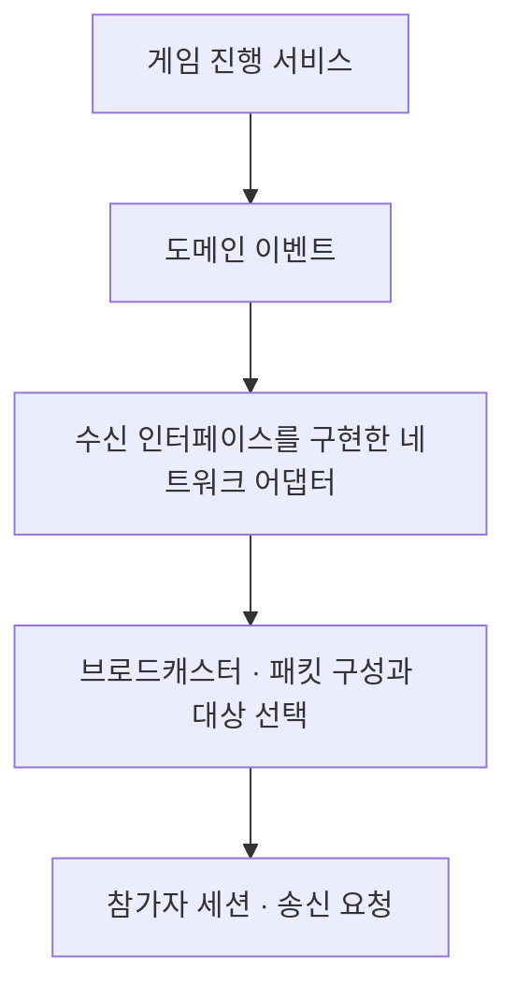
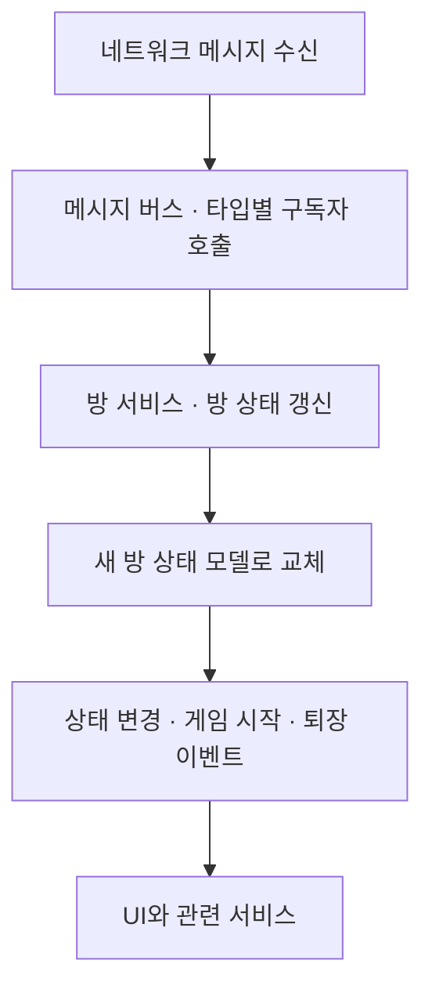

## 게임 규칙과 전송 책임을 나눈다/ 어댑터 패턴

게임 진행 서비스는 라운드와 페이즈를 계산하고, 그 결과를 도메인 이벤트로 만든다. 서비스는 인터페이스 타입으로 어댑터 객체를 가진다.서비스가 이벤트를 생성해 Publish하면, 어댑터의 std::visit가 이벤트 타입에 맞는 람다를 호출하고 브로드캐스터에 연결(호출)한다.

  
즉, 어댑터 자체가 이벤트 수신자(sink)다. 게임 진행 서비스는 수신 인터페이스 타입으로 어댑터를 보유하고, 이벤트를 발행할 때 그 어댑터를 호출한다. 인터페이스와 구현체를 통해 게임 로직과 네트워크 전송의 경계를 나눈 Port·Adapter 구조다.

| 구성 | 역할 |
| --- | --- |
| 게임 진행 서비스 | 게임 규칙과 상태를 계산하고 결과 이벤트 생성 |
| 이벤트 수신 인터페이스 | 게임 진행 서비스가 외부에 결과를 전달하는 접점(Port) |
| 네트워크 어댑터 | 수신 인터페이스를 구현하고 이벤트 종류를 전송 동작(람다)에 연결(Adapter) |
| 브로드캐스터 | 결과를 패킷으로 구성하고 대상 세션을 선택해 송신 요청 |
| 참가자 세션 | 연결된 클라이언트로 패킷 전송 |

## 이벤트 객체와 처리 함수를 연결한다

서버는 여러 종류의 이벤트 객체를 std::variant 하나로 전달한다. 어댑터는 각 이벤트 타입을 매개변수로 받는 람다 함수를 준비한다. `std::visit`는 전달된 이벤트의 실제 타입에 맞는 람다 함수를 호출한다.

즉, 게임 진행 서비스가 결과 이벤트를 발행하면 어댑터는 그 이벤트에 대응하는 처리 함수를 실행한다. 처리 함수는 이벤트에 담긴 값을 적절한 브로드캐스터에 넘긴다. 이벤트 타입과 처리 함수의 연결은 컴파일할 때 정해진다.(이벤트 타입에 맞는 처리 함수가 오버로딩 규칙에 따라 결정된다)

이 방식으로 이벤트 종류에 따른 처리 분기를 어댑터에 모았다. 게임 진행 서비스는 게임 상태와 결과를 계산하고 게임 규칙을 판단하는 역할을 맡고, 브로드캐스터는 이미 결정된 결과의 전송을 맡는다. 

## 이벤트 전달과 비동기 송신의 실행 순서

게임 진행 서비스는 Room 작업 큐에서 상태를 변경하고 이벤트를 만든다. 서비스는 자신의 상태 lock을 놓은 뒤 등록된 어댑터를 호출한다. 어댑터와 브로드캐스터 호출도 같은 작업의 실행 흐름에서 이어진다.

브로드캐스터는 방 참가자 목록에서 연결된 세션을 찾아 송신을 요청한다. 이후 Windows가 비동기 I/O를 완료하면 IOCP worker가 완료 통지를 받아 처리한다. 도메인 이벤트의 전달과 소켓 I/O 완료는 이 순서로 연결된다.

## Unity의 이벤트 버스 — 발행·구독 패턴

Unity의 네트워크 메시지 버스는 메시지 타입별로 구독한 처리 함수들을 보관한다. 네트워크 수신 경로가 메시지를 발행하면, 버스는 해당 타입의 구독 목록을 찾아 각 처리 함수를 호출한다. 발행자는 메시지를 사용할 UI나 서비스를 직접 참조하지 않는다.

서버 어댑터의 `std::visit`는 한 이벤트에 맞는 처리 분기를 선택한다. Unity의 메시지 버스는 한 메시지를 구독한 여러 처리 함수에 전달한다.서버와 클라이언트는 각각의 역할에 맞게 이벤트를 연결했다.

방 서비스는 참가자·준비·방장 변경 알림을 구독한다. 서비스는 받은 내용으로 새 방 상태 모델을 만들고 기존 모델을 교체한 뒤 변경 이벤트를 발행한다. UI와 관련 서비스는 방 서비스의 이벤트를 구독해 화면과 동작을 갱신한다.

방 서비스가 네트워크 알림을 화면에서 사용할 상태로 바꾸는 창구를 맡으므로, UI는 서버 패킷을 직접 해석하거나 참가자 목록을 별도로 관리할 필요가 없다.

## 구독의 수명을 서비스에 맞춘다

메시지 버스는 구독을 해제할 수 있는 객체를 반환한다. 방 서비스는 이 객체들을 `CompositeSubscription`에 모으고, 서비스가 정리될 때 구독을 한꺼번에 해제한다. 방을 나갈 때는 보관 중인 방 상태를 비우고 퇴장 이벤트를 발행한다.

서버는 도메인 결과를 어댑터를 통해 네트워크에 연결한다. 클라이언트는 네트워크 알림을 방 상태로 바꾼 뒤 UI에 이벤트로 전달한다. 양쪽 모두 계산·전송·화면 갱신의 책임을 나눠 구성했다.
